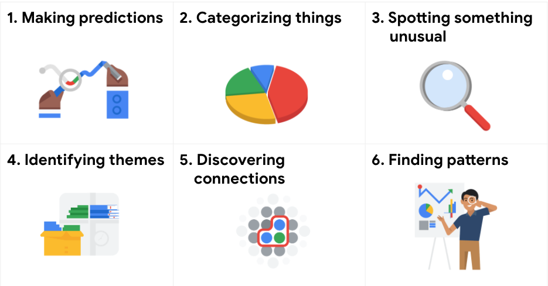

# From issue to action: The six data analysis phases

There are six data analysis phases that will help you make seamless decisions: ask, prepare, process, analyze, share, and act. Keep in mind, these are different from the data life cycle, which describes the changes data goes through over its lifetime. Going through the steps will help you solve all kinds of business problems that you might face on the job.

## Step 1: Ask

It’s impossible to solve a problem if you don’t know what it is. These are some things to consider:

- Define the problem you’re trying to solve
- Make sure you fully understand the stakeholder’s expectations
- Focus on the actual problem and avoid any distractions
- Collaborate with stakeholders and keep an open line of communication
- Take a step back and see the whole situation in context

### Questions to ask yourself in this step:

1. What are my stakeholders saying their problems are?
2. Now that I’ve identified the issues, how can I help the stakeholders resolve their questions?

## Step 2: Prepare

You will decide what data you need to collect in order to answer your questions and how to organize it so that it is useful. You might use your business task to decide:

- What metrics to measure
- Locate data in your database
- Create security measures to protect that data

### Questions to ask yourself in this step:

1. What do I need to figure out how to solve this problem?
2. What research do I need to do?

## Step 3: Process

Clean data is the best data and you will need to clean up your data to get rid of any possible errors, inaccuracies, or inconsistencies. This might mean:

- Using spreadsheet functions to find incorrectly entered data
- Using SQL functions to check for extra spaces
- Removing repeated entries
- Checking as much as possible for bias in the data

### Questions to ask yourself in this step:

1. What data errors or inaccuracies might get in my way of getting the best possible answer to the problem I am trying to solve?
2. How can I clean my data so the information I have is more consistent?

## Step 4: Analyze

You will want to think analytically about your data. At this stage, you might sort and format your data to make it easier to:

- Perform calculations
- Combine data from multiple sources
- Create tables with your results

### Questions to ask yourself in this step:

1. What story is my data telling me?
2. How will my data help me solve this problem?
3. Who needs my company’s product or service? What type of person is most likely to use it?

## Step 5: Share

Everyone shares their results differently so be sure to summarize your results with clear and enticing visuals of your analysis using data via tools like graphs or dashboards. This is your chance to show the stakeholders you have solved their problem and how you got there. Sharing will certainly help your team:

- Make better decisions
- Make more informed decisions
- Lead to stronger outcomes
- Successfully communicate your findings

### Questions to ask yourself in this step:

1. How can I make what I present to the stakeholders engaging and easy to understand?
2. What would help me understand this if I were the listener?

## Step 6: Act

Now it’s time to act on your data. You will take everything you have learned from your data analysis and put it to use. This could mean providing your stakeholders with recommendations based on your findings so they can make data-driven decisions.

### Questions to ask yourself in this step:

1. How can I use the feedback I received during the share phase (step 5) to actually meet the stakeholder’s needs and expectations?

These six steps can help you to break the data analysis process into smaller, manageable parts, which is called **structured thinking**. This process involves four basic activities:

1. Recognizing the current problem or situation
2. Organizing available information
3. Revealing gaps and opportunities
4. Identifying your options

When you are starting out in your career as a data analyst, it is normal to feel pulled in a few different directions with your role and expectations. Following processes like the ones outlined here and using structured thinking skills can help get you back on track, fill in any gaps and let you know exactly what you need.

# Six common problem types

Data analytics is so much more than just plugging information into a platform to find insights. It is about solving problems. To get to the root of these problems and find practical solutions, there are lots of opportunities for creative thinking. No matter the problem, the first and most important step is understanding it. From there, it is good to take a problem-solver approach to your analysis to help you decide what information needs to be included, how you can transform the data, and how the data will be used.

## Data analysts typically work with six problem types

1. Making predictions
2. Categorizing things
3. Spotting something unusual
4. Identifying themes
5. Discovering connections
6. Finding patterns

A  video, [Common problem types](https://www.coursera.org/learn/ask-questions-make-decisions/lecture/E8HxZ/common-problem-types "Common problem types"), introduced the six problem types with an example for each. The examples are summarized below for review.

### Making predictions

A company that wants to know the best advertising method to bring in new customers is an example of a problem requiring analysts to make predictions. Analysts with data on location, type of media, and number of new customers acquired as a result of past ads can't guarantee future results, but they can help predict the best placement of advertising to reach the target audience.

### Categorizing things

An example of a problem requiring analysts to categorize things is a company's goal to improve customer satisfaction. Analysts might classify customer service calls based on certain keywords or scores. This could help identify top-performing customer service representatives or help correlate certain actions taken with higher customer satisfaction scores.

### Spotting something unusual

A company that sells smart watches that help people monitor their health would be interested in designing their software to spot something unusual. Analysts who have analyzed aggregated health data can help product developers determine the right algorithms to spot and set off alarms when certain data doesn't trend normally.

### Identifying themes

User experience (UX) designers might rely on analysts to analyze user interaction data. Similar to problems that require analysts to categorize things, usability improvement projects might require analysts to identify themes to help prioritize the right product features for improvement. Themes are most often used to help researchers explore certain aspects of data. In a user study, user beliefs, practices, and needs are examples of themes.

By now you might be wondering if there is a difference between categorizing things and identifying themes. The best way to think about it is: categorizing things involves assigning items to categories; identifying themes takes those categories a step further by grouping them into broader themes.

### Discovering connections

A third-party logistics company working with another company to get shipments delivered to customers on time is a problem requiring analysts to discover connections. By analyzing the wait times at shipping hubs, analysts can determine the appropriate schedule changes to increase the number of on-time deliveries.

### Finding patterns

Minimizing downtime caused by machine failure is an example of a problem requiring analysts to find patterns in data. For example, by analyzing maintenance data, they might discover that most failures happen if regular maintenance is delayed by more than a 15-day window.

# More about SMART questions

Companies in lots of industries today are dealing with rapid change and rising uncertainty. Even well-established businesses are under pressure to keep up with what is new and figure out what is next. To do that, they need to ask questions. Asking the right questions can help spark the innovative ideas that so many businesses are hungry for these days.

The same goes for data analytics. No matter how much information you have or how advanced your tools are, your data won’t tell you much if you don’t start with the right questions. Think of it like a detective with tons of evidence who doesn’t ask a key suspect about it.  Coming up, you will learn more about how to ask highly effective questions, along with certain practices you want to avoid.

## Highly effective questions are SMART questions:

| **Specific:** Is the question specific? Does it address the problem? Does it have context? Will it uncover a lot of the information you need? | **Measurable:** Will the question give you answers that you can measure? | **Action-oriented:** Will the answers provide information that helps you devise some type of plan? | **Relevant:** Is the question about the particular problem you are trying to solve? | **Time-bound:** Are the answers relevant to the specific time being studied? |
| ----------------------------------------------------------------------------------------------------------------------------------------------- | -------------------------------------------------------------------------- | ---------------------------------------------------------------------------------------------------- | ------------------------------------------------------------------------------------- | ------------------------------------------------------------------------------ |

## Examples of SMART questions

Here's an example that breaks down the thought process of turning a problem question into one or more SMART questions using the SMART method: **What features do people look for when buying a new car?**

* **Specific**: Does the question focus on a particular car feature?
* **Measurable**: Does the question include a feature rating system?
* **Action-oriented**: Does the question influence creation of different or new feature packages?
* **Relevant**: Does the question identify which features make or break a potential car purchase?
* **Time-bound**: Does the question validate data on the most popular features from the last three years?

Questions should be **open-ended.** This is the best way to get responses that will help you accurately qualify or disqualify potential solutions to your specific problem. So, based on the thought process, possible SMART questions might be:

* On a scale of 1-10 (with 10 being the most important) how important is your car having four-wheel drive? Explain.
* What are the top five features you would like to see in a car package?
* What features, if included with four-wheel drive, would make you more inclined to buy the car?
* How does a car having four-wheel drive contribute to its value, in your opinion?

## Things to avoid when asking questions

**Leading questions**: questions that only have a particular response

- Example: **This product is too expensive, isn’t it?**

This is a leading question because it suggests an answer as part of the question. A better question might be, “What is your opinion of this product?” There are tons of answers to that question, and they could include information about usability, features, accessories, color, reliability, and popularity, on top of price. Now, if your problem is actually focused on pricing, you could ask a question like “What price (or price range) would make you consider purchasing this product?” This question would provide a lot of different measurable responses.

**Closed-ended questions**: questions that ask for a one-word or brief response only

- Example: **Were you satisfied with the customer trial?**

This is a closed-ended question because it doesn’t encourage people to expand on their answer. It is really easy for them to give one-word responses that aren’t very informative. A better question might be, “What did you learn about customer experience from the trial.” This encourages people to provide more detail besides “It went well.”

**Vague questions:** questions that aren’t specific or don’t provide context

- Example: **Does the tool work for you?**

This question is too vague because there is no context. Is it about comparing the new tool to the one it replaces? You just don’t know. A better inquiry might be, “When it comes to data entry, is the new tool faster, slower, or about the same as the old tool? If faster, how much time is saved? If slower, how much time is lost?” These questions give context (data entry) and help frame responses that are measurable (time).

# Data trials and triumphs

## Introduction

A data analytics professional’s job is to provide the data necessary to inform key decisions. They also need to frame their analysis in a way that helps business leaders make the best possible decisions.

In this reading, you’re going to explore the role of data in decision-making and the reasons why data analytics professionals are so important to this process. You’ll compare data-driven and data-inspired decisions to understand the difference between them. You’ll also check out some examples where projects failed or succeeded based on how the data was applied.

Both data-driven and data-inspired approaches are rooted in the idea that data is inherently valuable for making a decision. Well-curated data can provide information to  decision-makers that improves the quality of their decisions. Remember: Data does not make decisions, but it does improve them.

## Data-driven decisions

As you’ve been learning, data-driven decision-making means using facts to guide business strategy. The phrase “data-driven decisions” means exactly that: Data is used to arrive at a decision. This approach is limited by the quantity and quality of readily-available data. If the quality and quantity of the data is sufficient, this approach can far improve decision-making. But if the data is insufficient or biased, this can create problems for decision-makers. Potential dangers of relying entirely on data-driven decision-making can include overreliance on historical data, a tendency to ignore qualitative insights, and potential biases in data collection and analysis

### Example of a data-driven decision

A/B testing is a simple example of collecting data for data-driven decision-making. For example, a website that sells widgets has an idea for a new website layout they think will result in more people buying widgets. For two weeks, half of their website visitors are directed to the old site; the other half are directed to the new site. After those two weeks, the analyst gathers the data about their website visitors and the number of widgets sold for analysis. This helps the analyst understand which website layout resulted in more widget sales. If the new website performed better in producing widget sales, then the company can confidently make the decision to use the new layout!

## Data-inspired decisions

Data-inspired decisions include the same considerations as data-driven decisions while adding another layer of complexity. They create space for people using data to consider a broader range of ideas: drawing on comparisons to related concepts, giving weight to feelings and experiences, and considering other qualities that may be more difficult to measure. Data-inspired decision-making can avoid some of the pitfalls that data-driven decisions might be prone to.

### Example of a data-inspired decision

A customer support center gathers customer satisfaction data (often known as a “CSAT” score). They use a simple 1–10 score along with a qualitative description in which the customer describes their experience. The customer support center manager wants to improve customer experience, so they set a goal to improve the CSAT score. They start by analyzing the CSAT scores and reading each of the descriptions from the customers. Additionally, they interview the people working in the customer support center. From there, the manager formulates a strategy and decides what needs to improve the most in order to raise customer satisfaction scores. While the manager certainly relies on the CSAT data in the decision-making process, input of support center representatives and other qualitative information informs the approach as well.

## A data analysis triumph

When data is used strategically, businesses can transform and grow their revenue. Consider the example below.

### PepsiCo

Since the days of the New Coke launch, things have changed dramatically for beverage and other consumer packaged goods (CPG) companies.

According to a *Think with Google* article by Shyam Venugopal, PepsiCo “hired analytical talent and established cross-functional workflows around an infrastructure designed to put consumers’ needs first. Then [the company] set up the right processes to make critical decisions based on data and technology use cases. Finally, [it] invested in the right technology stack and platforms so that data could flow into a central cloud-based hub. This is critical. When data comes together, we develop a holistic understanding of the consumer and their journeys."

In this data-inspired decision, PepsiCo is not just using its own set of data, but also employing external sources to supplement its datasets and expand its market reach. Learn about how PepsiCo is delivering a more personal and valuable experience to customers using data in [How one of the world’s biggest marketers ripped up its playbook and learned to anticipate intent](https://www.thinkwithgoogle.com/marketing-strategies/data-and-measurement/pepsi-digital-transformation/).

## Data analysis failures

You’ve been learning why data is such a powerful business tool and how data analysts help their companies make data-driven decisions for great results. Using data to draw accurate conclusions and make good recommendations starts with having complete, correct, and relevant data.

Note: It’s important to remember that it’s possible to have solid data and still make the wrong choices. It’s up to data analysts to interpret the data accurately. When data is interpreted incorrectly, that incorrect interpretation can lead to huge losses. Consider the following.

### Coke launch failure

In 1985, New Coke was launched, replacing the classic Coke formula. The company had done taste tests with 200,000 people and found that test subjects preferred the taste of New Coke over Pepsi, which had become a tough competitor. Based on this data alone, classic Coke was taken off the market and replaced with New Coke. The company thought this was the solution to take back the market share that had been lost to Pepsi.

But as it turns out, New Coke was very unpopular—and the company ended up losing tens of millions of dollars. The data seemed correct, but it was incomplete: The data didn't consider how customers would feel about New Coke replacing classic Coke. The company’s decision to retire classic Coke was a data-driven decision based on incomplete data.

## Mars Orbiter loss

In 1999, NASA lost the $125 million Mars Climate Orbiter even though the teams had good data. The spacecraft burned to pieces because of poor collaboration and communication. The Orbiter’s navigation team was using the International System of Units (newtons) for their force calculations, but the engineers who built the spacecraft used the English Engineering Units system (pounds) for force calculations.

No one realized there was a problem until the Orbiter burst into flames in the Martian atmosphere. Later, a NASA review board investigating the cause of the problem discovered the issue was in the software that controlled the thrusters. One program calculated the thrusters’ force in pounds; another program working with the data assumed it was in newtons. The software controllers were making data-driven decisions to adjust the thrust based on 100% accurate data, but these decisions were wrong because of inaccurate assumptions when interpreting it. The two teams might have communicated so they picked a single unit of measure, or so the analysts would have known that conversion was a necessary step in the process to prepare the data. A conversion of the data from one system of measurement to the other could have prevented the loss.

There’s a difference between making a decision with incomplete data and making a decision with a small amount of data. You learned that making a decision with incomplete data is dangerous. But sometimes accurate data from a small test can help you make a good decision. Stay tuned: You’ll learn about how much data to collect later in the program.

# Qualitative and quantitative data in business

This reading further elaborates on the meaning of **qualitative** versus **quantitative**.

As you have learned, there are two types of data: qualitative and quantitative.

Qualitative data tools: focus groups, social media text analysis, and in-person interviews

Quantitative data tools: structured interviews, surveys, and polls

Now, take a closer look at the data types and data collection tools. In this scenario, you are a data analyst for a chain of movie theaters. Your manager wants you to track trends in:

- **Movie attendance over time**
- **Profitability of the concession stand**
- **Evening audience preferences**

Assume quantitative data already exists to monitor all three trends.

## Movie attendance over time

Starting with the historical data the theater has through its loyalty and rewards program, your first step is to investigate what insights you can gain from that data. You look at attendance over the last 3 months. But, because the last 3 months didn’t include a major holiday, you decide it is better to look at a full year’s worth of data. As you suspected, the quantitative data confirmed that average attendance was 550 per month but then rose to an average of 1,600 per month for the months with holidays.

The historical data serves your needs for the project, but you also decide that you will resume the analysis again in a few months after the theater increases ticket prices for evening showtimes.

## Profitability of the concession stand

Profit is calculated by subtracting cost from sales revenue. The historical data shows that while the concession stand was profitable, profit margins were razor thin at less than 5%. You saw that average purchases totaled $20 or less. You decide that you will keep monitoring this on an ongoing basis.

Based on your understanding of data collection tools, you will suggest an online survey of customers so they can comment on the food at the concession stand. This will enable you to gather even more quantitative data to revamp the menu and potentially increase profits.

## Evening audience preferences

Your analysis of the historical data shows that the 7:30 PM showtime was the most popular and had the greatest attendance, followed by the 7:15 PM and 9:00 PM showtimes. You may suggest replacing the current 8:00 PM showtime that has lower attendance with an 8:30 PM showtime. But you need more data to back up your hunch that people would be more likely to attend the later show.

Evening movie-goers are the largest source of revenue for the theater. Therefore, you also decide to include a question in your online survey to gain more insight.

## Qualitative data for all three trends plus ticket pricing

Since you know that the theater is planning to raise ticket prices for evening showtimes in a few months, you will also include a question in the survey to get an idea of customers’ price sensitivity.

Your final online survey might include these questions for qualitative data:

1. What went into your decision to see a movie in our theater today? (movie attendance)
2. What do you think about the quality and value of your purchases at the concession stand? (concession stand profitability)
3. Which showtime do you prefer, 8:00 PM or 8:30 PM, and why do you prefer that time? (evening movie-goer preferences)
4. Under what circumstances would you choose a matinee over a nighttime showing? (ticket price increase)

# Big and small data

As a data analyst, you will work with data both big and small. Both kinds of data are valuable, but they play very different roles.

Whether you work with big or small data, you can use it to help stakeholders improve business processes, answer questions, create new products, and much more. But there are certain challenges and benefits that come with big data and the following table explores the differences between big and small data.

| Small data                                                                             | Big data                                                                                                             |
| ---------------------------------------------------------------------------------------- | ---------------------------------------------------------------------------------------------------------------------- |
| Describes a dataset made up of specific metrics over a short, well-defined time period | Describes large, less-specific datasets that cover a long time period                                                |
| Usually organized and analyzed in spreadsheets                                         | Usually kept in a database and queried                                                                               |
| Likely to be used by small and midsize businesses                                      | Likely to be used by large organizations                                                                             |
| Simple to collect, store, manage, sort, and visually represent                         | Takes a lot of effort to collect, store, manage, sort, and visually represent                                        |
| Usually already a manageable size for analysis                                         | Usually needs to be broken into smaller pieces in order to be organized and analyzed effectively for decision-making |

## Challenges and benefits

Here are some **challenges** you might face when working with big data:

- A lot of organizations deal with data overload and way too much unimportant or irrelevant information.
- Important data can be hidden deep down with all of the non-important data, which makes it harder to find and use. This can lead to slower and more inefficient decision-making time frames.
- The data you need isn’t always easily accessible.
- Current technology tools and solutions still struggle to provide measurable and reportable data. This can lead to unfair algorithmic bias.
- There are gaps in many big data business solutions.

Now for the good news! Here are some **benefits** that come with big data:

- When large amounts of data can be stored and analyzed, it can help companies identify more efficient ways of doing business and save a lot of time and money.
- Big data helps organizations spot the trends of customer buying patterns and satisfaction levels, which can help them create new products and solutions that will make customers happy.
- By analyzing big data, businesses get a much better understanding of current market conditions, which can help them stay ahead of the competition.
- As in our earlier social media example, big data helps companies keep track of their online presence—especially feedback, both good and bad, from customers. This gives them the information they need to improve and protect their brand.

## The three (or four) V words for big data

When thinking about the benefits and challenges of big data, it helps to think about the three Vs: **volume, variety,** and **velocity.** Volume describes the amount of data. Variety describes the different kinds of data. Velocity describes how fast the data can be processed. Some data analysts also consider a fourth V: **veracity.** Veracity refers to the quality and reliability of the data. These are all important considerations related to processing huge, complex datasets.

| Volume             | Variety                     | Velocity                           | Veracity                                |
| -------------------- | ----------------------------- | ------------------------------------ | ----------------------------------------- |
| The amount of data | The different kinds of data | How fast the data can be processed | The quality and reliability of the data |

# The importance of context

**Context** in data analytics is the condition and circumstances that surround and give meaning to the data. Context is important in data analytics because it helps make disorganized data accessible and understood. The fact is, data has little value if it is not paired with context.

Understanding the context behind the data can help us make it more meaningful at every stage of the data analysis process. For example, you might be able to make a few guesses about what you're looking at in the following table, but you couldn't be certain without more context.

| 2010 | 28000 |
| ------ | ------- |
| 2005 | 18000 |
| 2000 | 23000 |
| 1995 | 10000 |

On the other hand, if the first column was labeled to represent the years when a survey was conducted, and the second column showed the number of people who responded to that survey, then the table would start to make a lot more sense. Take this a step further, and you might notice that the survey is conducted every 5 years. This added context helps you understand why there are five-year gaps in the table.

| **Years** (Collected every 5 years) | **Respondents** |
| ------------------------------------- | ----------------- |
| 2010                                | 28000           |
| 2005                                | 18000           |
| 2000                                | 23000           |
| 1995                                | 10000           |

**Context can turn raw data into meaningful information.** It is very important for data analysts to contextualize their data. This means giving the data perspective by defining it. To do this, you need to identify:

- Who: The person or organization that created, collected, and/or funded the data collection
- What: The things in the world that data could have an impact on
- Where: The origin of the data
- When: The time when the data was created or collected
- Why: The motivation behind the creation or collection
- How: The method used to create or collect it

Understanding and including the context is important during each step of your analysis process, so it is a good idea to get comfortable with it early in your career. For example, when you collect data, you’ll also want to ask questions about the context to make sure that you understand the business and business process. During organization, the context is important for your naming conventions, how you choose to show relationships between variables, and what you choose to keep or leave out. And finally, when you present, it is important to include contextual information so that your stakeholders understand your analysis.
