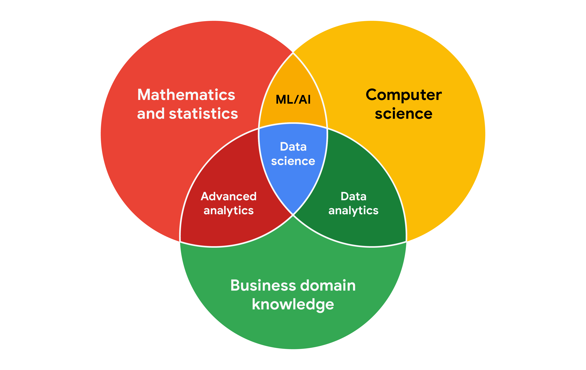

# Working with stakeholders

Your data analysis project should answer the business task and create opportunities for data-driven decision-making. That's why it is so important to focus on project stakeholders. As a data analyst, it is your responsibility to understand and manage your stakeholders’ expectations while keeping the project goals front and center.

You might remember that **stakeholders** are people who have invested time, interest, and resources into the projects that you are  working on. This can be a pretty broad group, and your project stakeholders may change from project to project. But there are three common stakeholder groups that you might find yourself working with: the executive team, the customer-facing team, and the data science team.

Let’s get to know more about the different stakeholders and their goals. Then we'll learn some tips for communicating with them effectively.

## Executive team

The executive team provides strategic and operational leadership to the company. They set goals, develop strategy, and make sure that strategy is executed effectively. The executive team might include vice presidents, the chief marketing officer, and senior-level professionals who help plan and direct the company’s work. These stakeholders think about decisions at a very high level and they are looking for the headline news about your project first.  They are less interested in the details. Time is very limited with them, so make the most of it by leading your presentations with the answers to their questions. You can keep the more detailed information handy in your presentation appendix or your project documentation for them to dig into when they have more time.

For example, you might find yourself working with the vice president of human resources on an analysis project to understand the rate of employee absences. A marketing director might look to you for competitive analyses. Part of your job will be balancing what information they will need to make informed decisions with their busy schedule.

But you don’t have to tackle that by yourself. Your project manager will be overseeing the progress of the entire team, and you will be giving them more regular updates than someone like the vice president of HR. They are able to give you what you need to move forward on a project, including getting approvals from the busy executive team. Working closely with your project manager can help you pinpoint the needs of the executive stakeholders for your project, so don’t be afraid to ask them for guidance.

## Customer-facing team

The customer-facing team includes anyone in an organization who has some level of interaction with customers and potential customers. Typically they compile information, set expectations, and communicate customer feedback to other parts of the internal organization. These stakeholders have their own objectives and may come to you with specific asks. It is important to let the data tell the story and not be swayed by asks from your stakeholders to find certain patterns that might not exist.

Let’s say a customer-facing team is working with you to build a new version of a company’s most popular product. Part of your work might involve collecting and sharing data about consumers’ buying behavior to help inform product features. Here, you want to be sure that your analysis and presentation focuses on what is actually in the data-- not on what your stakeholders hope to find.

## Data science team

Organizing data within a company takes teamwork. There's a good chance you'll find yourself working with other data analysts, data scientists, and data engineers. For example, maybe you team up with a company's data science team to work on boosting company engagement to lower rates of employee turnover. In that case, you might look into the data on employee productivity, while another analyst looks at hiring data. Then you share those findings with the data scientist on your team, who uses them to predict how new processes could boost employee productivity and engagement. When you share what you found in your individual analyses, you uncover the bigger story. A big part of your job will be collaborating with other data team members to find new angles of the data to explore. Here's a view of how  different roles on a typical data science team support different functions:

## Working effectively with stakeholders

When you're working with each group of stakeholders- from the executive team, to the customer-facing team, to the data science team, you'll often have to go beyond the data. Use the following tips to communicate clearly, establish trust, and deliver your findings across groups.

**Discuss goals.** Stakeholder requests are often tied to a bigger project or goal. When they ask you for something, take the opportunity to learn more. Start a discussion. Ask about the kind of results the stakeholder wants. Sometimes, a quick chat about goals can help set expectations and plan the next steps.

**Feel empowered to say “no**.” Let’s say you are approached by a marketing director who has a “high-priority” project and needs data to back up their hypothesis. They ask you to produce the analysis and charts for a presentation by tomorrow morning. Maybe you realize their hypothesis isn’t fully formed and you have helpful ideas about a better way to approach the analysis. Or maybe you realize it will take more time and effort to perform the analysis than estimated. Whatever the case may be, don’t be afraid to push back when you need to.

Stakeholders don’t always realize the time and effort that goes into collecting and analyzing data. They also might not know what they actually need. You can help stakeholders by asking about their goals and determining whether you can deliver what they need. If you can’t, have the confidence to say “no,” and provide a respectful explanation. If there’s an option that would be more helpful, point the stakeholder toward those resources. If you find that you need to prioritize other projects first, discuss what you can prioritize and when. When your stakeholders understand what needs to be done and what can be accomplished in a given timeline, they will usually be comfortable resetting their expectations. You should feel empowered to say no-- just remember to give context so others understand why.

**Plan for the unexpected.** Before you start a project, make a list of potential roadblocks. Then, when you discuss project expectations and timelines with your stakeholders, give yourself some extra time for problem-solving at each stage of the process.

**Know your project.** Keep track of your discussions about the project over email or reports, and be ready to answer questions about how certain aspects are important for your organization. Get to know how your project connects to the rest of the company and get involved in providing the most insight possible. If you have a good understanding about why you are doing an analysis, it can help you connect your work with other goals and be more effective at solving larger problems.

**Start with words ****and**** visuals.** It is common for data analysts and stakeholders to interpret things in different ways while assuming the other is on the same page. This *illusion of agreement***** ***has been historically identified as a cause of projects going back-and-forth a number of times before a direction is finally nailed down. To help avoid this, start with a description and a quick visual of what you are trying to convey. Stakeholders have many points of view and may prefer to absorb information in words or pictures. Work with them to make changes and improvements from there. The faster everyone agrees, the faster you can perform the first analysis to test the usefulness of the project, measure the feedback, learn from the data, and implement changes.

**Communicate often.** Your stakeholders will want regular updates on your projects. Share notes about project milestones, setbacks, and changes. Then use your notes to create a shareable report. Another great resource to use is a change-log, which is a tool that will be explored further throughout the program. For now, just know that a change-log is a file containing a chronologically ordered list of modifications made to a project. Depending on the way you set it up, stakeholders can even pop in and view updates whenever they want.

# Use multiple communication strategies to reach your audience

Being able to communicate in multiple formats is a key skill for data analysts. Listening, speaking, presenting, and writing skills will help you succeed in your projects and in your career. This reading covers effective communication strategies, including examples of clearly worded emails for common situations.

Here's an important first tip: Know your audience! When you communicate your analysis and recommendations as a data analyst, it's vital to keep your audience in mind.

Be sure to answer these four important questions related to your audience:

1. **Who is your audience?**
2. **What do they already know?**
3. **What do they need to know?**
4. **How can you best communicate what they need to know?**

## Project example

As a data analyst, you'll get plenty of requests and questions through email. Let’s walk through an example of how you might approach answering one of these emails. Assume you're a data analyst working at a company that develops mobile apps. Let's start by reviewing answers to the four audience questions we just covered:

Kiri, Product Development Project Manager

Kiri received updates about our project from its planning stages, including the most recent project report, sent two weeks ago.

Kiri needs an update on the analysis project’s progress and needs to know that the executive team approved changes to the data and timeline. You know that adding a new variable to the analysis will impact the current project timeline. Kiri will need to change the project’s milestones and completion date.

You can start by sending an email update to Kiri with the latest timeline for the project, but a meeting might be necessary if she wants to talk through her concerns about missing a deadline.

## Updated timeline email sample

After answering the audience questions, you have the key building blocks you need to write an email to Kiri. Here's an example of how these questions can help organize the flow of the email message:

Hello Kiri, (who is your audience?)

Thank you for your email about the app analysis project's status. I understand you're concerned about how adding this new data will impact the project timeline, and I'd be glad to provide as much information about the project status as I can. (What do they already know? )

We can include the new data that you've suggested however, we'll need time to collect and incorporate it into our analysis. As a result, it will take an additional two weeks to include the new data, which changes our analysis project timeline. (What do they need to know?)

I plan to send out a full report on Monday. This report will include the finalized timeline and share the latest findings, including any new insights we've found.

I understand you're waiting on our report, and I want to make sure that we're able to get you the information you need. If you'd like to meet before the next report, please let me know what time would work best for you. (How can you best communicate what they need to know?)

Thank you,
(your first name)

After receiving your email, Kiri will have a clearer view of the changes to the analysis project and will be able to make adjustments to work with the new timeline.

## Project follow-up email sample

After the next report is completed, you can also send out a project update offering more information. The email could look like this:

Hello Kiri,

The app analysis report has been released, and I wanted to let you know that we are meeting all deadlines in our new timeline.

I've attached a copy of the report so that you can see the results. Analysis with our new data has been included in the report, along with more details about the next steps.

Please pass this along to your team, and let me know if you need any more information.

Thank you,
[your first name]

Good communication keeps stakeholders updated on progress and ultimately helps prevent problems. Carefully worded responses are key. Whether you gather and address feedback using email, meetings, or reports, everyone you work with will know what to expect. As a result, they will be able to better manage their own schedules, resources, and teams.

# Limitations of data

Data is powerful, but it has its limitations. Has someone’s personal opinion found its way into the numbers? Is your data telling the whole story? Part of being a great data analyst is knowing the limits of data and planning for them. This reading explores how you can do that.

If you have incomplete or nonexistent data, you might realize during an analysis that you don't have enough data to reach a conclusion. Or, you might even be solving a different problem altogether! For example, suppose you are looking for employees who earned a particular certificate but discover that certification records go back only two years at your company. You can still use the data, but you will need to make the limits of your analysis clear. You might be able to find an alternate source of the data by contacting the company that led the training. But to be safe, you should be up front about the incomplete dataset until that data becomes available.

If you're collecting data from other teams and using existing spreadsheets, it is good to keep in mind that people use different business rules. So one team might define and measure things in a completely different way than another. For example, if a metric is the total number of trainees in a certificate program, you could have one team that counts every person who registered for the training, and another team that counts only the people who completed the program. In cases like these, establishing how to measure things early on standardizes the data across the board for greater reliability and accuracy. This will make sure comparisons between teams are meaningful and insightful.

Dirty data refers to data that contains errors. Dirty data can lead to productivity loss, unnecessary spending, and unwise decision-making. A good data cleaning effort can help you avoid this. As a quick reminder, data cleaning is the process of fixing or removing incorrect, corrupted, incorrectly formatted, duplicate, or incomplete data within a dataset. When you find and fix the errors - while tracking the changes you made - you can avoid a data disaster. You will learn how to clean data later in the training.

Avinash Kaushik, a Digital Marketing Evangelist for Google, has lots of great tips for data analysts in his [blog: Occam's Razor](http://www.kaushik.net/). Below are some of the best practices he recommends for good data storytelling:

* **Compare the same types of data**: Data can get mixed up when you chart it for visualization. Be sure to compare the same types of data and double check that any segments in your chart definitely display different metrics.
* **Visualize with care**: A 0.01% drop in a score can look huge if you zoom in close enough. To make sure your audience sees the full story clearly, it is a good idea to set your Y-axis to 0.
* **Leave out needless graphs:** If a table can show your story at a glance, stick with the table instead of a pie chart or a graph. Your busy audience will appreciate the clarity.
* **Test for statistical significance:** Sometimes two datasets will look different, but you will need a way to test whether the difference is real and important. So remember to run statistical tests to see how much confidence you can place in that difference.
* **Pay attention to sample size**: Gather lots of data. If a sample size is small, a few unusual responses can skew the results. If you find that you have too little data, be careful about using it to form judgments. Look for opportunities to collect more data, then chart those trends over longer periods.

In any organization, a big part of a data analyst’s role is making sound judgments. When you know the limitations of your data, you can make judgment calls that help people make better decisions supported by the data. Data is an extremely powerful tool for decision-making, but if it is incomplete, misaligned, or hasn’t been cleaned, then it can be misleading. Take the necessary steps to make sure that your data is complete and consistent. Clean the data before you begin your analysis to save yourself and possibly others a great amount of time and effort.

# Lead great meetings

One day soon, you might find yourself planning a meeting in your role as a data analyst. Great things can happen when participants anticipate a well-executed meeting. Attendees show up on time. They aren’t distracted by their laptops and phones. They feel like their time will be well spent. It all comes down to good planning and communication of expectations. The following are our best practical tips for leading meetings.

## Before the meeting

If you are organizing the meeting, you will probably talk about the data. Before the meeting:

* Identify your objective. Establish the purpose, goals, and desired outcomes of the meeting, including any questions or requests that need to be addressed.
* Acknowledge participants and keep them involved with different points of view and experiences with the data, the project, or the business.
* Organize the data to be presented. You might need to turn raw data into accessible formats or create data visualizations.
* Prepare and distribute an agenda. We will go over this next.

## Crafting a compelling agenda

A solid meeting agenda sets your meeting up for success. Here are the basic parts your agenda should include:

* Meeting start and end time
* Meeting location (including information to participate remotely, if that option is available)
* Objectives
* Background material or data the participants should review beforehand

Here's an example of an agenda for an analysis project that is just getting started:

## Sharing your agenda ahead of time

After writing your agenda, it's time to share it with the invitees. Sharing the agenda with everyone ahead of time helps them understand the meeting goals and prepare questions, comments, or feedback. You can email the agenda or share it using another collaboration tool.

## During the meeting

As the leader of the meeting, it's your job to guide the data discussion. With everyone well informed of the meeting plan and goals, you can follow these steps to avoid any distractions:

* Make introductions (if necessary) and review key messages
* Present the data
* Discuss observations, interpretations, and implications of the data
* Take notes during the meeting
* Determine and summarize next steps for the group

## After the meeting

To keep the project and everyone aligned, prepare and distribute a brief recap of the meeting with next steps that were agreed upon in the meeting. You can even take it a step further by asking for feedback from the team.

* Distribute any notes or data
* Confirm next steps and timeline for additional actions
* Ask for feedback (this is an effective way to figure out if you missed anything in your recap)

## A final word about meetings

Even with the most careful planning and detailed agendas, meetings can sometimes go off track. An emergency situation might steal people’s attention. A recent decision might unexpectedly change requirements that were previously discussed and agreed on. Action items might not apply to the current situation. If this happens, you might be forced to shorten or cancel your meeting. That's all right; just be sure to discuss anything that impacts your project with your manager or stakeholders and reschedule your meeting after you have more information.
