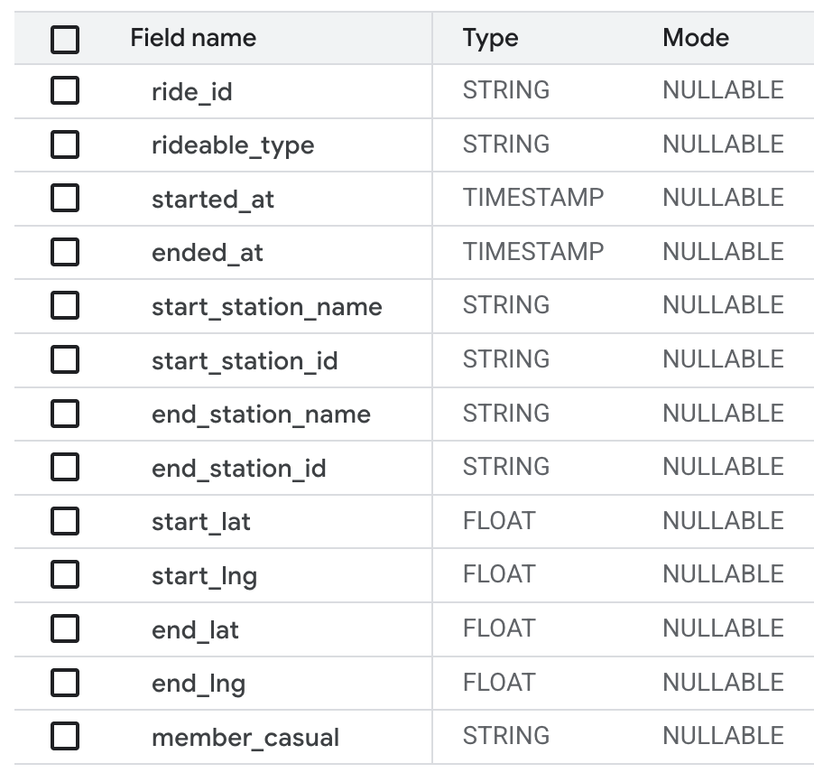
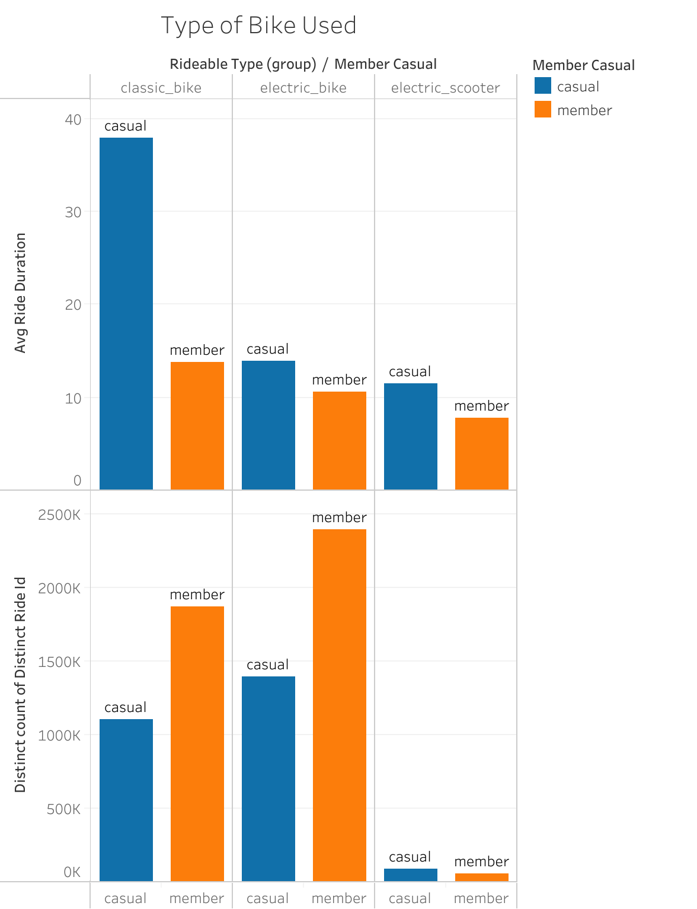
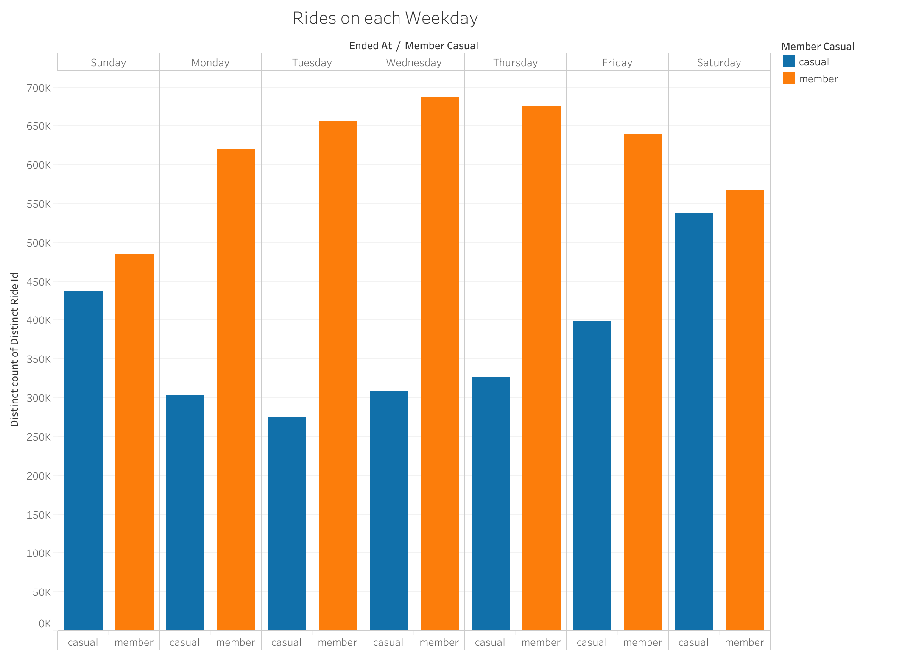

# Cyclistic Bike Share Case Study

**Reference:** [CaseStudyPDF](./Case%20Study%201_How%20does%20a%20bike-share%20navigate%20speedy%20success.pdf).

The following steps were followed for this case study, incorporating techniques and best practices learned during the Google Data Analytics Professional Certificate program:
1.Ask – Identified the business problem: understanding how casual riders and annual members use Cyclistic bikes differently.
2.Prepare – Sourced and organized 12 months of Cyclistic trip data.
3.Process – Cleaned and transformed the data using tools like Excel, Google Sheets, and BigQuery.
4.Analyze – Conducted descriptive analytics, created pivot tables, and generated insights with calculated fields.
5.Share – Visualized findings using Tableau through charts and dashboards.
6.Act – Proposed actionable recommendations to increase annual membership conversions based on the analysis.

The same have been discussed in detail below.

## Ask

### Business Task Statement

Cyclistic, a bike-share company in Chicago, aims to increase annual memberships, which are more profitable than casual passes. The key business task is to design marketing strategies to convert casual riders to members by understanding how annual and casual riders differ, why casual riders would buy a membership, and how digital media could affect their marketing tactics.

**Questions for guiding future marketing program:**

How do annual members and casual riders use Cyclistic bikes differently?
Why would casual riders buy Cyclistic annual memberships?
How can Cyclistic use digital media to influence casual riders to become members

## Prepare

### Description of Data Sources

Data Source: [divvy-tripdata](https://divvy-tripdata.s3.amazonaws.com/index.html)

The analysis uses Cyclistic’s historical trip data over the previous 12 months i.e. June 2024 to July 2025. The dataset includes information such as:

- Ride ID
- Bike type (classic, docked, electric)
- Start and end Station ID and name
- Start and end timestamps
- Start and End Coordinates
- Rider type (casual vs member)

This public dataset, derived from Motivate International Inc., excludes personally identifiable information for privacy compliance. The data has been made available by Motivate International Inc. under this [license](https://www.divvybikes.com/data-license-agreement) The data is stored in Google BigQuery, and subsets were exported to CSV for analysis and visualization in Tableau Public.

## Process

The following steps were following in processing the data:

1.**Data Uploading**

The raw CSV files were uploaded to Google Cloud Storage under the bucket name: DivvyTripData2024-25. The data was accessed in Google BigQuery, where a new dataset and consolidated table were created. Each monthly file was appended to the main BigQuery table, streamlining processing and enabling consistent querying across all records.

2.**Data Exploration**

I ran the queries for each column from left to right in order to determine the **data type** and to uncover any **missing values, outliers, inconsistencies, and errors** within the dataset. Refer [Analysing Data.sql](./Data%20Exploration.sql) to refer to the queries run.

**Conclusions Drawn:**

- The dataset contains 13 variables with correct data types.
- There are **no NULL ride_id** but **211 Duplicate ride_ids** exist.
- There are **3 unique rideable types** in dataset: electric bike, classic bike, electric scooter.
- There are **2 unique member types** in the dataset: member and casual
- There are **1341897 instances of NULL start_station_id and start_station_name** but there are no cases where a start_station_name is missing, but the start_station_id is known elsewhere in the dataset.
- There are **1380243 instances of NULL end_station_id and end_station_name** but there are no cases where an end_station_name is missing, but the end_station_id is known elsewhere in the dataset.
- There are **7938 instances of NULL end_lat and end_lng**.
- A new column for **ride duration** is required for analysis.
- There are **58 ride_id with negative ride durations**.
- There are **no start or end latitude and latitude outside the acceptable range**.

3.**Data Cleaning**

A new table is created in the database using [queries](./Data%20Cleaning.sql) with following changes:

- New columns added: ride_duration, weekday_of_trip, month_of_trip, row_number for duplicate ride_id
- 211 Duplicate ride_id with less accuarte timestamp removed
- Rides with negative ride duration removed

***Note:*** The entries with NULL start_station_id, start_station_name, end_station_id, end_station_name, end_lat, end_lag have not been removed since missing values will not impact our analysis. But removing the same will skew our analysis results.

4.**Data Analysis**

The analysis question is:

> How do annual members and casual riders use Cyclistic bikes differently?

The cleaned data is imported into Tableau for analysis and analysis is carried out by plotting data on different graphs.

**User Type Distribution**

- Members account for 62.6% of total rides
- Casual riders make up the remaining 37.4%
- This indicates that members are the dominant user group in terms of ride frequency

**Bike Type Preferences**

- Members prefer electric bikes for speed and convenience, with nearly equal ride duration across bike types
- Casual riders use classic and electric bikes almost equally but spend significantly more time on classic bikes
- Suggests members prioritize the speed and convenience.

**Ride Duration**

- Casual riders consistently have longer average ride durations across all months
- Members have shorter but more frequent rides
- Suggests: Casual users ride for leisure; members use bikes for efficiency/commuting

**Rides by Month**

- Peak usage for both groups occurs in May and June
- Likely influenced by favorable weather conditions or seasonal programs
- Indicates an opportunity to target membership promotions in spring/summer

**Rides by Day of the Week**

- Members ride more during weekdays, indicating commuting behavior
- Casual riders ride more during weekends, indicating leisure/recreational use
- Clear behavioral divide between user groups

**Summary Analysis**

- Casual riders = longer, leisure-oriented, weekend usage
- Members = frequent, short, commute-oriented, weekday usage
- There are seasonal and behavioral patterns that can inform targeted marketing strategies

## Recommendations for Cyclistic Marketing Strategy

### Target Casual Riders with Spring/Summer Promotions

- Launch limited-time offers during May–June, when casual ridership peaks.
- Use digital ads and mobile push notifications to convert casual riders into members during high engagement months.

### Promote Weekday Commuter Benefits

- Emphasize time and cost savings of annual memberships for weekday commuters.
- Position membership as a practical alternative to car or public transport for short daily trips.

### Leverage Bike Type Preferences

- Create marketing segments based on bike preferences:
- Promote electric bikes to casual users with convenience-focused messaging.
- Highlight classic bikes to leisure riders for scenic or tourist routes.

### Weekend “Trial-to-Membership” Campaigns

- Offer weekend passes with an upsell to annual memberships.
- Use QR codes on bikes/docks and email follow-ups to encourage conversion.

### Behavior-Based Email Segmentation

- Use ride duration, frequency, and day-of-week patterns to segment users:
- Casual users riding more than 2x/month should receive upgrade offers.
- Frequent weekend users can be nudged with leisure-centric benefits.

### Introduce Loyalty/Referral Programs

- Encourage existing members to refer casual riders with incentives.
- Gamify ridership milestones with discounts or rewards (e.g., 5th ride = discount offer).

### In-App Behavioral Nudges

- Notify casual riders about savings from membership after their 3rd ride in a 30-day period.
- Show comparative stats like “You’ve spent $X more than a member this month!”

****Missing Data That Could Have Enhanced the Analysis***

- User demographics (age, gender, ZIP code) to segment audiences more precisely
- Trip purpose (commute, leisure, fitness, etc.)
- Weather data to confirm seasonal ride behavior
- Marketing campaign data to measure past promotion effectiveness
- Repeat casual user IDs to identify high-potential conversion targets

## Conclusion

This analysis provides valuable insights into the preferences and behaviors of Cyclistic members and casual riders. By tailoring strategies to the identified differences and preferences, Cyclistic can effectively convert casual riders into potential members. Additional data would help confirm or refine the above conclusions.
