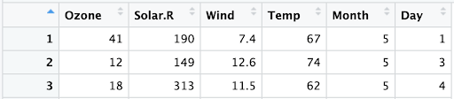
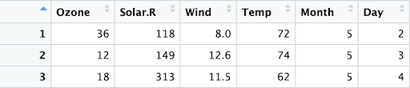
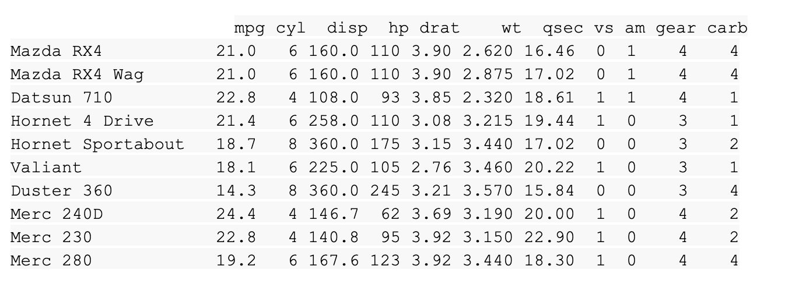
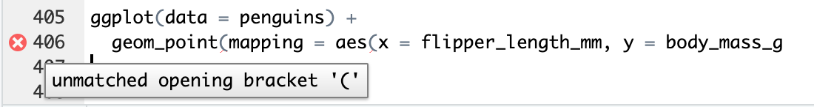

# Vectors and lists in R

In programming, a **data structure** is a format for organizing and storing data. The most common data structures in the R programming language include vectors, data frames, matrices, and arrays. This reading focuses on vectors in R. Later on, you’ll learn more about data frames, matrices, and arrays.

Think of a data structure as a house that contains your data. The separate parts of a house, such as bricks or boards, don’t provide shelter on their own. But talented builders can use their skills and expertise, along with a blueprint, to build a functional house. Data structures are similar: Single data elements don’t give you much information, but when data elements are combined into vectors, data frames, and other data structures, a talented data analyst can use them to solve a business challenge.

Just as there are rules that govern building a safe, sturdy house, there are certain rules that each type of data structure must follow. As you become more familiar with these rules, you’ll become better at working with data and using it to draw conclusions in R.


There are two types of vectors in R: **atomic vectors** and **lists**.

## Atomic vectors

First, you’ll explore the different types of atomic vectors. Then, you’ll learn how to use R code to create, identify, and name the vectors. You’ll also learn how to extract a subset of a vector.

In R, a** vector** is a group of data elements of the same type, stored in a one-dimensional sequence. Vectors can only contain data of one type.

There are six primary types of atomic vectors: logical, integer, double, character (which contain strings), complex, and raw. The last two–complex and raw–aren’t as common in data analysis, so you’ll focus on the first four in this course. Together, integers and double vectors are known as numeric vectors because they both contain numbers. This table summarizes the four primary types of atomic vectors:


| **Type**          | **Description **                   | **Example** |
| ------------------- | ------------------------------------ | ------------- |
| Logical (Boolean) | True/False                         | TRUE        |
| Integer           | Positive and negative whole values | 3           |
| Double            | Decimal values                     | 101.175     |
| Character         | String/character values            | “Coding”  |

This diagram demonstrates the hierarchy of relationships among these four main vector types. It indicates that numeric vectors can be either integers or doubles and that atomic vectors can be logical, numeric, or character.

Bottom: logical (arrow points to atomic), integer (arrow points to numeric), double (arrow points to numeric), character (arrow points to atomic)
Second to bottom: numeric (arrow points to atomic)
second level: atomic (arrow points to vector)
top: vector

### **Create vectors**

One way to create a vector in R is with the** **c() function. This function combines multiple values into a vector. To use it, enter the letter c followed by the values you want in your vector inside the parentheses, separated by a comma: c(x, y, z).

For example, you can use the c() function to store numeric data in a vector.

```{r}
c(2.5, 48.5, 101.5)
```

To create a vector of integers with the c() function, you must place the letter L directly after each number.

```{r}
c(1L, 5L, 15L)
```

You can also create a vector containing characters or logicals.

```{r}
c("Sara" , "Lisa" , "Anna")
c(TRUE, FALSE, TRUE)
```

To create a vector of a sequence of numbers, use a colon to separate the starting number and the ending number. For example, the following code creates a vector, z, that includes the whole numbers from 4 through 10. Run the code block to display the vector.

```{r}
z <- c(4:10)
z
```

### **Determine vector properties**

Every vector has two key properties: type and length.

#### **Vector type**

Determine a vector's type with the typeof() function. Place the code for the vector inside the parentheses of the function. When you run the function, R will tell you its type.  For example, when you run the following code, R returns the output "character":

```{r}
typeof(c("a" , "b"))
```

Similarly, if you use the typeof() function on a vector with integer values, then the output is "integer" instead:

```{r}
typeof(c(1L , 3L))
```

You can also check if a vector is a specific type by using an is function: is.logical(), is.double(), is.integer(), or is.character(). In this example, R returns a value of TRUE because the vector contains integers.

```{r}
x <- c(2L, 5L, 11L)
is.integer(x)
```

In contrast, in this example, R returns a value of FALSE because the vector contains logical values, not characters.

```{r}
y <- c(TRUE, TRUE, FALSE)
is.character(y)
```

#### Vector length

Determine the length of an existing vector–meaning, the number of elements it contains–with the **length()** function. In this example, an assignment operator assigns the vector to the variable x. Then, the **length()** function is applied to the variable. When you run the function, R tells you the length is 3.

```{r}
x <- c(33.5, 57.75, 120.05)
length(x)
```

### **Name vectors**

You can name elements in vectors of any type with the names() function. Names are useful for writing readable code and describing objects in R.

As an example, the following code assigns the variable, x, to a new vector with three elements. Then, it uses the names() function to assign a different name to each element of the vector. Finally, it displays the variable, x. Run the following code:

```{r}
x <- c(1, 3, 5)
names(x) <- c("a", "b", "c")
x
```

The R output indicates that the first element of the vector is named a, the second b, and the third c.

### Extract a subset of a vector

Sometimes, you might want to extract a particular element or subset of elements from a vector. Do this by referencing the element’s position in the vector or its name (if it has one) with the extract operator,** **[].

For example, if you want to call the second element in the vector x, use the code x[2].

```{r}
x <- c(1, 3, 5)
names(x) <- c("a", "b", "c")
x
x[2]
```

Alternatively, vector element 2 is named b, so you can call it with the code** **x["b"] :

```{r}
x <- c(1, 3, 5)
names(x) <- c("a", "b", "c")
x
x["b"]
```

In R, the indices of elements start with 1, so to refer to the first element in a vector you would use the code** **x[1].

Remember that an atomic vector can only contain elements of the same type.

## Lists

**Lists **are different from atomic vectors because their elements can be of any type—including characters, integers, and logical values. Lists can even contain other lists, matrices, vectors, or data frames.

### Create lists

You can create a list with the list()** **function. Similar to the c() function, the list() function is a list of the values inside the function’s parentheses: list(x, y, z). Run the following code to create a list that contains four different kinds of elements: character ("a"), integer (1L), double (1.5), and logical (TRUE).

```{r}
list("a", 1L, 1.5, TRUE)
```

As you learned, lists can contain other lists. Run the following code to create a list inside a list:

```{r}
list(list(list(1 , 3, 5)))
```

### **Determine a list's structure**

To find out what types of elements a list contains, use the** **str()** **function. To do so, place the code for the list inside the parentheses of the function. When you run the function, R presents the list’s data structure by describing its elements and their types.

Apply the str() function to the first list example:

```{r}
str(list("a", 1L, 1.5, TRUE))
```

R presents the list’s structure as containing four elements. Each element is a different data type: character (chr), integer (int**)**, number (num), and logical (logi).

Use the str() function to discover the structure of another example. First, assign the list to the variable z to make it easier to input in the str()** **function. Then, run the command str(z) to find z’s structure.

```{r}
z <- list(list(list(1 , 3, 5)))
str(z)
```

The indentation of the $ symbols reflect the nested structure of this list. Here, there are two levels, which means that there is a list within a list.

### **Name list elements**

List elements, like vector elements, can be named when you create them with the list() function:

```{r}
list('Chicago' = 1, 'New York' = 2, 'Los Angeles' = 3)
```

## Key takeaways

Data structures are formats for organizing and storing data. Vectors are a common data structure used in R. You can create two types of vectors in R: atomic vectors and lists. Both of these vectors store data elements in a one-dimensional sequence. However, lists can store multiple types of data, whereas atomic vectors can only store one type of data. To create a vector, use the combine function, c(). To create a list, use the list function, list().

## Resources for more information

To learn more about vectors and lists, check out [R for Data Science, Chapter 20: Vectors](https://r4ds.had.co.nz/vectors.html#vectors "This link takes you to Chapter 20 of the R for Data Science book."). R for Data Science is a classic resource for learning how to use R for data science and data analysis. It covers everything from cleaning to visualizing to communicating your data. If you want to get more details about the topic of vectors and lists, this chapter is a great place to start.

*You can save this reading for future reference. Feel free to download a .pdf version of this reading below:*

[Vectors & Lists in R.pdf](https://www.coursera.org/api/rest/v1/asset/download/pdf/sdWCfHp_Q12ynCNS9u3pXw?pageStart=&pageEnd=)

# Dates and times in R

In this reading, you’ll learn how R presents dates and times. You’ll also explore dates, times, and date-times with the tidyverse’s lubridate package.


## Load tidyverse and lubridate packages

This reading is ungraded, and you are not required to run the commands that are part of it. However, if you would like to follow along with the reading, begin by opening your preferred version of RStudio.

If you haven't already installed tidyverse, use the install.packages() function to do so with the command install.packages("tidyverse").

Next, load the core tidyverse to make it available in your current R session with the command** **library(tidyverse). Then, load the lubridate package with the command** **library(lubridate).

## Work with dates and times

This section covers the data types for dates and times in R and how to convert strings to date-time formats.

### **Types**

In R, there are three types of data that refer to an instant in time:

* A date ("2016-08-16")
* A time within a day ("20:11:59 UTC")
* And a date-time. This is a date plus a time ("2018-03-31 18:15:48 UTC")

As an example, if you run the command** **today(), R displays the current date as year (4 digits), month (2 digits), and day (2 digits):  "2023-11-27".

Time is given in UTC, which stands for Universal Time Coordinated, more commonly called Universal Coordinated Time. This is the international reference time scale that is used to regulate time around the world. To get the current date-time, run the now() function. Note that the time is presented to the nearest second, for example: "2021-11-27 16:25:05 UTC".

When you use  R for analysis, you may need to create date-time formats using the following methods:

* From a string
* From an existing date/time object

For each of these methods, R creates dates in the standard yyyy-mm-dd format by default.

You’ll explore each method in the following sections.

### Create a date from a string

Date/time data often comes as character strings. You’ll need to convert these strings to dates or date-times before you’ll be able to perform operations on them. You can do this with the tools provided by the lubridate package. These tools automatically discover the date/time format.

To use these tools, first identify the order in which the year, month, and day appear in your strings. Then, arrange the letters y, m, and d in the same order. That gives you the name of the lubridate function that will parse your date. For example, for the date 2021-01-20, you use the order ymd:

```{r}
ymd("2023-01-20")
```

It works the same way for any order. For example, month, day, and year. R still returns the date in yyyy-mm-dd format.

```{r}
mdy("January 20th, 2023")
# code output:
# [1] "2023-01-20"
```

Or, day, month, and year. R still returns the date in yyyy-mm-dd format.

```{r}
dmy("20-Jan-2021")
# code output:
# [1] "2021-01-20"
```

These functions also take unquoted numbers and convert them into the yyyy-mm-dd format.

```{r}
ymd(20210120)
# code output:
# [1] "2021-01-20"
```

### Create a date-time from a string

The ymd() function and its variations create dates. To create a date-time from a string*,* add an underscore and one or more of the letters h, m, and s (hours, minutes, seconds) to the name of the function:

```{r}
ymd_hms("2021-01-20 20:11:59")
# code output:
# [1] "2021-01-20 20:11:59 UTC"
mdy_hm("01/20/2021 08:01")
# code output:
# [1] "2021-01-20 08:01:00 UTC"
```

### Create a date from a date-time

Finally, you might want to switch between a date-time and a date.

You can use the function as_date() to convert a date-time to a date. For example, put the current date-time—now()—in the parentheses of the function.

```{r}
as_date(now())
# code output:
# [1] "2021-01-20"
```

## Key takeaways

In R, the data types date, time, and date-time can be used to represent a moment in time. You can use the lubridate package to work with these data types in R. Use variations of the ymd()** **function to create a date or date-time from a string. And use the as_date()** **function to convert a date-time to a date.

## Resources for more information

To learn more about working with dates and times in R, explore the following resources:

* [Dates and times with lubridate: Cheat Sheet](https://rawgit.com/rstudio/cheatsheets/master/lubridate.pdf): This resource provides a detailed map of all the different things you can do with the lubridate package. You don’t need to know all of this information, but this resource is a useful reference for any questions you might have about working with dates and times in R.
* [lubridate.tidyverse](https://lubridate.tidyverse.org/index.html): This is the “lubridate” entry from the official tidyverse documentation, which offers a comprehensive reference guide to the various tidyverse packages. Go to this link for an overview of key concepts and functions.

# Other common data structures

In this reading, you’ll continue exploring data structures through an introduction to data frames and matrices. You will learn about the basic properties of each structure, and simple ways to create them with R code. You’ll also briefly examine **files**, which are often used to access and store data and related information. The files and matrices sections of this reading are optional.

## Data structures

Recall that a data structure is like a house that contains your data, helping you to bring data elements together in a structured way that enables you to draw conclusions.


### **Data frames**

Data frames are the most common way of storing and analyzing data in R, so it’s important to understand what they are and how to create them. A **data frame** is a collection of columns containing data, similar to a spreadsheet or SQL table. Each column has a name that represents a variable and includes one observation per row. Data frames summarize data and organize it into a format that is easy to read and use.

For example, the data frame below shows the diamonds dataset, which is one of the preloaded datasets in R. Each column contains a single variable that is related to diamonds: carat, cut, color, clarity, depth, and so on. Each row represents a single observation.


There are a few key things to keep in mind when working with data frames:

- Data frames can include many different types of data, including numeric, logical, or character.
- Data frames can have only one element in each cell.
- Each column should be named.
- Each column should consist of elements of the same data type.

You will learn more about data frames later on in the program, but this is a great starting point.

If you need to manually create a data frame in R, you can use the data.frame() function. The data.frame() function takes vectors as input. In the parentheses, enter the name of the column, followed by an equals sign, and then the vector you want to input for that column. In this example, the x column is a vector with elements 1, 2, 3, and the y column is a vector with elements 1.5, 5.5, 7.5. Run the following code to create the data frame.

```{r}
data.frame(x = c(1, 2, 3) , y = c(1.5, 5.5, 7.5))
```

When you run the code, R displays the data frame in ordered rows and columns.

Use the extract operator to extract a subset from a data frame. When you use this operator on a data frame, it takes two arguments: the row(s) and column(s) you’d like to extract, separated by a comma. As an example, name the data frame above z. Then, to extract the element from the second row and the first column, use the code z\[2,1\], which returns a value of 2:

```{r}
z <- data.frame(x = c(1, 2, 3) , y = c(1.5, 5.5, 7.5))
z[2,1]
```

You’ll learn more about data frames later on in the course, but this is enough to get you started!

## Optional: Files

When you’re doing data analysis, you won’t usually create a data frame yourself. Instead, you’ll import data from another source, such as  a .csv file, a relational database, or a software program. For this reason, it’s essential to be able to work with files in R. In this section, you’ll explore a few of the most useful functions for working with files, including commands to create, copy, and delete files in R.

### Create a file

Use the file.create() function to create a blank file. Place the name and the type of the file in the parentheses of the function. Your file types will usually be something like .txt, .docx, or .csv.

```{r}
file.create("new_text_file.txt") 
file.create("new_word_file.docx") 
file.create("new_csv_file.csv") 
```

If the file is successfully created when you run the function, R will return a value of TRUE. Otherwise, R will return a value of FALSE.

```{r}
file.create("new_csv_file.csv")
# code output:
# [1] TRUE
```

### Copy a file

Copy a file with the file.copy() function. In the parentheses, add the name of the file to be copied. Then, enter a comma, and add the name of the destination folder that you want to copy the file to.

```{r}
file.copy("new_text_file.txt", "destination_folder")
```

If you check the **Files** tab in RStudio, a copy of the file appears in the relevant folder:


You can delete R files with the unlink() function. Enter the file’s name in the parentheses of the function.

```{r}
unlink("some_.file.csv")
```

You’ll learn techniques for importing files into R later in this course.

## Optional: Matrices

A **matrix** is a two-dimensional collection of data elements. This means it has both rows and columns. By contrast, a vector is a one-dimensional sequence of data elements. But like vectors, matrices can only contain a single data type. For example, you can’t have both logicals and numerics in a matrix.

To create a matrix in R, you can use the matrix() function. The matrix() function has two main arguments that you enter in the parentheses. First, add a vector. The vector contains the values you want to place in the matrix. Next, add at least one matrix dimension. You can choose to specify the number of rows or the number of columns by using the code nrow = or ncol =.

For example, to create a 2x3 (two rows by three columns) matrix containing the values 3-8, enter a vector containing that series of numbers: c(3:8). Then, enter a comma. Finally, enter nrow = 2 to specify the number of rows. Run the code:

```{r}
matrix(c(3:8), nrow = 2)
```

R displays a matrix with three columns and two rows (typically referred to as a “2x3”) that contain the numeric values 3, 4, 5, 6, 7, 8. R places the first value (3) of the vector in the uppermost row, and the leftmost column of the matrix, and continues the sequence from left to right.

You can also choose to specify the number of columns (ncol = ) instead of the number of rows (nrow = ). Run the code:

```{r}
matrix(c(3:8), ncol = 2)
```

R infers the number of rows automatically.

Similar to data frames, you can extract an element from a matrix with the extract operator, \[\].

## Key takeaways

As a data analyst, you’ll work with data frames often. Data frames in R are a collection of columns containing data, similar to a spreadsheet or SQL table. Data frames can contain data of different types, although each column must be of the same data type. By contrast, matrices are a collection of two-dimensional data elements that can only contain one data type. Usually, you’ll import data into R before you analyze it, so knowing how to use R to work with files is critical. You’ll learn techniques to import files later in this course, but you can also use R functions to create, copy, and delete files.

## Resources for more information

For more information on working with files in R, check out [R documentation: files](https://www.rdocumentation.org/packages/base/versions/3.6.2/topics/files). It’s a useful reference guide for functions in R code.

# Logical operators and conditional statements

Earlier in this course and program, you learned that a logical **operator** allows you to combine logical statements and return a logical value, TRUE or FALSE. In this reading, you’ll explore how the main types of logical operators can be used with datasets. In an optional section, you can also explore how logical operators create conditional statements that allow you to work with datasets in R.


In this scenario, you’re a researcher working with the airquality dataset available in R. It contains data about daily air quality measurements in New York from May to September of 1973.

To access the preloaded airquality dataset in RStudio:

1\. Log in to your [Posit Cloud](https://login.posit.cloud/) account and open an existing RStudio project or create a new project.

2\. Select the **Packages** tab in the Output pane.


3\. Select the **datasets** box in the System Library list of packages.


4\. Run the following command data("airquality") in the console to load the airquality dataset.

5\. Then, run the command View(airquality) to open the dataset in the Script Editor.

This dataset is a data frame with six columns: Ozone (the ozone measurement), Solar.R (the solar measurement), Wind (the wind measurement), Temp (the temperature in Fahrenheit), and the Month and Day these measurements were taken. Each row represents a specific month and day combination.


Next, explore how the AND, OR, and NOT operators might be helpful in this situation.

### **AND example**

You want to find observations (rows) in which conditions are both extremely sunny and windy. You define this as observations that have a Solar measurement of over 150 and a Wind measurement of over 10.

In R, you can express this logical statement as:

airquality\[, "Solar.R"\] > 150 & airquality\[, "Wind"\] > 10

This code specifies that R should return a value of TRUE for rows in which the airquality dataset’s Solar.R value is greater than 150 and its Wind value is greater than 10, and a value of FALSE otherwise.

Only the rows where both of these conditions are true fulfill the criteria, such as the following row:


Image of a single row of the airquality dataset in the RStudio data viewer. The Solar.R value is 313 and the Wind value is 11.5.

### **OR example**

Next, you want to specify rows where it’s extremely sunny or it’s extremely windy, which you define as having a Solar measurement of over 150 or a Wind measurement of over 10.

In R, you can express this logical statement as:

airquality\[, "Solar.R"\] > 150 | airquality\[, "Wind"\] > 10

This code specifies that R should return a value of TRUE when either the airquality dataset’s Solar.R value is greater than 150 or its Wind value is greater than 10. Otherwise, R will return a value of FALSE.

Rows where either of these conditions are true fulfill the criteria, such as the following rows:



Image of three rows of the airquality dataset in the RStudio data viewer. In row 1, the Solar.R value is 190 and the Wind value is 7.4. In row 2, the Solar.R value is 149 and the Wind value is 12.6. The Solar.R value is 313 and the Wind value is 11.5

### **NOT example**

If you just want to focus on the weather measurements for days that aren't the first day of the month, use the NOT condition.

In R, this logical statement is expressed:

airquality\[, "Day"\] != 1

This code specifies that R should return a value of TRUE when the airquality dataset’s Day value is not 1 and a value of FALSE when the Day value is 1.

Rows where this condition is true fulfill the criteria, such as the following rows:



Finally, you want to focus on scenarios that are neither extremely sunny nor extremely windy, based on your previous definitions of extremely sunny and extremely windy. In other words, the following statement should not be true: either a Solar measurement greater than 150 or a Wind measurement greater than 10.

Notice that this statement is the opposite of the OR statement used above. To express this statement in R, you can put an exclamation point (!) in front of the previous OR statement:

!(airquality\[, "Solar.R"\] > 150 | airquality\[, "Wind"\] > 10)

R will apply the NOT operator to everything within the parentheses.

Rows where this condition is true fulfill the criteria, such as the following row:


## Optional: Conditional statements

A **conditional statement** is a declaration that, if a certain condition holds, then a certain event must take place. For example, “If the temperature is above freezing, then I will go outside for a walk.” If the first condition is true (the temperature is above freezing), then the second condition will occur (I will go for a walk). Conditional statements in R code have a similar logic.

In this section, you’ll explore how to create conditional statements in R using three related statements:

- if()
- else()
- else if()

### **if statement**

The if statement sets a condition, and if the condition evaluates to TRUE, the R code associated with the if statement is executed.

In R, you place the code for the condition inside the parentheses of the if statement. The code to be executed if the condition is TRUE follows in curly braces (expr). Note that in this case, the second curly brace is placed on its own line of code and identifies the end of the code that you want to execute.

```{r}
if (condition) {
  expr
}
```

For example, create a variable x equal to 4.

x <- 4

Next, create a conditional statement: if x is greater than 0, then R will print out the string "x is a positive number".

```{r}
if (x > 0) {
  print("x is a positive number")
}
```

As x is equal to 4, the condition is true (because 4 is greater than 0). Therefore, when you run the code, R prints out the string "x is a positive number".

But, if you change x to a negative number, such as -4, then the condition will be FALSE because -4 is not greater than 0. If you run the code, R will not execute the print statement. Instead, a blank line will appear as the result.

Here’s an example using the airquality data:

if(airquality\[1, "Temp"\] < 80) {print("It's not a hot day.")}

Running this code will check the value in the first row of the airquality dataset’s Temp column. If that value is less than 80 degrees, it will print "It’s not a hot day." Otherwise, it won’t print anything.

### **else statement**

The else statement is used in combination with an if statement. This is how the code is structured in R:

```{r}
if (condition) {
  expr1
} else {
  expr2
}
```

The code associated with the else statement is executed only when the condition in the if statement is not TRUE. In other words, if the condition is TRUE, then R will execute the code in the if statement (expr1); if the condition is not TRUE, then R will execute the code in the else statement (expr2).

Explore the following example. First, create a variable x equal to 7.

x <- 7

Next, set up the following conditions:

- If x is greater than 0, R will print "x is a positive number".
- If x is less than or equal to 0, R will print "x is either a negative number or zero".

In the code, the first condition (x > 0) is part of the if statement. The second condition of x less than or equal to 0 is implied in the else statement. If x > 0, then R will print "x is a positive number". Otherwise, R will print "x is either a negative number or zero".

```{r}
x <- 7
if (x > 0) {
  print ("x is a positive number")
} else {
  print ("x is either a negative number or zero")
}
```

As 7 is greater than 0, the condition of the if statement is true. So, when you run the code, R prints out "x is a positive number".

But, if you set x equal to -7, the condition of the if statement is not true because -7 is not greater than 0. Therefore, R will execute the code in the else statement. When you run the following code, R prints out "x is either a negative number or zero".

```{r}
x <- -7
if (x > 0) {
  print("x is a positive number")
} else {
  print ("x is either a negative number or zero")
}
```

Here’s an example using the airquality data:

```{r}
if (airquality$Temp[1] < 80) {
  print("It's not a hot day!")
} else {
  print("It's a hot day.")
}
```

Similar to the first example, the if statement checks the Temp value for the first row in airquality. This time, if the if statement’s condition is FALSE because Temp is greater than 80, the else statement is printed.

### **else if statement**

In some cases, you might want to customize your conditional statement even further by adding the else if statement. The else if statement comes in between the if statement and the else statement. This is the code structure:

```{r}
if (condition1) {
  expr1
} else if (condition2) {
  expr2
} else {
  expr3
}
```

If the if condition (condition1) is met, then R executes the code in the first expression (expr1). If the if condition is not met and the else if condition (condition2) is met, then R executes the code in the second expression (expr2). If neither of the two conditions are met, R executes the code in the third expression (expr3).

In the previous example, using only the if and else statements, R can only print "x is either a negative number or zero" if x equals 0 or x is less than zero. Imagine you want R to print the string "x is zero" if x equals 0. You need to add another condition using the else if statement.

Try an example. First, create a variable x equal to negative 1. Run the code to save the variable to memory.

x <- -1

Now, set up the following conditions:

- If x is less than 0, print "x is a negative number"
- If x equals 0, print "x is zero"
- Otherwise, print "x is a positive number"

In the code, the first condition will be part of the if statement, the second condition will be part of the else if statement, and the third condition will be part of the else statement. If x is less than 0, then R will print "x is a negative number". If x is equal to 0, then R will print "x is zero". Otherwise, R will print "x is a positive number".

```{r}
x <- -1
if (x < 0) {
  print("x is a negative number")
} else if (x == 0) {
  print("x is zero")
} else {
  print("x is a positive number")
}
```

When you run the code, the condition for the if statement evaluates to TRUE because -1 is less than 0. So, R prints "x is a negative number".

\[1\] "x is a negative number"

If you make x equal 0, R will first check the if condition (x < 0) and determine that it is FALSE. Then, R will evaluate the else if condition. This condition, x==0, is TRUE. So, in this case, R prints "x is zero".

If you make x equal to 1, both the if condition and the else if condition evaluate to FALSE. So, R will execute the else statement and print "x is a positive number".

As soon as R discovers a condition that evaluates to TRUE, R executes the corresponding code and ignores the rest.

Here’s an example using the airquality data:

```{r}
ozone_level <- airquality[1,"Ozone"]
if(is.na(ozone_level)){
  print("Ozone reading is missing for the first day.")
} else if(ozone_level < 30){ 
  print("Low ozone level.")
} else if(ozone_level < 100){ 
  print("Moderate ozone level.")
} else{
  print("High ozone level.")
}
```

In this example, the code first assigns the ozone measurement of the first day in the airquality dataset to a variable ozone\_level.

It then checks if this value is missing with the is.na() function. If the value is missing, R prints that the ozone reading is missing.

If the ozone\_level value is not missing, R moves to the next condition, checking if it's less than 30 to determine if the ozone level is low. If it's not less than 30 but still less than 100, it prints that it's a moderate ozone level. If none of the previous conditions are met, meaning the ozone level is 100 or more, it prints that it's a high ozone level.

This sequence of if, else if, and else statements allows for multiple, mutually exclusive conditions to be checked in order.

## Key takeaways

In R, the logical operators for AND (&), OR (|), and NOT(!) can be used to check a condition and return a logical data type. In R, logical data is presented as T or TRUE when a condition is met, and F or FALSE when it is not. Additionally, you can use if, else, and else if statements to complete a task depending on whether one or more conditions are met. Using logical operators and conditional statements with your data can be a powerful analytical tool when you need to find observations that match specific criteria.

## Resources for more information

To learn more about logical operators and conditional statements, check out DataCamp's tutorial [Conditionals and Control Flow in R](https://www.datacamp.com/community/tutorials/conditionals-and-control-flow-in-r). DataCamp is a popular resource for people learning about computer programming. The tutorial is filled with useful examples of coding applications for logical operators and conditional statements (and relational operators), and offers a helpful overview of each topic and the connections between them.

You can save this reading for future reference. Feel free to download a .pdf version of this reading below:

[Logical Operators & Conditional Statements.pdf](https://www.coursera.org/api/rest/v1/asset/download/pdf/5sfNJkpvTDOYo7fktMvQrw?pageStart=&pageEnd=)

# Guide: Keeping your code readable

Download this helpful guide for best practices to keep your R code readable:

[Keeping your code readable.pdf](https://www.coursera.org/api/rest/v1/asset/download/pdf/O4EaLwvJSyWBGi8LycsltA?pageStart=&pageEnd=)

# Available R packages

To make the most of R for your data analysis, you will need to install packages. **Packages** are units of reproducible R code that you can use to add more functionality to R. The best part is that the R community creates and shares packages so that other users can access them! In this reading, you will learn more about widely used packages and where to find them.


Packages can be found in repositories, which are collections of useful packages that are ready to install. You can find repositories on [**Bioconductor**](http://bioconductor.org/ "This link takes you to the Bioconductor home page."), [**R-Forge**](https://r-forge.r-project.org/ "This link takes you to the R-Forge welcome page."), [**rOpenSci**](https://ropensci.org/ "This link takes you to the ROpenSci home page."), or [**GitHub**](https://github.com/ "This link takes you to the GitHub home page."), but the most commonly used repository is the Comprehensive R Archive Network or [**CRAN**](https://cran.r-project.org/ "This link takes you to the home page for The Comprehensive R Archive Network (CRAN)."). CRAN stores code and documentation so that you can install packages into your own RStudio space.

## Package documentation

Packages will not only include the code itself, but also documentation that explains the package’s author, function, and any other packages that you will need to download. When you are using CRAN, you can find the package documentation in the DESCRIPTION file.

Check out Karl Broman's [**R Package Primer**](https://kbroman.org/pkg_primer/ "This link takes you to Karl Broman's online primer on R packages.")** **to learn more.

## Choosing the right packages

With so many packages out there, it can be hard to know which ones will be the most useful for your library or directory of installed packages. Luckily, there are some great resources out there:

* [**Tidyverse**](https://www.tidyverse.org/ "This link takes you to the Tidyverse home page."): the tidyverse is a collection of R packages specifically designed for working with data. It’s a standard library for most data analysts, but you can also download the packages individually.
* [**Quick list of useful R packages**](https://support.rstudio.com/hc/en-us/articles/201057987-Quick-list-of-useful-R-packages "This link takes you to a list of R packages recommended by RStudio Support."): this is RStudio Support’s list of useful packages with installation instructions and functionality descriptions.
* [**CRAN Task Views**](https://cran.r-project.org/web/views/ "This link takes you to a list of packages on CRAN by topic or task in alphabetical order."): this is an index of CRAN packages sorted by task. You can search for the type of task you need to perform and it will pull up a page with packages related to that task for you to explore.

You will discover more packages throughout this course and as you use R more often, but this is a great starting point for building your own library.

# R resources for more help


The R community is full of dedicated users helping each other find solutions to problems and new ways of using R. There are also a lot of great blogs where you can find tutorials and other resources.  Here are a few of them:

* [**Posit Blog:**](https://posit.co/blog/ "This link takes you to the home page for Posit blog articles.") Posit's blog is a great place to find information about RStudio, including company news.  You can read the most recent [**featured posts**](https://blog.rstudio.com/categories/featured/ "This link takes you to the featured RStudio blog posts.") or use the search bar and the list of categories on the left side of the page to explore specific topics you might find interesting or to search for a specific post.
* [**Stack Overflow:**](https://stackoverflow.blog/ "This link takes you to The Overflow which is Stack Overflow's blog feed.")** **The Stack Overflow blog posts opinions and advice from other coders. This is a great place to stay in touch with conversations happening in the community.
* [**R-Bloggers:**](https://www.r-bloggers.com/ "This link takes you to the R-Bloggers home page.")** **The R-Bloggers blog has useful tutorials and news articles posted by other R users in the community.
* [**R-Bloggers' tutorials for learning R: **](https://www.r-bloggers.com/2015/12/how-to-learn-r-2/#h.y5b98o9o2h1r "This link takes you to R-Bloggers' collection of tutorials for learning R.")This blog post from R-Bloggers compiles some basic R tutorials and also links to more advanced guides.

# More about tibbles

Tibbles are a streamlined variation of data frames. As a data analyst, you’ll use them to efficiently organize data in R, especially if your team uses other tidyverse packages. In this reading, you’ll explore tibbles and how they’re distinct from standard data frames. You’ll also learn the code for creating them in R.

## Tibbles

Tibbles are a type of data frame specifically designed for improved data management in R. While a data frame resembles a collection of columns, similar to a spreadsheet or a SQL table, tibbles offer a more streamlined approach. Tibbles automatically pull up only the first 10 rows of a dataset and only as many columns as can fit on your screen. This feature is particularly useful when handling large sets of data. Rather than trying to examine an entire dataset, tibbles allow you to view a small snapshot. Additionally, unlike data frames, tibbles maintain the integrity of your variable names and data types throughout, ensuring consistency in your data.


The tibble package is part of the core tidyverse. If you’ve already installed the tidyverse, you have what you need to start working with tibbles. If not, install and load the tidyverse to get started.

## Tibbles increase efficiency

Understanding tibbles is essential for a successful career in data analysis for several key reasons. In particular, tibbles allow you to:

- **Efficiently explore data**: Tibbles simplify data exploration by automatically presenting a manageable preview of the data.
- **Maintain consistency and data integrity**: Tibbles maintain the consistency of variable names and data types, ensuring data integrity through the analysis process. This reduces the risk of errors and data mishandling, a critical consideration in data analysis.
- **Integrate with the tidyverse**: Tibbles seamlessly integrates with the tidyverse ecosystem, aligning with industry best practices. Mastering tibbles will enhance your proficiency in data manipulation and visualization, providing you with a comprehensive toolkit.

## Explore a tibble

Here is an example of how to create a tibble in R. You can use the pre-loaded diamonds dataset that you’ve explored in previous activities. As a reminder, the diamonds dataset includes information about different diamond qualities, including carat, cut, color, clarity, and more.

### **Load the dataset**

You can load the dataset with the data() function using the the following code:

```{r}
install.packages("tidyverse")
library(tidyverse) 
data(diamonds)
```

Then, add the dataset to the data viewer in RStudio with the View() function.

View(diamonds)

The dataset has 10 columns and thousands of rows. This image includes part of the dataset:


### **Create a tibble**

Use the function as\_tibble() to create a tibble from an existing data frame or matrix. Specify the data frame you’d like to convert to a tibble in the function:

as\_tibble(diamonds)

Running this function will display the diamonds tibble, but it won’t save the tibble. To save the diamonds dataset as a tibble, save it to a new object with the following code:

diamonds\_tibble <- as\_tibble(diamonds)

Then, examine it with the code:

diamonds\_tibble

### **Examine the tibble**

The following image of a tibble in R includes the same data, but the output is slightly different.


While RStudio’s built-in data frame tool returns thousands of rows in the diamonds dataset, the tibble only returns the first 10 rows in a neatly organized table, which makes it easier to view and print. The tibble also includes the type of data in each column.

## Key takeaways

Tibbles offer a streamlined approach to data management, automatically displaying only the first 10 rows of a dataset and only as many columns as can fit on your screen. This makes it easier to handle large datasets while maintaining the integrity of your variable names and data types. Using tibbles in R can make your data exploration more efficient, ensure data integrity, and reduce the risk of errors and data mishandling. The seamless integration of tibbles with the tidyverse ecosystem aligns with industry best practices. Proficiency with tibbles can be a powerful addition to your data analysis toolkit.

## Resources for more information

For more information on tibbles, access the following resources:

- The entry for [tibble](https://tibble.tidyverse.org/) in the tidyverse documentation summarizes what a tibble is and how it works in R code. If you want a quick overview of the essentials, this is the place to go.
- The [Tidy chapter](https://rstudio-education.github.io/tidyverse-cookbook/tidy.html#)

# Data-import basics

_You can save this reading for future reference. Feel free to download a PDF version of this reading below:_

[Data import basics.pdf](https://www.coursera.org/api/rest/v1/asset/download/pdf/sVF77vMISbONi27VPuNHsA?pageStart=&pageEnd=)

## **The** data() **function**


The default installation of R comes with a number of preloaded datasets that you can practice with. This is a great way to develop your R skills and learn about some important data analysis functions. Plus, many online resources and tutorials use these sample datasets to teach coding concepts in R.

You can use the data() function to load these datasets in R. If you run the data() function without an argument, R will display a list of the available datasets.

data()

This includes the list of preloaded datasets from the datasets package.


If you want to load a specific dataset, just enter its name in the parentheses of the data() function. For example, let’s load the mtcars dataset, which has information about cars that have been featured in past issues of _Motor Trend_ magazine.

data(mtcars)

When you run the function, R will load the dataset. The dataset will also appear in the Environment pane of your RStudio. The Environment pane displays the names of the data objects, such as data frames and variables, that you have in your current workspace. In this image, mtcars appears in the fifth row of the pane. R tells us that it contains 32 observations and 11 variables.


Now that the dataset is loaded, you can get a preview of it in the R console pane. Just type its name...

mtcars

...and then press ctrl (or cmd) and enter.



You can also display the dataset by clicking directly on the name of the dataset in the Environment pane. So, if you click on mtcars in the Environment pane, R automatically runs the View() function and displays the dataset in the RStudio data viewer.


Try experimenting with other datasets in the list if you want some more practice.

## **The readr package**

In addition to using R’s built-in datasets, it is also helpful to import data from other sources to use for practice or analysis. The readr package in R is a great tool for reading rectangular data. Rectangular data is data that fits nicely inside a rectangle of rows and columns, with each column referring to a single variable and each row referring to a single observation.

Here are some examples of file types that store rectangular data:

- **.csv** **(comma separated values)**: a .csv file is a plain text file that contains a list of data. They mostly use commas to separate (or delimit) data, but sometimes they use other characters, like semicolons.
- **.tsv (tab separated values)**: a .tsv file stores a data table in which the columns of data are separated by tabs. For example, a database table or spreadsheet data.
- **.fwf** **(fixed width files)**: a .fwf file has a specific format that allows for the saving of textual data in an organized fashion.
- **.log:** a .log file is a computer-generated file that records events from operating systems and other software programs.

Base R also has functions for reading files, but the equivalent functions in readr are typically _much_ faster. They also produce tibbles, which are easy to use and read.

The readr package is part of the core tidyverse. So, if you’ve already installed the tidyverse, you have what you need to start working with readr. If not, you can install the tidyverse now.

### **readr functions**

The goal of readr is to provide a fast and friendly way to read rectangular data. readr supports several read\_ functions. Each function refers to a specific file format.

- read\_csv(): comma-separated values (.csv) files
- read\_tsv(): tab-separated values files
- read\_delim(): general delimited files
- read\_fwf(): fixed-width files
- read\_table(): tabular files where columns are separated by white-space
- read\_log(): web log files

These functions all have similar syntax, so once you learn how to use one of them, you can apply your knowledge to the others. This reading will focus on the read\_csv() function, since .csv files are one of the most common forms of data storage and you will work with them frequently.

In most cases, these functions will work automatically: you supply the path to a file, run the function, and you get a tibble that displays the data in the file. Behind the scenes, readr parses the overall file and specifies how each column should be converted from a character vector to the most appropriate data type.

### **Reading a .csv file with readr**

The readr package comes with some sample files from built-in datasets that you can use for example code. To list the sample files, you can run the readr\_example() function with no arguments.

```{r}
readr_example()
[1] "challenge.csv"     "epa78.txt"         "example.log"      
[4] "fwf-sample.txt"    "massey-rating.txt" "mtcars.csv"       
[7] "mtcars.csv.bz2"    "mtcars.csv.zip"
```

The "mtcars.csv" file refers to the _mtcars_ dataset that was mentioned earlier. Let’s use the read\_csv() function to read the "mtcars.csv" file, as an example. In the parentheses, you need to supply the path to the file. In this case, it’s "readr\_example("mtcars.csv").

read\_csv(readr\_example("mtcars.csv"))

When you run the function, R prints out a column specification that gives the name and type of each column.

```{r}
── Column specification ──
cols(
  mpg = col_double(),
  cyl = col_double(),
  disp = col_double(),
  hp = col_double(),
  drat = col_double(),
  wt = col_double(),
  qsec = col_double(),
  vs = col_double(),
  am = col_double(),
  gear = col_double(),
  carb = col_double()
)
```

R also prints a tibble.

```{r}
# A tibble: 32 x 11
     mpg   cyl  disp    hp  drat    wt  qsec    vs    am  gear  carb
   <dbl> <dbl> <dbl> <dbl> <dbl> <dbl> <dbl> <dbl> <dbl> <dbl> <dbl>
 1  21       6  160    110  3.9   2.62  16.5     0     1     4     4
 2  21       6  160    110  3.9   2.88  17.0     0     1     4     4
 3  22.8     4  108     93  3.85  2.32  18.6     1     1     4     1
 4  21.4     6  258    110  3.08  3.22  19.4     1     0     3     1
 5  18.7     8  360    175  3.15  3.44  17.0     0     0     3     2
 6  18.1     6  225    105  2.76  3.46  20.2     1     0     3     1
 7  14.3     8  360    245  3.21  3.57  15.8     0     0     3     4
 8  24.4     4  147.    62  3.69  3.19  20       1     0     4     2
 9  22.8     4  141.    95  3.92  3.15  22.9     1     0     4     2
10  19.2     6  168.   123  3.92  3.44  18.3     1     0     4     4
# ... with 22 more rows
```

## Optional: the readxl package

To import spreadsheet data into R, you can use the readxl package. The readxl package makes it easy to transfer data from Excel into R. Readxl supports both the legacy .xls file format and the modern xml-based .xlsx file format.

The readxl package is part of the tidyverse but is not a _core_ tidyverse package, so you need to load readxl in R by using the library() function.

library(readxl)

### **Reading an .xlsx file with readxl**

Like the readr package, readxl comes with some sample files from built-in datasets that you can use for practice. You can run the code readxl\_example() to see the list.

You can use the read\_excel() function to read a spreadsheet file just like you used read\_csv() function to read a  .csv file. The code for reading the example file "type-me.xlsx" includes the path to the file in the parentheses of the function.

read\_excel(readxl\_example("type-me.xlsx"))

You can use the [excel\_sheets()](https://readxl.tidyverse.org/reference/excel_sheets.html "This link takes you to Tidyverse's readxl documentation that describes the excel_sheets function. ") function to list the names of the individual sheets.

 excel\_sheets(readxl\_example("type-me.xlsx"))

\[1\] "logical\_coercion" "numeric\_coercion" "date\_coercion" "text\_coercion"

You can also specify a sheet by name or number.  Just type "sheet =" followed by the name or number of the sheet. For example, you can use the sheet named "numeric\_coercion" from the list above.

read\_excel(readxl\_example("type-me.xlsx"), sheet = "numeric\_coercion")

When you run the function, R returns a tibble of the sheet.

```{r}
# A tibble: 7 x 2                                                                 
  `maybe numeric?` explanation  
  <chr>            <chr>    
1 NA               "empty"  
2 TRUE             "boolean true"   
3 FALSE            "boolean false"  
4 40534            "datetime"   
5 123456           "the string \"123456\""
6 123456           "the number 123456"  
7 cabbage          "\"cabbage\""   
```

## Additional resources

- If you want to learn how to use readr functions to work with more complex files, check out the [Data Import chapter](https://r4ds.had.co.nz/data-import.html "This link takes you to the Data Import chapter of the R for Data Science book.") of the R for Data Science book. It explores some of the common issues you might encounter when reading files, and how to use readr to manage those issues.
- The [readxl](https://readxl.tidyverse.org/ "This link takes you to tidyverse's documentation for the readxl package.") entry in the tidyverse documentation gives a good overview of the basic functions in readxl, provides a detailed explanation of how the package operates and the coding concepts behind them, and offers links to other useful resources.
- The R "datasets" package contains lots of useful preloaded datasets. Check out [The R Datasets Package](https://stat.ethz.ch/R-manual/R-devel/library/datasets/html/00Index.html "This link takes you to a list of the datasets in the R datasets pacakge.")

# File-naming conventions

An important part of cleaning data is making sure that all of your files are accurately named. Regardless of the file-naming conventions an analyst prefers to follow, file names should be accurate, consistent, and easy to read. This reading provides some general guidelines for you to follow when naming or renaming your data files.


## What’s in a (file)name?

When you first start working with R (or any other programming language, analysis tool, or platform, for that matter), you or your company should establish naming conventions for your files. This helps ensure that anyone reviewing your analysis–yourself included–can quickly and easily find what they need. Next are some helpful *do’s* and *don’ts* to keep in mind when naming your files.

### **Do**

* Keep your filenames to a reasonable length.
* Use underscores and hyphens for readability.
* Start or end your filename with a letter or number.
* Use a standard date format when applicable; example: YYYY-MM-DD.
* Use filenames for related files that work well with default ordering, (e.g. in chronological order, or logical order using numbers first).


| Examples of good filenames      |
| --------------------------------- |
| 2020-04-10_march-attendance.R   |
| 2021_03_20_new_customer_ids.csv |
| 01_data-sales.html              |
| 02_data-sales.html              |

### **Don't**

* Use unnecessary additional characters in filenames.
* Use spaces or *illegal* characters; examples: &, %, #, <, or >.
* Start or end your filename with a symbol.
* Use incomplete or inconsistent date formats; example: M-D-YY.
* Use filenames for related files that do not work well with default ordering, (e.g. a random system of numbers or date formats, or using letters first).


| Examples of filenames to avoid           |
| ------------------------------------------ |
| 4102020marchattendance<workinprogress>.R |
| _20210320*newcustomeridsforfebonly.csv   |
| firstfile_for_datasales/1-25-2020.html   |
| secondfile_for_datasales/2-5-2020.html   |

## Additional resources

These resources include more info about some of the file naming standards discussed here, and provide additional insights into best practices.

* [**How to name files**](https://speakerdeck.com/jennybc/how-to-name-files "This link takes you to an online presentation on how to name files."): this resource from Speaker Deck is a playful take on file naming. It includes several slides with tips and examples for how to accurately name lots of different types of files. You will learn why filenames should be both machine readable and human readable.
* [**File naming and structure**](https://www.tikar.or.id/?q=node/205 "princeton university file naming guide"): this resource from the Princeton University Library provides an easy-to-scan list of best practices, considerations, and examples for developing file naming conventions.

# More on R operators

As you’ve learned, an **operator** is a symbol that names the operation or calculation to be performed, often in a formula. In an earlier video, you explored using the assignment and arithmetic operators to assign variables and perform calculations. In this reading, you’ll review a detailed summary of the main types of operators in R and learn how to use specific operators in R code.

## Operators

In R, there are four main types of operators:

1. Assignment
2. Arithmetic
3. Relational
4. Logical

### **Assignment operators**

**Assignment operators** assign values to variables.

In many scripting programming languages the equal sign (\=) is used to assign a variable. In R, the best practice is to use the arrow assignment (<-). Technically, the single arrow assignment can be used in the left or right direction. But the rightward assignment is not generally used in R code.

For example, to assign a variable called x the value of 2 in R, use the command x <- 2. When you enter x into the console and press enter, the output is \[1\] 2.

### **Arithmetic operators**

**Arithmetic operators** perform basic math operations, such as addition, subtraction, multiplication, and division.

Explore some examples by creating two variables: x equals 2 and y equals 5. Note that you use the assignment operator to store these values.

```{r}
x <- 2
y <- 5
```

The table below summarizes the different arithmetic operators in R.


| **Operator** | **Description**                                            | **Example Code** | **Result/Output** |
| -------------- | ------------------------------------------------------------ | ------------------ | ------------------- |
| +            | Addition                                                   | x + y            | [1] 7             |
| -            | Subtraction                                                | x - y            | [1] -3            |
| *            | Multiplication                                             | x * y            | [1] 10            |
| /            | Division                                                   | x / y            | [1] 0.4           |
| %%           | Modulus (returns the remainder after division)             | y %% x           | [1] 1             |
| %/%          | Integer division (returns an integer value after division) | y %/% x          | [1] 2             |
| ^            | Exponent                                                   | y ^ x            | [1] 25            |

This table contains the results of each mathematical operation when x is 2 and y is 5. The results are as follows:

- Addition: x + y or 2 + 5 = 7
- Subtraction: x - y or 2 - 5 = -3
- Multiplication: x \* y or 2 \* 5 = 10
- Division: x / y or 2 / 5 = 0.4
- Modulus: y %% x or 5 %% 2 = 1
- Integer division: y %/% x or 5 %/% 2 = 2
- Exponent: y^x or 5^2 = 25

### **Relational operators**

**Relational operators**, also known as comparators, allow you to compare values. Relational operators identify how one R object relates to another—like whether an object is less than, equal to, or greater than another object. The output for relational operators is either TRUE or FALSE (which is a logical data type, or boolean).

To explore these relational operators, create two variables: x equals 2 and y equals 5:

```{r}
x <- 2
y <- 5
```

Then, use x and y with the relational operators. The table below summarizes the results of using these operators. Notice that in each example, the output is boolean: TRUE or FALSE.


| **Operator** | **Description**          | **Example Code** | **Result/Output** |
| -------------- | -------------------------- | ------------------ | ------------------- |
| <            | Less than                | x < y            | \[1\] TRUE        |
| \>           | Greater than             | x > y            | \[1\] FALSE       |
| <=           | Less than or equal to    | x < = 2          | \[1\] TRUE        |
| \>=          | Greater than or equal to | y >= 10          | \[1\] FALSE       |
| \==          | Equal to                 | y == 5           | \[1\] TRUE        |
| !=           | Not equal to             | x != 2           | \[1\] FALSE       |

This table demonstrates whether example code evaluates to TRUE or FALSE. For example, if x equals 2 and y equals 5:

- The code x < y or 2 < 5 evaluates to TRUE.
- The code x > y or 2 > 5 evaluates to FALSE.
- The code x < = 2 or 2 < =2 evaluates to TRUE.
- The code y >== 10 or 5 >== 10 evaluates to FALSE.
- The code y == 5 or y == 5 evaluates to TRUE.
- The code x != 2 or 2 != 2 evaluates to FALSE.

### **Logical operators**

**Logical operators** allow you to combine logical statements and return a logical value, TRUE or FALSE. You encountered logical operators earlier in this program, and they work similarly in R.

The table below summarizes the logical operators in R.


| **Operator** | **Description**          |
| -------------- | -------------------------- |
| &            | Element-wise logical AND |
| \|           | Element-wise logical OR  |
| !            | Logical NOT              |

This table summarizes the operators &, |, and !.

Next, review logical operators and how they work in R code.

**Element-wise logical AND operator “&”**

The AND operator compares two logical statements or values. It returns TRUE only if both individual statements or values are TRUE. This means that TRUE & TRUE evaluates to TRUE. However, FALSE & TRUE, TRUE & FALSE, and FALSE & FALSE all evaluate to FALSE.

If you run the the corresponding code in R, you get the following results:

```{r}
TRUE & TRUE
[1] TRUE
TRUE & FALSE
[1] FALSE
FALSE & TRUE
[1] FALSE
FALSE & FALSE
[1] FALSE
```

You can illustrate this using the results of our comparisons. Create a variable x that is equal to 10 with the following code.

```{r}
x <- 10
```

To check if x is greater than 3 but less than 12, use x > 3 and x < 12 as the values of an “AND” expression.

```{r}
x > 3 & x < 12
```

When you run this line of code, R returns the result TRUE.

```{r}
[1] TRUE
```

The first part, x > 3 will evaluate to TRUE because 10 is greater than 3. The second part, x < 12 will also evaluate to TRUE because 10 is less than 12. So, as both values are TRUE, the result of the AND expression is TRUE.

However, if you make x equal to 20, the expression x > 3 & x < 12 will return a different result.

```{r}
x <- 20
x > 3 & x < 12
[1] FALSE
```

Although x > 3 is TRUE (20 > 3), x < 12 is FALSE (20 < 12). If one part of an AND expression is FALSE, the entire expression is FALSE.

### **The element-wise OR operator “|”**

The OR operator (|) works in a similar way to the AND operator (&). The main difference is that at least one of the values of the OR operation must be TRUE for the entire OR operation to evaluate to TRUE. This means that TRUE|TRUE, TRUE|FALSE, and FALSE|TRUE all evaluate to TRUE. However, FALSE|FALSE, evaluates to FALSE.

If you run the code, you get the following results:

```{r}
> TRUE|TRUE
[1] TRUE
> TRUE|FALSE
[1] TRUE
> FALSE|TRUE
[1] TRUE
> FALSE|FALSE
[1] FALSE
```

For example, suppose you create a variable y that equals 7. To check if y is less than 8 or greater than 16, use the following expression:

```{r}
y <- 7
y < 8 | y > 16
```

The comparison result is TRUE (7 is less than 8)|FALSE (7 is not greater than 16). As only one value of an OR expression needs to be TRUE for the entire expression to be TRUE, R returns a result of TRUE.

Now, suppose y is 12. The expression y < 8 | y > 16 now evaluates to FALSE (12 < 8) | FALSE (12 > 16). Both comparisons are FALSE, so the result is FALSE.

```{r}
y <- 12
y < 8 | y > 16
[1] FALSE
```

### **Logical NOT (!)**

The NOT operator simply negates the logical value, and evaluates to its opposite. In other words, !TRUE evaluates to FALSE, and !FALSE evaluates to TRUE. In R, zero is considered FALSE and all non-zero numbers are considered TRUE.

For example, set the variable x equal to 10. Then, evaluate the following code:

```{r}
!(x < 15)
[1] FALSE
```

The NOT operation evaluates to FALSE because it takes the opposite logical value of the statement x < 15, which is TRUE (10 is less than 15).

## Key takeaways

The essential operators in R are categorized into four main types: assignment, arithmetic, relational, and logical. Assignment operators are used to assign values to variables in R, with the preference for the leftward assignment. Arithmetic operators are used to perform basic math operations such as addition, subtraction, multiplication, division, modulus, integer division, and exponentiation. Relational operators are used to compare variables, resulting in Boolean outcomes of the logical data types TRUE or FALSE. Lastly, logical operators, such as &, |, and !, combine logical statements and return logical values, TRUE or FALSE.

## Resources for more information

Check out the article about [R Operators](https://r-coder.com/operators-r/#Assignment_operators_in_R)

# Optional: Manually create a data frame

Coming up in the next video, you are going to learn how to transform data in R. The video will be using manually entered data instead of a data set from an R package.

If you would like to follow along with the video in your own R or RStudio console, complete the following steps:

1. Copy, paste and run the following code to enter the data and create a data frame in your R console.

```{r}
id <- c(1:10)

name <- c("John Mendes", "Rob Stewart", "Rachel Abrahamson", "Christy Hickman", "Johnson Harper", "Candace Miller", "Carlson Landy", "Pansy Jordan", "Darius Berry", "Claudia Garcia")

job_title <- c("Professional", "Programmer", "Management", "Clerical", "Developer", "Programmer", "Management", "Clerical", "Developer", "Programmer")

employee <- data.frame(id, name, job_title)
```

2. Install and load the tidyr package with the following commands:

```{r}
install.packages("tidyr")
library(tidyr)
```

Then, you can perform the functions from the video in your own console to practice transforming and cleaning data in R! Practicing along with the video will help you explore how these functions are supposed to work while also executing them yourself. You can also use this data frame to practice more after the video.


# Wide to long with tidyr

When organizing or tidying your data using R, you might need to convert wide data to long data or long to wide. Recall that this is what data looks like in a wide format spreadsheet:


**Wide data** has observations across several columns. Each column contains data from a different condition of the variable. In this example the columns are different years.

Now check out the same data in a long format:


To review what you already learned about the difference, **long data** has all the observations in a single column, and the variable conditions are placed into separate rows.

## The pivot_longer() and pivot_wider() functions


There are compelling reasons to use both formats. But as an analyst, it is important to know how to tidy data when you need to. In R, you may have a data frame in a wide format that has several variables and conditions for each variable. It might feel a bit messy.

That’s where pivot_longer() comes in. As part of the tidyr package, you can use this R function to lengthen the data in a data frame by increasing the number of rows and decreasing the number of columns. Similarly, if you want to convert your data to have more columns and fewer rows, you would use the pivot_wider() function.

## Additional resources

To learn more about these two functions and how to apply them in your R programming, check out these resources:

* [**Pivoting**](https://tidyr.tidyverse.org/articles/pivot.html "This link takes you to the tidyr documentation for the pivot_longer and pivot_wider functions."): Consider this a starting point for tidying data through wide and long conversions. This web page is taken directly from tidyr package information at [**tidyverse.org**](https://www.tidyverse.org/ "This link takes you to the tidyverse home page."). It explores the components of the pivot_longer() and pivot_wider() functions using specific details, examples, and definitions.
* [**CleanItUp 5: R-Ladies Sydney: Wide to Long to Wide to…PIVOT**](https://rladiessydney.org/courses/ryouwithme/02-cleanitup-5/ "This link takes you to an R-Ladies Sydney article on converting wide to long data."): This resource gives you additional details about the pivot_longer and pivot_wider functions. The examples provided use interesting datasets to illustrate how to convert data from wide to long and back to wide.
* [**Plotting multiple variables**](https://scc.ms.unimelb.edu.au/resources-list/simple-r-scripts-for-analysis/r-scripts "This link takes you to the University of Melbourne's tips for plotting multiple variables by pivoting longer.")[**:**](https://www.datamentor.io/r-programming/saving-plot/) This resource explains how to visualize wide and long data, with ggplot2 to help tidy it. The focus is on using pivot_longer() to restructure data and make similar plots of a number of variables at once. You can apply what you learn from the other resources here for a broader understanding of the pivot functions.


# Work with biased data

Every data analyst will encounter bias at some point in the data analysis process. Avoiding biased data is crucial to making objective insights, following correct legal guidelines, honoring ethical considerations, and avoiding potential loss of credibility. As a data professional, you will need to take the time to understand how to identify and manage biased data whenever possible.

You explored bias earlier in this program. In this reading, you will read about an example of an analyst who performed data analysis, discovered bias in their data, and used R to address the bias.

## Address biased data with R

R programming offers a diverse toolkit for addressing data bias in various domains. R's libraries allow for the application of oversampling techniques to ensure equitable representation. R programming provides a rich set of functions and methods to tackle data bias effectively. Working with biased data can waste time and resources, as the analysis may need to be redone when bias is discovered. Resolving bias also enhances the trust and credibility of your analysis, models, and the decisions made based on them. By addressing bias with R, you can enhance the quality and reliability of your data analysis, machine learning, and decision-making processes.

## Examples of using R to address bias


This first scenario was shared by a quantitative analyst who collects data from people all over the world. They explain how they discovered bias in their data and how they used R to address it:

“I work on a team that collects survey-like data for a start-up software company. One of our team’s tasks is called a comparative analysis. A comparative analysis is a side-by-side comparison that identifies the similarities and contrasts between two or more items. An example of this might be a clothing manufacturer wanting to compare the features of two or more uniform designs to determine their impact on sales and identify areas for improvement. The analysis aims to provide detailed insights into each feature and leverage historical data for meaningful comparisons.

For our software company, our comparative analysis was showing a group of users with three ads side-by-side for the same mobile app design. After viewing the ads, we had the users complete a survey to determine their preferences. We asked several questions about the ads including recalling the key messages, organization of navigational elements, aesthetics, any prompts to take action with the mobile app, relevance to social media, etc.  In this specific case, after many iterations, we were seeing consistent bias in favor of the ad viewed first, even when switching the placement of the ads.

We decided to add randomization to the position of the ads using R. We wanted to make sure that the ads with similar frequencies were near each other and to eliminate as much bias as possible. We used sample() to inject a randomization element into our R programming. In R, the sample() function allows you to take a random sample of elements from a data set. Adding this piece of code randomly shuffled the rows in our data. We presented the ads to users again, and this time, the position of the ads was random and controlled for bias. Less bias meant that the survey was more effective because the data was more reliable.”

In another instance of the data analysis process focusing on furniture sales, a significant issue arose when the dataset contained biased information related to the geographic representation of sales data. Certain regions were overrepresented, leading to skewed conclusions about popular furniture items. To address this bias, the furniture team employed statistical techniques to rebalance the dataset, oversampling underrepresented regions, and undersampling the overrepresented ones with R programming. The team employed the SMOTE (Synthetic Minority Oversampling Technique) for oversampling underrepresented regions and the NearMiss algorithm for undersampling overrepresented regions. Bootstrapping and k-nearest neighbor are used by the SMOTE function to generate further observations of the bias through oversampling. You can learn more about SMOTE by reading [the CRAN documentation](https://search.r-project.org/CRAN/refmans/performanceEstimation/html/smote.html) about it. You can also find [CRAN documentation for NearMiss](https://search.r-project.org/CRAN/refmans/themis/html/nearmiss.html).

By rectifying this bias with R programming, the analysis discovered more accurate insights into the furniture market, enabling the company to make more effective decisions and optimize its product offerings for a broader customer base.

## Key takeaways

R equips analysts with the ability to address data bias across various domains to ensure equitable representation, enhance trust, and instill credibility in the decision-making process, all while avoiding resource waste. The sample(), SMOTE, and NearMiss algorithms are just a handful of the many functions and methods in R that you can use to address bias in your data.


# Common problems when visualizing in R

You can save this reading for future reference. Feel free to download a .pdf version of this reading below:

[

](https://www.coursera.org/api/rest/v1/asset/download/pdf/kSeOfs3jRD6GL0GzmFow8A?pageStart=&pageEnd=)

Coding errors are an inevitable part of writing code—especially when you’re first learning a new programming language. In this reading, you will learn how to recognize common coding errors when creating visualizations using **ggplot2**. You’ll also find links to some resources that you can use to help address any coding problems you might encounter moving forward.

## Common coding errors in ggplot2

When working with R code in ggplot2, many of the most common coding errors involve issues with syntax, such as misplaced characters. That is why paying attention to details is such an important part of writing code. When there’s an error in your code that R is able to detect, it will generate an error message. Error messages can help point you in the right direction, but they won’t always help you figure out the precise problem.

Now, explore a few of the most common coding errors you might encounter in ggplot2.

### **Case sensitivity **

R code is case sensitive. If you accidentally capitalize the first letter in a certain function, it might affect your code. Here’s an example:

Glimpse(penguins)

The error message lets you know that R cannot find a function named “Glimpse”:

Error in Glimpse(penguins) : could not find function "Glimpse"

But you know that the function glimpse (lowercase “g”) does exist. Notice that the error message doesn’t explain exactly what is wrong, but does point you in a general direction.

Based on that, you can figure out that this is the correct code:

glimpse(penguins)

### **Balancing parentheses and quotation marks**

Another common R coding error involves parentheses and quotation marks. In R, you need to make sure that every opening parenthesis in your function has a closing parenthesis, and every opening quotation mark has a closing quotation mark. For example, if you run the following code, nothing happens. R does not create the plot. That is because the second line of code is missing two closing parentheses:

ggplot(data = penguins) +

geom_point(mapping = aes(x = flipper_length_mm, y = body_mass_g

RStudio does alert you to the problem. To the left of the line of code in your RStudio source  editor, you might notice a red circle with a white X in the center. If you hover over the circle with your cursor, this message appears:



RStudio lets you know that you have an unmatched opening bracket. So, to correct the code, you know that you need to add a closing bracket to match each opening bracket.

Here’s the correct code:

ggplot(data = penguins) +

geom_point(mapping = aes(x = flipper_length_mm, y = body_mass_g))

### **Using the plus sign to add layers **

In ggplot2, you need to add a plus sign (+) to your code when you add a new layer to your plot. Putting the plus sign in the wrong place is a common mistake. The plus sign should always be placed at the end of a line of code, not the beginning of a line.

Here’s an example of code that includes incorrect placement of the plus sign:

ggplot(data = penguins)

+ geom_point(mapping = aes(x = flipper_length_mm, y = body_mass_g))

In this case, R’s error message identifies the problem and prompts you to correct it:

Error: Cannot use `+.gg()` with a single argument. Did you accidentally put + on a new line?

Here’s the correct code:

ggplot(data = penguins) +

geom_point(mapping = aes(x = flipper_length_mm, y = body_mass_g))

You also might accidentally use a pipe instead of a plus sign to add a new layer to your plot, like this:

ggplot(data = penguins)%>%

geom_point(mapping = aes(x = flipper_length_mm, y = body_mass_g))

You then get the following error message:

Error: `data` must be a data frame, or other object coercible by `fortify()`, not an S3 object with class gg/ggplot

Here’s the correct code:

ggplot(data = penguins) +

geom_point(mapping = aes(x = flipper_length_mm, y = body_mass_g))

Keep in mind these issues and pay attention to details when you write code will help you reduce errors and save time, so you can stay focused on your analysis.

## Help resources

Everyone makes mistakes when writing code—it’s just part of the learning process. Fortunately, there are lots of helpful resources available in RStudio and online.

### **R documentation**

R has built-in documentation for all functions and packages. To learn more about any R function, just run the code ?function_name. For example, if you want to learn more about the geom_bar function, enter:

?geom_bar

When you run the code, an entry on geom_bar appears in the Help viewer in the lower-right pane of your RStudio workspace. The entry begins with a Description section that discusses bar charts:


The [RDocumentation website](https://www.rdocumentation.org/) contains much of the same content in a slightly different format, with additional examples and links.

### **ggplot2 documentation**

The [ggplot2 page](https://ggplot2.tidyverse.org/), which is part of the official tidyverse documentation, is a great resource for all things related to ggplot2. It includes entries on key topics, useful examples of code, and links to other helpful resources.

### **Online search**

Doing an online search for the error message you are encountering (and including “R” and the function or package name in your search terms) is another option. There’s a good chance someone else has already encountered the same error and posted about it online.

### **The R community**

If the other resources don’t help, reach out to the Posit community online for advice about using RStudio. There are lots of useful online forums and websites:

* [R for Data Science Online Learning Community](https://www.rfordatasci.com/)
* [Posit Community](https://community.rstudio.com/)
* [Stackoverflow](http://stackoverflow.com/)
* [Twitter (#rstats)](https://twitter.com/hashtag/rstats?ref_src=twsrc%5Etfw%7Ctwcamp%5Etweetembed%7Ctwterm%5E1229486581620367361%7Ctwgr%5Eshare_3&ref_url=https%3A%2F%2Fwww.t4rstats.com%2F&src=hashtag_click)


# Aesthetic attributes

In this reading, you will learn about the three basic aesthetic attributes to consider when creating ggplot2 visualizations in R: **color, size, **and** shape.** These attributes are essential tools for creating data visualizations with ggplot2 and are built directly into its code.


## Aesthetics in ggplot2

**ggplot2** is an R package that allows you to create different types of data visualizations right in your R workspace. In ggplot2, an **aesthetic***** ***is defined as a visual property of an object in your plot.

There are three aesthetic attributes in ggplot2:

* **Color**: this allows you to change the color of all of the points on your plot, or the color of each data group
* **Size**: this allows you to change the size of the points on your plot by data group
* **Shape**: this allows you to change the shape of the points on your plot by data group

Here’s an example of how aesthetic attributes are displayed in R:

ggplot(data, aes(x=distance, y= dep_delay, color=carrier, size=air_time, shape = carrier))
geom_point()

By applying these aesthetic attributes to your work with ggplot2, you can create data visualizations in R that clearly communicate trends in your data.

## Additional resources

For more information about aesthetic attributes, check out these resources:

* [**Data visualization with ggplot2 cheat sheet**](https://ggplot2.tidyverse.org/): RStudio’s cheat sheet is a great reference to use while working with ggplot2. It has tons of helpful information, including explanations of how to use geoms and examples of the different visualizations that you can create.
* [**RDocumentation aes function**](https://www.rdocumentation.org/packages/ggplot2/versions/3.3.3/topics/aes "This link takes you to the aes function documentation on the RDocumentation website."): This guide describes the syntax of the aes function and explains what each argument does.


# Smoothing

In this reading, you will learn about smoothing in ggplot2 and how it can be used to make your data visualizations in R clearer and easier to follow. Sometimes it can be hard to understand trends in your data from scatter plots alone. **Smoothing** enables the detection of a data trend even when you can't easily notice a trend from the plotted data points. ggplot2’s smoothing functionality is helpful because it adds a **smoothing line** as another layer to a plot; the smoothing line helps the data to make sense to a casual observer.


| **Example code**             |
| ------------------------------ |
| ggplot(data, aes(x=distance, |
| y= dep_delay)) +             |
| geom_point() +               |
| geom_smooth()                |

The example code creates a plot with a trend line similar to the blue line below.


# Two types of smoothing


| **Type of smoothing**                                                   | **Description**                                                                     | **Example code**           |
| ------------------------------------------------------------------------- | ------------------------------------------------------------------------------------- | ---------------------------- |
| **Loess smoothing**                                                     | The loess smoothing process is best for smoothing plots with less than 1000 points. | ggplot(data, aes(x=, y=))+ |
| geom_point() +                                                          |                                                                                     |                            |
| geom_smooth(method="loess")                                             |                                                                                     |                            |
| **Gam smoothing**                                                       | Gam smoothing, or generalized additive model                                        |                            |
| smoothing, is useful for smoothing plots with a large number of points. | ggplot(data, aes(x=, y=)) +                                                         |                            |
| geom_point() +                                                          |                                                                                     |                            |
| geom_smooth(method="gam",                                               |                                                                                     |                            |
| formula = y ~s(x))                                                      |                                                                                     |                            |

The smoothing functionality in ggplot2 helps make data plots more readable, so you are better able to recognize data trends and make key insights. The first plot below is the data before smoothing, and the second plot below is the same data after smoothing.


# Key takeaways

Smoothing helps data professionals reveal trends. When scatterplots alone lack clarity, smoothing adds a trend line, making underlying patterns in the data easier to spot for casual observers. ggplot2 offers two smoothing methods: Loess is best for plots with fewer than 1,000 points, it creates a flexible, local smoother. Gam is ideal for larger datasets because it uses a more robust model for general trends. Smoothing enhances data communication, adding a visual cue to highlight trends so data visualizations become clearer and more impactful for audiences.


# Filters and plots

By this point you have likely downloaded at least a few packages into your R library. The tools in some of these packages can actually be combined and used together to become even more useful. This reading will share a few resources that will teach you how to use the filter function from **dplyr** to make the plots you create with **ggplot2** easier to read.


## Example of filtering data for plotting

Filtering your data before you plot it allows you to focus on specific subsets of your data and gain more targeted insights. To do this, just include the dplyr filter() function in your ggplot syntax.


| **Example code**                                                                    |
| ------------------------------------------------------------------------------------- |
| data %>%                                                                            |
| filter(variable1 == "DS") %>%                                                       |
| ggplot(aes(x = weight, y = variable2, colour = variable1)) +                        |
| geom_point(alpha = 0.3,  position = position_jitter()) + stat_smooth(method = "lm") |

## Additional resources

To learn more details about ggplot2 and filtering with dplyr, check out these resources:

* [**RYouWithMe: VizWhiz**](https://rladiessydney.org/courses/03-vizwhiz-0 "This link takes you to a dplyr and ggplot section of an R-Ladies Sydney course.")**: **The RLadies of Sydney’s course on R uses real data to demonstrate R functions. This lesson focuses specifically on combining dplyr and ggplot to filter data before plotting it. The instructional video will guide you through every step in the process while you follow along with the data they have provided.
* [**Data transformation:**](https://r4ds.had.co.nz/transform.html "This link takes you to Chapter 5: Data Transformation in the R for Data Science book.")** **This resource focuses on how to use the filter() function in R, and demonstrates how to combine filter() with ggplot(). This is a useful resource if you are interested in learning more about how filter() can be used before plotting.
* [**Visualizing data with ggplot2: **](https://datacarpentry.org/dc_zurich/R-ecology/05-visualisation-ggplot2.html "This link takes you to Data Carpentry's documentation on visualizating data with ggplot2.")This comprehensive guide includes everything from the most basic uses for ggplot2 to creating complicated visualizations. It includes the filter() function in most of the examples so you can learn how to implement it in R to create data visualizations.


# Adding annotations in R


Annotations are a useful way to add notes to your plot. They help you explain the plot’s purpose, highlight important data points, or comment on any data trends or findings the plot illustrates. You have already learned how to add notes as labels, titles, subtitles, and captions. You can also draw arrows or add shapes to your plot to create more emphasis. Usually you add these kinds of annotations in your presentation application after you have saved the visualizations. But, you can now add lines, arrows, and shapes to your plots using **ggplot2**.

## Resources

Check out these resources to learn more:

* [**Create an annotation layer**](https://ggplot2.tidyverse.org/reference/annotate.html "This link takes you to the tidyverse ggplot2 documentation on creating an annotation layer. "): This guide explains how to add an annotation layer with ggplot2. It includes sample code and data visualizations with annotations created in ggplot2.
* [**How to annotate a plot in ggplot2**](https://www.r-graph-gallery.com/233-add-annotations-on-ggplot2-chart.html "This link takes you to the R Graph Gallery's instructions to annotate a plot in ggplot2.")**:** This resource includes explanations about how to add different kinds of annotations to your ggplot2 plots, and is a great reference if you need to quickly look up a specific kind of annotation.
* [**Annotations**](https://ggplot2-book.org/annotations.html "This link takes you to Chapter 8: Annotations in a ggplot2 book. "): Chapter eight of the online ggplot2 textbook is focused entirely on annotations. It provides in-depth explanations of the different types of annotations, how they are used, and detailed examples.
* [**How to annotate a plot**](https://www.r-bloggers.com/2017/02/how-to-annotate-a-plot-in-ggplot2/ "This link takes you to an R-Bloggers post on how to annotate a plot."):This R-Bloggers article includes explanations about how to annotate plots in ggplot2. It starts with basic concepts and covers more complicated information the further on you read.
* [**Text Annotations**](https://viz-ggplot2.rsquaredacademy.com/textann.html "This link takes you to Chapter 5: Text Annotations in the Data Visualization with ggplot2 book.") : This resource focuses specifically on adding text annotations and labels to ggplot2 visualizations.

# Saving images without ggsave()

In most cases, **ggsave() **is the simplest way to save your plot. But there are situations when it might be best to save your plot by writing it directly to a graphics device. This reading will cover some of the different ways you can save images and plots without ggsave(), and includes additional resources to check out if you want to learn more.


A graphics device allows a plot to appear on your computer. Examples include:

* A window on your computer (screen device)
* A PDF, PNG, or JPEG file (file device)
* An SVG, or scalable vector graphics file (file device)

When you make a plot in R, it has to be “sent” to a specific graphics device. To save images without using ggsave(), you can open an R graphics device like **png() **or **pdf()**; these will allow you to save your plot as a .png or .pdf file. You can also choose to print the plot and then close the device using **dev.off()**.


| **Example of using png() **                       | **Example of using pdf()**                        |
| --------------------------------------------------- | --------------------------------------------------- |
| png(file = "exampleplot.png", bg = "transparent") |                                                   |
| plot(1:10)                                        |                                                   |
| rect(1, 5, 3, 7, col = "white")                   |                                                   |
| dev.off()                                         | pdf(file = "/Users/username/Desktop/example.pdf", |
| width = 4,                                        |                                                   |
| height = 4)                                       |                                                   |
| plot(x = 1:10,                                    |                                                   |
| y = 1:10)                                         |                                                   |
| abline(v = 0)                                     |                                                   |
| text(x = 0, y = 1, labels = "Random text")        |                                                   |
| dev.off()                                         |                                                   |

To learn more about the different processes for saving images, check out these resources:

* [**Saving images without ggsave()**](https://ggplot2.tidyverse.org/reference/ggsave.html#saving-images-without-ggsave- "This link takes you to tidyverse's ggplot2 documentation on saving images without ggsave()."): This resource is pulled directly from the ggplot2 documentation at [**tidyverse.org**](https://www.tidyverse.org/). It explores the tools you can use to save images in R, and includes several examples to follow along with and learn how to save images in your own R workspace.
* [**How to save a ggplot**](https://www.datanovia.com/en/blog/how-to-save-a-ggplot/ "This link takes you to Data Novia's blog on how to save a ggplot."): This resource covers multiple different methods for saving ggplots. It also includes copyable code with explanations about how each function is being used so that you can better understand each step in the process.
* [**Saving a plot in R:**](https://www.datamentor.io/r-programming/saving-plot/ "This link takes you to Data Mentor's article on how to save a plot as a bitmap, vector image, PDF, or PostScript file.") This guide covers multiple file formats that you can use to save your plots in R. Each section includes an example with an actual plot that you can copy and use for practice in your own R workspace.


# R Markdown resources

**R Markdown** is a useful tool that allows you to save and execute code, and generate shareable reports for stakeholders. As you learn more about how to use it, it can be helpful to bookmark some resources to refer to later.

This reading explores some great online resources that will help you learn more about R Markdown and how to use it to document your analysis.


## R Markdown documentation

RStudio's [R Markdown documentation](https://rmarkdown.rstudio.com/lesson-1.html "This link takes you to RStudio's R Markdown documentation and training.") includes a series of tutorials that will help you learn about the main features of R Markdown, including code chunks, output formats, notebooks, interactive documents, and more. The tutorials include online lessons that you can complete directly in your RStudio Cloud workspace.

## R Markdown reference materials

RStudio has developed a reference guide and a cheat sheet that you can bookmark and use whenever you practice writing R Markdown files.

* The [R Markdown Reference Guide](https://rstudio.com/wp-content/uploads/2015/03/rmarkdown-reference.pdf?_ga=2.49295910.1034302809.1602760608-739985330.1601281773 "This link takes you to RStudio's R Markdown Reference Guide.") contains three sections: Markdown syntax, knitr chunk options, and Pandoc options. The guide is super detailed and includes tons of examples and explanations so that you can easily find the exact information you need to customize your R Markdown documents.
* The [R Markdown Cheat Sheet](https://rmarkdown.rstudio.com/lesson-15.html "This link takes you to RStudio's R Markdown Cheat Sheet.") is a convenient summary of the different steps and workflow processes for R. It also includes sections with abbreviated explanations of knitr and pandoc chunk options, and other useful information to review or look up while you work.

## R for Data Science book

For a well-organized introduction to the basics of R Markdown, check out the [Communicate](https://r4ds.had.co.nz/communicate-intro.html "This link takes you to Chapter 26: Introduction in the Communicate section of the R for Data Science book.") section of the **R for Data Science** book. It covers the main features and functions of R Markdown, the various output formats, and the workflow for combining text and code to create an analysis notebook.

## R Markdown: The Definitive Guide

If you want to really explore the capabilities of R Markdown in a systematic way, [R Markdown: The Definitive Guide](https://bookdown.org/yihui/rmarkdown/ "This link takes you to the book entitled R Markdown: The Definitive Guide.") provides a comprehensive guide to the R Markdown ecosystem. This book contains four main parts:

1. [Part I](https://bookdown.org/yihui/rmarkdown/installation.html "This link takes you to Chapter 1: Installation in R Markdown: The Definitive Guide.") explains how to install the relevant packages and offers an overview of R Markdown, including the syntax for Markdown and code chunks.
2. [Part II](https://bookdown.org/yihui/rmarkdown/documents.html "This link takes you to Chapter 3: Documents in R Markdown: The Definitive Guide.") provides detailed documentation of the built-in output formats included in R Markdown, like document formats and presentation formats.
3. [Part III](https://bookdown.org/yihui/rmarkdown/dashboards.html "This link takes you to Chapter 5: Dashboards in R Markdown: The Definitive Guide.") shares several R Markdown extension packages that allow you to build different applications or generate output documents with different styles.
4. [Part IV](https://bookdown.org/yihui/rmarkdown/parameterized-reports.html "This link takes you to Chapter 15: Parameterized reports in R Markdown: The Definitive Guide.") covers advanced topics in R Markdown.


# Optional: Jupyter notebooks


**Jupyter notebooks** are documents that contain computer code and rich text elements – such as comments, links, or descriptions of your analysis and results. You will find them used in a variety of online tools, including Project Jupyter, Kaggle, and Google Colaboratory ("Colab" for short). These notebooks can be executable documents that you can run to perform an analysis.

Jupyter notebooks can come in handy with everything from data cleaning and transformation, to statistical modeling and visualizations. They are compatible with R, so you can consider them as an alternative to R Markdown. And just like R Markdown documents, you can easily share Jupyter notebooks with team members and stakeholders.

## Jupyter notebooks in Kaggle

If you are working in Kaggle, there are two types of notebooks available: Jupyter notebooks and scripts (including R Markdown scripts). For more information, refer to the [How to Use Kaggle Notebooks](https://www.kaggle.com/docs/notebooks "How to Use Kaggle Notebooks") page.

## Jupyter notebooks in Google Colab

Google Colab is a product from Google Research. Colab is a hosted Jupyter notebook service that requires no setup to use.  For more information, refer to the [Welcome to Colaboratory](https://colab.research.google.com/notebooks/intro.ipynb "Welcome to Colaboratory") page.

## Additional resources

To learn more about Jupyter notebooks, check out these resources:

* [**Project Jupyter**](https://jupyter.org/ "Project Jupyter"): This is the home of Jupyter notebooks, as well as JupyterLab – the web-based interactive development environment for Jupyter notebooks, code, and data.
* [**Jupyter Notebook: An Introduction**](https://realpython.com/jupyter-notebook-introduction/ "Jupyter Notebook: An Introduction"): This detailed introduction of Jupyter notebooks comes from the people at Real Python, a tutorial-based site devoted to all things Python. You can take a video course or follow the written tutorial to get started with Jupyter notebooks and learn about its features and capabilities.

And, just like R Markdown, Jupyter notebooks include basic formatting tools and rules that will help you keep your work organized and user-friendly. In fact, Jupyter uses R Markdown as its language for writing and formatting text in a notebook.

To learn about basic formatting in Jupyter notebooks, check out these resources:

* [**The Jupyter** **Notebook**](https://jupyter-notebook.readthedocs.io/en/stable/notebook.html "The Jupyter Notebook")**: **This resource provides an overview of Jupyter notebooks, including information about the structure of the user interface and notebook document. You’ll also learn about the basic workflow for using a notebook document, along with information about keyboard shortcuts and other features that will help you format your work.
* [**Using Jupyter Notebook for Writing**](https://gtribello.github.io/mathNET/assets/notebook-writing.html "Using Jupyter Notebook for Writing")**:** This resource focuses on how to use Markdown to format your writing in a Jupyter notebook. Use this as a guide to manage the syntax of your writing, including making titles and subtitles and adding links.
* [**The Jupyter Notebook Formatting Guide**](https://medium.com/analytics-vidhya/the-jupyter-notebook-formatting-guide-873ab39f765e "The Jupyter Notebook Formatting Guide"): This resource includes a wide variety of formatting options for Jupyter notebooks. You’ll learn about the basics as well as some more advanced options, like embedding PDF documents and videos.

After you know how to apply basic formatting to your notebooks, you can start exploring more advanced options.


# Output formats in R Markdown

*You can save this reading for future reference. Feel free to download a PDF version of this reading below:*

[Output formats in R Markdown.pdf](https://www.coursera.org/api/rest/v1/asset/download/pdf/HMmvfrAKSl6Jr36wCjpejg?pageStart=&pageEnd=)

This reading will explore the different types of output formats you can produce with R Markdown.

## Setting the output of an R Markdown document

When working in RStudio, you can set the output of a document in R Markdown by changing the YAML header.

For example, the following code creates an HTML document:

---

title: "Demo"

output: html_document

---

And the following code creates a PDF document:

---

title: "Demo"

output: pdf_document

---

The **Knit** button in the RStudio source editor renders a file to the first format listed in its output field (HTML is the default). You can render a file to additional formats by clicking the dropdown menu next to the knit button.


## Available document outputs

In addition to the default HTML output (**html_document**), you can create other types of documents in R Markdown using the following output settings:

* **pdf_document** – This creates a PDF file with LaTeX (an open source document layout system). If you don’t already have LaTeX, RStudio will automatically prompt you to install it.
* **word_document** – This creates a Microsoft Word document (.docx).
* **odt_document** – This creates an OpenDocument Text document (.odt).
* **rtf_document** – This creates a Rich Text Format document (.rtf).
* **md_document** – This creates a Markdown document (which strictly conforms to the original Markdown specification)
* **github_document** – This creates a GitHub document which is a customized version of a Markdown document designed for sharing on GitHub.

For a detailed guide to creating different types of R Markdown documents, check out the [Documents ](https://bookdown.org/yihui/rmarkdown/documents.html "This link takes you to Chapter 3: Documents in R Markdown: The Definitive Guide.")chapter in *R Markdown: The Definitive Guide*.

### **Notebooks**

A **notebook** (html_notebook) is a variation on an HTML document (html_document). Overall, the output formats are similar; the main difference between them is that the rendered output of a notebook always includes an embedded copy of the source code.

Notebooks and HTML documents also have different purposes. HTML documents are good for communicating with stakeholders. Notebooks are better for collaborating with other data analysts or data scientists.

To learn more, check out the section on [Notebooks](https://rmarkdown.rstudio.com/lesson-10.html "This link takes you to the Notebooks section of RStudio's R Markdown documentation.") in the R Markdown documentation.

### **Presentations**

You can also use R Markdown to produce presentations. Automatically inserting the results of your R code into a presentation can save you lots of time.

R Markdown renders files to specific presentation formats when you use the following output settings:

* **beamer_presentation** – for PDF presentations with beamer
* **ioslides_presentation** – for HTML presentations with ioslides
* **slidy_presentation** – for HTML presentations with Slidy
* **powerpoint_presentation** – for PowerPoint presentations
* **revealjs : : revealjs_presentation **– for HTML presentations with reveal.js (a framework for creating HTML presentations that requires the reveal.js package)

To learn more, check out the section on [Slide Presentations](https://rmarkdown.rstudio.com/lesson-11.html "This link takes you to the Slide Presentations section of RStudio's R Markdown documentation.") in the R Markdown documentation.

### **Dashboards**

Dashboards are a useful way to quickly communicate a lot of information. The** **[flexdashboard](https://github.com/rstudio/flexdashboard "This link takes you to the flexdashboard package on GitHub.") package lets you publish a group of related data visualizations as a dashboard. Flexdashboard also provides tools for creating sidebars, tabsets, value boxes, and gauges.

To learn more, visit the [flexdashboard for R](https://rmarkdown.rstudio.com/flexdashboard/ "This link takes you to RStudio's flexdashboard for R content.") page and the [Dashboards](https://rmarkdown.rstudio.com/lesson-12.html "This link takes you to Dashboard section of RStudio's R Markdown documentation.") section in the R Markdown documentation.

### **Shiny**

**Shiny** is an R package that lets you build interactive web apps using R code. You can embed your apps in R Markdown documents or host them on a webpage.

To call Shiny code from an R Markdown document, add  runtime: shiny to the YAML header:

---

title: "Shiny Web App"

output: html_document

runtime: shiny

---

To learn more about Shiny and how to use R code to add interactive components to an R Markdown document, check out the [Shiny](https://shiny.rstudio.com/tutorial/ "This link takes you to RStudio's Shiny tutorial.") tutorial from RStudio.

### **Other formats**

Other packages provide even more output formats:

* The [bookdown](https://github.com/rstudio/bookdown "This link takes you the the bookdown package on GitHub.") package is helpful for writing books and long-form articles.
* The [prettydoc](https://github.com/yixuan/prettydoc/ "This link takes you to the prettydoc package on GitHub.") package provides a range of attractive themes for R Markdown documents.
* The** **[rticles](https://github.com/rstudio/rticles "This link takes you to the rticles package on GitHub.")** **package provides templates for various journals and publishers.

Visit the [RStudio Formats](https://rmarkdown.rstudio.com/formats.html "This link takes you to the RStudo Formats page in RStudio's R Markdown documentation.") page in the R Markdown documentation for a more comprehensive list of output formats and packages.

## Additional resources

For more information, check out these additional resources:

* The [R Markdown gallery](https://rmarkdown.rstudio.com/gallery.html "This link takes you to RStudio's R Markdown gallery.") from RStudio has tons of examples of the outputs you can create with R Markdown.
* The [R Markdown Formats](https://r4ds.had.co.nz/r-markdown-formats.html "This link takes you the Chapter 29: R Markdown Formats in the R for Data Science book.") chapter in the *R for Data Science* book provides more details about the output formats introduced in this reading. This reading was compiled from information in this book.
