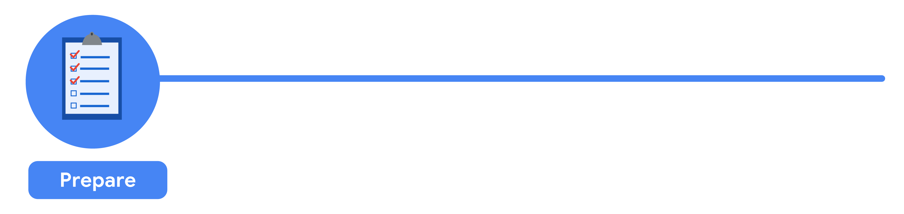
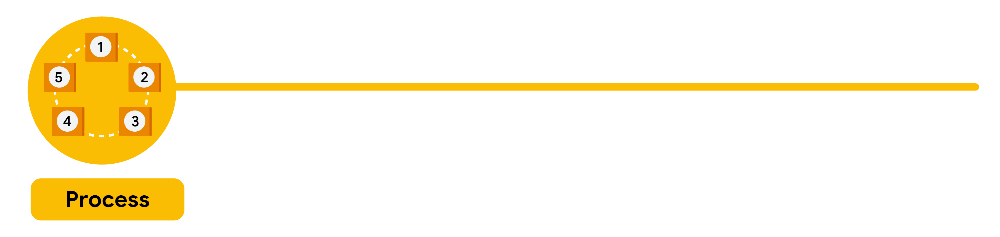
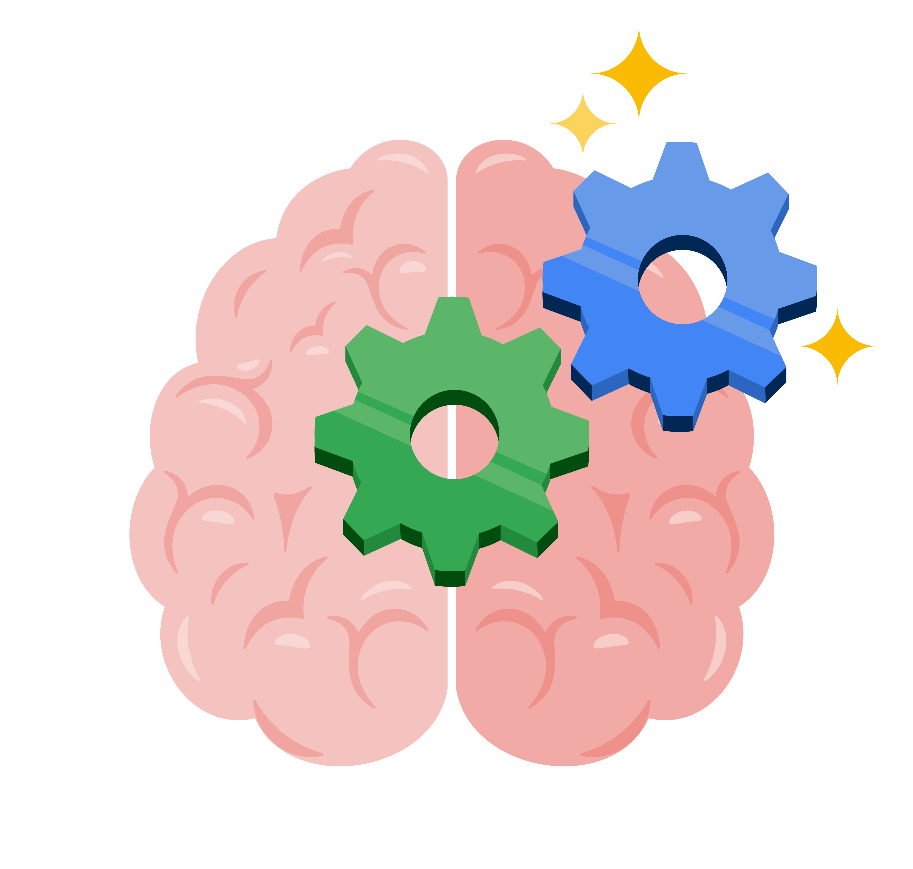
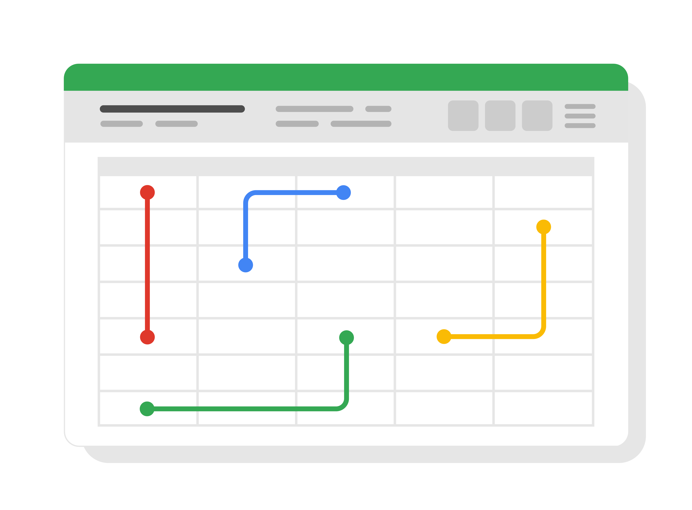

# New data perspectives

As you have been learning, you can find data pretty much everywhere. Any time you observe and evaluate something in the world, you’re collecting and analyzing data. Your analysis helps you find easier ways of doing things, identify patterns to save you time, and discover surprising new perspectives that can completely change the way you experience things.

The six steps of the data analysis process that you have been learning in this program are: ask, prepare, process, analyze, share, and act. These six steps apply to any data analysis.

An organization was experiencing a high turnover rate among new hires. Many employees left the company before the end of their first year on the job. The analysts used the data analysis process to answer the following question: How can the organization improve the retention rate for new employees?

Here is a break down of what this team did, step by step.

First up, the analysts needed to define what the project would look like and what would qualify as a successful result. So, to determine these things, they asked effective questions and collaborated with leaders and managers who were interested in the outcome of their people analysis. These were the kinds of questions they asked:

What do you think new employees need to learn to be successful in their first year on the job?

Have you gathered data from new employees before? If so, may we have access to the historical data?

Do you believe managers with higher retention rates offer new employees something extra or unique?

What do you suspect is a leading cause of dissatisfaction among new employees?

By what percentage would you like employee retention to increase in the next fiscal year?

It all started with solid preparation. The group built a timeline of three months and decided how they wanted to relay their progress to interested parties. Also during this step, the analysts identified what data they needed to achieve the successful result they identified in the previous step - in this case, the analysts chose to gather the data from an online survey of new employees. These were the things they did to prepare:

They developed specific questions to ask about employee satisfaction with different business processes, such as hiring and onboarding, and their overall compensation.

They established rules for who would have access to the data collected - in this case, anyone outside the group wouldn't have access to the raw data, but could view summarized or aggregated data. For example, an individual's compensation wouldn't be available, but salary ranges for groups of individuals would be viewable.

They finalized what specific information would be gathered, and how best to present the data visually. The analysts brainstormed possible project- and data-related issues and how to avoid them.

The group sent the survey out. Great analysts know how to respect both their data and the people who provide it. Since employees provided the data, it was important to make sure all employees gave their consent to participate. The data analysts also made sure employees understood how their data would be collected, stored, managed, and protected. Collecting and using data ethically is one of the responsibilities of data analysts. In order to maintain confidentiality and protect and store the data effectively, these were the steps they took:

They restricted access to the data to a limited number of analysts.

They cleaned the data to make sure it was complete, correct, and relevant. Certain data was aggregated and summarized without revealing individual responses.

They uploaded raw data to an internal data warehouse for an additional layer of security.

Then, the analysts did what they do best: analyze! From the completed surveys, the data analysts discovered that an employee’s experience with certain processes was a key indicator of overall job satisfaction. These were their findings:

Employees who experienced a long and complicated hiring process were most likely to leave the company.

Employees who experienced an efficient and transparent evaluation and feedback process were most likely to remain with the company.

The group knew it was important to document exactly what they found in the analysis, no matter what the results. To do otherwise would diminish trust in the survey process and reduce their ability to collect truthful data from employees in the future.

Just as they made sure the data was carefully protected, the analysts were also careful sharing the report. This is how they shared their findings:

They shared the report with managers who met or exceeded the minimum number of direct reports with submitted responses to the survey.

They presented the results to the managers to make sure they had the full picture.

They asked the managers to personally deliver the results to their teams.

This process gave managers an opportunity to communicate the results with the right context. As a result, they could have productive team conversations about next steps to improve employee engagement.

The last stage of the process for the team of analysts was to work with leaders within their company and decide how best to implement changes and take actions based on the findings. These were their recommendations:

Standardize the hiring and evaluation process for employees based on the most efficient and transparent practices.

Conduct the same survey annually and compare results with those from the previous year.

A year later, the same survey was distributed to employees. Analysts anticipated that a comparison between the two sets of results would indicate that the action plan worked. Turns out, the changes improved the retention rate for new employees and the actions taken by leaders were successful!

# Origins of the data analysis process

Data analysis is rooted in statistics, which has a pretty long history itself. Archaeologists mark the start of statistics in ancient Egypt with the building of the pyramids. The ancient Egyptians were masters of organizing data. They documented their calculations and theories on papyri (paper-like materials), which are now viewed as the earliest examples of spreadsheets and checklists. Today’s data analysts owe a lot to those brilliant scribes, who helped create a more technical and efficient process.

It is time to enter the data analysis process—how industry professionals move from data to decision. All team members can drive success by planning work both upfront and at the end of the data analysis process. While the data analysis process is well known among experts, there isn't a single defined structure or single architecture that’s uniformly followed by every data analyst. But there are some shared fundamentals. This reading provides an overview of several processes, starting with the one that forms the foundation of the Google Data Analytics Certificate.

The process presented as part of the Google Data Analytics Certificate is one that will be valuable to you as you keep moving forward in your career:

- Ask: business challenge, objective, or question
- Prepare: data generation, collection, storage, and data management
- Process: data cleaning and data integrity
- Analyze: data exploration, visualization, and analysis
- Share: communicating and interpreting results
- Act:  putting  insights to work to solve the problem

Understanding this process—and all of the iterations that helped make it popular—will be a big part of guiding your own analysis and your work in this program. Let’s go over a few other variations of the data analysis process.

### EMC's data analysis process

EMC Corporation's data analytics process is cyclical with six steps:

- Discovery
- Pre-processing data
- Model planning
- Model building
- Communicate results
- Operationalize

EMC Corporation is now Dell EMC. This model, created by David Dietrich, reflects the cyclical nature of typical business projects. The phases aren’t static milestones; each step connects and leads to the next, and eventually repeats. Key questions help analysts test whether they have accomplished enough to move forward and ensure that teams have spent enough time on each of the phases and don’t start modeling before the data is ready. It is a little different from the data analysis process on which this program is based on, but it has some core ideas in common: the first phase is interested in discovering and asking questions; data has to be prepared before it can be analyzed and used; and then findings should be shared and acted on.

### SAS's iterative process

An iterative data analysis process was created by a company called SAS, a leading data analytics solutions provider. It can be used to produce repeatable, reliable, and predictive results:

- Ask
- Prepare
- Explore
- Model
- Implement
- Act
- Evaluate

The SAS model emphasizes the cyclical nature of their model by visualizing it as an infinity symbol. Its process has seven steps, many of which mirror the other models, like ask, prepare, model, and act. But this process is also a little different; it includes a step after the act phase designed to help analysts evaluate their solutions and potentially return to the ask phase again.

### Project-based data analytics process

A project-based data analytics process has five simple steps:

- Identifying the problem
- Designing data requirements
- Pre-processing data
- Performing data analysis
- Visualizing data

This data analytics project process was developed by Vignesh Prajapati. It doesn’t include the sixth phase, or the act phase. However, it still covers a lot of the same steps described. It begins with identifying the problem, preparing and processing data before analysis, and ends with data visualization.

### Big data analytics process

Authors Thomas Erl, Wajid Khattak, and Paul Buhler proposed a big data analytics process in their book, **Big Data Fundamentals: Concepts, Drivers & Techniques**. Their process suggests phases divided into nine steps:

- Business case evaluation
- Data identification
- Data acquisition and filtering
- Data extraction
- Data validation and cleaning
- Data aggregation and representation
- Data analysis
- Data visualization
- Utilization of analysis results

This process appears to have three or four more steps than the previous models. But in reality, they have just broken down what has been referred to as prepare and process into smaller steps. It emphasizes the individual tasks required for gathering, preparing, and cleaning data before the analysis phase.

# Data and gut instinct

Analysts use data-driven decision-making and follow a step-by-step process.

But there are other factors that influence the decision-making process. You may have read mysteries where the detective used their gut instinct, and followed a hunch that helped them solve the case. Gut instinct is an intuitive understanding of something with little or no explanation. This isn’t always something conscious; we often pick up on signals without even realizing. You just have a “feeling” it’s right.

### Why gut instinct can be a problem

At the heart of data-driven decision making is data. Therefore, it's essential that data analysts focus on the data to ensure they make informed decisions. If you ignore data by preferring to make decisions based on your own experience, your decisions may be biased. But even worse, decisions based on gut instinct without any data to back them up can cause mistakes.

The more you understand the data related to a project, the easier it will be to figure out what is required. These efforts will also help you identify errors and gaps in your data so you can communicate your findings more effectively. Sometimes past experience helps you make a connection that no one else would notice. For example, a detective might be able to crack open a case because they remember an old case just like the one they’re solving today. It's not just gut instinct.

### Data + business knowledge = mystery solved

Blending data with business knowledge, plus maybe a touch of gut instinct, will be a common part of your process as a junior data analyst. The key is figuring out the exact mix for each particular project. A lot of times, it will depend on the goals of your analysis. That is why analysts often ask, “How do I define success for this project?”

In addition, try asking yourself these questions about a project to help find the perfect balance:

- What kind of results are needed?
- Who will be informed?
- Am I answering the question being asked?
- How quickly does a decision need to be made?

# Use data analytics skills in a business scenario

As you’ve been learning, data analysts have inherent analytical skills, whether they know it or not. In other words, the interests that have led you to pursue a career as a data analyst create a foundation that you will build on throughout your career. To review, these skills are:

- Curiosity
- Understanding of context
- Technical mindset
- Data design
- Data strategy

It’s important to recognize these skills and begin applying them to all sorts of situations. In this reading, you’ll do that through a case study based on a fictitious film production company, Mega-Pik International.

### Scenario: Use data to create better movies

The movies Mega-Pik has released recently aren’t having the impact they used to. Five of their last six releases barely broke even at the box office, and the sixth film lost a lot of money. The lead executives at Mega-Pik have noticed that their competitors went through a similar slump, but recovered when they started producing remakes of past successes and marketing them to a new audience.

Mega-Pik is interested in following this trend. They want to do this based on data-driven strategies, so they hire your analytics company to help them make popular movies again. Specifically, they ask for exploratory data analysis (EDA) to help them understand what audiences have liked in the past and determine if the successes of those films can be replicated.

You and your team develop the following objectives for Mega-Pik’s EDA:

- Identify key factors that contribute to a movie's opening weekend success.
- Understand the relationship between a movie's budget and its revenue.
- Determine which genres are most successful.

**The right dataset**
Your company collects, cleans, and organizes the following relevant information into a dataset:
Movie name
Release date
Opening night revenue
Opening weekend revenue
Budget (cost to create)
Marketing costs
Ratings
Genre

**Use your skills**
Now you’ll examine how inherent data analysis skills can help you guide Mega-Pik to make data-driven decisions about which movies to produce.

**Curiosity**

If you worked for the company performing this data analysis, what kinds of questions would you ask based on the data and how it relates to the objectives of the EDA? Curiosity is critical here, because it will help you come up with questions you can answer

For example, you might wonder if there’s a relationship between a movie’s budget and the revenue it generates on opening night or over the opening weekend. You might also be curious about combining columns to make new metrics, such as which genres tend to perform better on opening weekend—both overall and in the seasons in which the movies were released. You might even ask if there should be additional columns of data that you don’t already have, such as audience demographics.

Curiosity is a skill that drives analysts to discover just how much information they can coax out of the data in expected or unexpected ways. Keep in mind that curiosity isn’t the only skill that compels analysts to ask probing questions about their data.

**Understanding context**

Context is crucial for any kind of meaningful data analysis. By contextualizing data, you start to understand why the data shows what it does. Factors including the time of year a movie is released, holidays, and competing events can all have an effect on revenue, which is the gauge Mega-Pik uses to determine success. Audience demographics such as age, gender, education, and income levels can help you understand who is going to the movies. This context might clarify which genres or storylines are most interesting to movie-goers.

Analysts determine context by looking for patterns or anomalies in a dataset. It also helps to understand the entertainment industry, which provides a whole other set of contextual clues. For example, family films typically generate more revenue when children are on vacation from school. This provides important context about the relationship between genre and revenue over a short timeframe. To understand the relationship between family films and revenue, you might have to search over a time period of more than one year to avoid inaccurate conclusions based on school schedule. Further the “season” in which children are on vacation from school differs by country, which is another contextual clue you have to take into account. An accurate analysis of this data needs to come from cross-referencing all of the various contexts, including external data or historical trends.

Understanding context helps you solve problems by narrowing down variables that are most likely to influence the outcome, which in turn enables you to come up with more meaningful insights.

**Technical mindset**

As you have discovered, having a technical mindset means approaching problems (and datasets) in a systematic and logical manner. This starts with the way you clean, organize, and prepare your data. It can also guide the tools or software you use to break down data and help you identify and fix incorrect data that can skew your analysis.

Remember that problems aren't always technical, but a technical mindset is the skill that you use to break down any complex issue into manageable parts. Focusing on implementing a process, regardless of what that looks like, is a great first step to exercising your technical mindset.

**Data design**

The skill of data design is an extension of your technical mindset. It deals with how information is organized. Suppose the dataset here is presented in a spreadsheet. You would be able to shift the cells to organize the data to find different patterns. For example, you might organize the data by revenue and then by genre, which could reveal that comedies are more profitable than dramas. Basically, how you choose to structure your data makes analysis easier and more insightful.

**Data strategy**

Data strategy is the management of the people, processes, and tools used in data analysis. In this scenario, think of it as the approach you use to analyze your dataset. One element might be the tools you use. If Mega-Pik wants a relatively simple dashboard, you might use Google Sheets or Excel because there are only a few columns of data. On the other hand, if Mega-Pik wants a dashboard where information updates every time new data comes in, you’d need a robust tool like Tableau.

The data strategy you select should be based on the dataset and the deliverables. Think about a data strategy as a kind of resource allocation—the tools, time, and effort that you put into a project will vary based on what you need to accomplish. One strategy you might use for this case study is to prioritize any analyses that would directly affect the next quarter's revenue. The way you allocate resources can lead you to quicker, more actionable insights.

# Use the five whys for root cause analysis

Recently, you’ve been learning why business solutions almost always require some data detective work. This is one way critical thinking helps data professionals determine the right questions to ask in order to arrive at those solutions. One very common question is, “What is the root cause of the problem?” A root cause is the reason why a problem occurs. So, by identifying and eliminating the root cause, data professionals can help stop that problem from occurring again.

The five whys is a simple but effective technique for identifying a root cause. It involves asking "Why?" repeatedly until the answer reveals itself. This often happens at the fifth “why,” but sometimes you’ll need to continue asking more times, sometimes fewer.

You recently explored a case involving lacking the necessary ingredients to bake pies; now, you’ll go more in-depth with some business applications of the five whys technique to do root cause analysis.

### Boost customer service

An online grocery store was receiving numerous customer service complaints about poor deliveries. To address this problem, a data analyst at the company asked their first “why?”

**Why #1. “Customers are complaining about poor grocery deliveries. Why?”**
The data analyst began by reviewing the customer feedback more closely. They noted the vast majority of complaints dealt with products arriving damaged. So, they asked “why?” again.

**Why #2. “Products are arriving damaged. Why?”**
To answer this question, the data analyst continued exploring the customer feedback. It turned out that many customers said products were not packaged properly.

**Why #3. “Products are not packaged properly. Why?”**
After asking their third “why,” the data analyst did some further detective work. They ultimately learned that their company’s grocery packers were not adequately trained on packing procedures.

**Why #4. “Grocery packers are not adequately trained. Why?”**
This “why” enabled the data analyst to uncover that nearly 35% of all packers were new to the company. They had not yet had the chance to complete all required training, yet they were already being asked to pack groceries for customer orders.

**Why #5. “Packers have not completed required training. Why?”**
This final “why?” led the data analyst to find out that the human resources department had not provided necessary training to any newly hired packers. This was because HR was in the middle of reworking the training program. Rather than training new hires using the old system, they had provided them with a quick one-page guide, which was insufficient.

So, in this example, the root cause of the problem was that HR had not completed the training program updates and was using a less-thorough guide to train new packers. Fortunately, this was a problem that the grocer could control. And thanks to the data analyst’s work, they provided more support to the HR department to complete the training and retrain all newly hired grocery packers!

### Advance quality control

An irrigation company was experiencing an increase in the number of defects in their water pumps. The company's data team used the five whys to analyze the situation:

**Why #1. “There has been an increase in the number of defects in water pumps. Why?”**
To answer this question, the data team set up a meeting with shop floor engineers. They asked for some insights into machine performance and manufacturing processes. After some exploration, it was discovered that the machines used to produce the pumps were not properly calibrated.

**Why #2. “The machines are not properly calibrated. Why?”**
After more brainstorming with the engineering team, it was determined that the machines were miscalibrated during the last maintenance cycle.

**Why #3. “The machines were miscalibrated during maintenance. Why?”**
Next, the data team investigated the procedures involved with machine calibration. They found out that the current method was inappropriate for the machines.

**Why #4. “The calibration method is inappropriate for the machines. Why?”**
This “why” led them to discover that the company had recently installed new software in their machines. Because it was a minor software upgrade, the engineers didn’t realize it would affect calibration. They didn’t have the information they needed to properly calibrate the upgraded machines.

**Why #5. “The engineers don’t have the information they need to calibrate the upgraded machines. Why?”**
The fifth and final “why” turned up even more evidence: The installation team had upgraded machine software, but had failed to share the corresponding calibration procedures with the engineers.

So, in this example, the root cause of the problem was that the engineers lacked important information about how to calibrate the machines using the new software system. The solution was found, and the irrigation company was able to implement it right away. Soon, the engineers had the necessary calibration instructions, and the pump defects were eliminated!

# Variations of the data life cycle

You have learned that there are six stages to the data life cycle. Here's a recap:

**Plan**: Decide what kind of data is needed, how it will be managed, and who will be responsible for it.

**Capture**: Collect or bring in data from a variety of different sources.

**Manage**: Care for and maintain the data. This includes determining how and where it is stored and the tools used to do so.

**Analyze**: Use the data to solve problems, make decisions, and support business goals.

**Archive**: Keep relevant data stored for long-term and future reference.

**Destroy**: Remove data from storage and delete any shared copies of the data.

*Note*: Be careful not to confuse the six stages of the data life cycle (plan, capture, manage, analyze, archive, and destroy) with the six phases of the data analysis process (ask, prepare, process, analyze, share, and act). They are not interchangeable.

The data life cycle provides a generic or common framework for how data is managed. You may recall that variations of the data analysis life cycle were described in Origins of the data analysis process

### U.S. Fish and Wildlife Service

The U.S. Fish and Wildlife Service uses the following data life cycle:

- Plan
- Acquire
- Maintain
- Access
- Evaluate
- Archive

### The U.S. Geological Survey (USGS)

The USGS uses the data life cycle below:

- Plan
- Acquire
- Process
- Analyze
- Preserve
- Publish/share

Several cross-cutting or overarching activities are also performed during each stage of their life cycle:

- Describe (metadata and documentation)
- Manage quality
- Backup and secure

### Financial institutions

Financial institutions may take a slightly different approach to the data life cycle as described in
The Data Life Cycle, an article in Strategic Finance magazine:

- Capture
- Qualify
- Transform
- Utilize
- Report
- Archive
- Purge

### Harvard Business School (HBS)

One final data life cycle informed by Harvard University research has eight stages:

- Generation
- Collection
- Processing
- Storage
- Management
- Analysis
- Visualization
- Interpretation

# More on the phases of data analysis and this program

Each step in the data analysis process—ask, prepare, process, analyze, share, and act—plays a crucial role in extracting meaningful insights from data. As you navigate through each phase, from asking the right questions to taking informed actions, you harness the true power of data. In this reading, you’ll explore how the data analysis process guides this program.

### The ask phase

At the start of any successful data analysis, the data analyst:

* Takes the time to fully understand stakeholder expectations
* Defines the problem to be solved
* Decides which questions to answer in order to solve the problem

Qualifying stakeholder expectations means determining who the stakeholders are, what they want, when they want it, why they want it, and how best to communicate with them. Defining the problem means looking at the current state and identifying the ways in which it’s different from the ideal state. With expectations qualified and the problem defined, you can derive questions that will help achieve these goals.

In an upcoming course, you'll learn how to ask effective questions and define the problem by working with stakeholders. You'll also cover strategies that can help you share what you discover in a way that keeps people interested.

### The prepare phase

In the prepare phase, the emphasis is on identifying and locating data you can use to answer your questions. In an upcoming course, you'll learn more about the different types of data and how to identify which kinds of data are most useful for solving a particular problem. You'll also discover why it's so important that data and results are objective and unbiased. In other words, any decisions made from an analysis should always be based on facts and be fair and impartial.

### The process phase

In this phase, the aim is to refine the data. Data analysts find and eliminate any errors and inaccuracies that can get in the way of results. This usually means:

* Cleaning data
* Transforming data into a more useful format
* Combining two or more datasets to make information more complete
* Removing outliers (data points that could skew the information)

After data analysts process data, they check the data they prepared to make sure it's complete and correct. This phase is all about getting the details right. Accordingly, the data analyst will refine strategies for verifying and sharing their data cleaning with stakeholders. In an upcoming course, you’ll use spreadsheets and structured query language, or SQL, to clean data.

### The analyze phase

With a solid foundation of well-defined questions and clean data, you’ll delve into the analyze phase. This is when you turn the data you’ve gathered, prepared, and processed into actionable information. Data analysts use many powerful tools in their work. In one upcoming course you'll continue using two of them: spreadsheets and SQL. In another upcoming course you’ll explore using the programming language R to work with and analyze data.

### The share phase

This phase is exactly what it sounds like: It’s time to share what you’ve learned with your stakeholders! In this part of the program, you'll learn how data analysts interpret results and share them with others to help stakeholders make effective, data-driven decisions. In the share phase, visualization is a data analyst's best friend. So, an upcoming course will highlight why visualization is essential to getting others to understand what your data is telling you. In another upcoming course, you’ll learn how to visualize data with R.

### The act phase

The data analysis journey culminates in the act phase, when data insights are put to work. For you, this action involves preparing for your job search and having the chance to complete a case study project. It's a great opportunity for you to bring together everything you've worked on throughout this course. Plus, adding a case study to your portfolio helps you stand out from other candidates!

# Consider fairness

Previously, you learned that part of a data professional’s responsibility is to make certain that their analysis is fair. **Fairness** means ensuring your analysis doesn't create or reinforce bias. This can be challenging, but if the analysis is not objective, the conclusions can be misleading and even harmful. In this reading, you’re going to explore some best practices you can use to guide your work toward a more fair analysis!

Following are some strategies that support fair analysis:

| **Best practice**                          | **Explanation**                                                                                                                                                                                                                                                                                                                                                                                                                                                                                                                     | **Example**                                                                                                                                                                                                                                                                                                                                                                                                                                                                                                                                                                        |
| -------------------------------------------- | ------------------------------------------------------------------------------------------------------------------------------------------------------------------------------------------------------------------------------------------------------------------------------------------------------------------------------------------------------------------------------------------------------------------------------------------------------------------------------------------------------------------------------------- | ------------------------------------------------------------------------------------------------------------------------------------------------------------------------------------------------------------------------------------------------------------------------------------------------------------------------------------------------------------------------------------------------------------------------------------------------------------------------------------------------------------------------------------------------------------------------------------ |
| Consider all of the available data         | Part of your job as a data analyst is to determine what data is going to be useful for your analysis. Often there will be data that isn’t relevant to what you’re focusing on or doesn’t seem to align with your expectations. But you can’t just ignore it; it’s critical to consider all of the available data so that your analysis reflects the truth and not just your own expectations.                                                                                                                                  | A state’s Department of Transportation is interested in measuring traffic patterns on holidays. At first, they only include metrics related to traffic volumes and the fact that the days are holidays. But the data team realizes they failed to consider how weather on these holidays might also affect traffic volumes. Considering this additional data helps them gain more complete insights.                                                                                                                                                                              |
| Identify surrounding factors               | As you’ll learn throughout these courses, context is key for you and your stakeholders to understand the final conclusions of any analysis. Similar to considering all of the data, you also must understand surrounding factors that could influence the insights you’re gaining.                                                                                                                                                                                                                                                | A human resources department wants to better plan for employee vacation time in order to anticipate staffing needs. HR uses a list of national bank holidays as a key part of the data-gathering process. But they fail to consider important holidays that aren’t on the bank calendar, which introduces bias against employees who celebrate them. It also gives HR less useful results because bank holidays may not necessarily apply to their actual employee population.                                                                                                    |
| Include self-reported data                 | **Self-reporting** is a data collection technique where participants provide information about themselves. Self-reported data can be a great way to introduce fairness in your data collection process. People bring conscious and unconscious bias to their observations about the world, including about other people. Using self-reporting methods to collect data can help avoid these observer biases. Additionally, separating self-reported data from other data you collect provides important context to your conclusions! | A data analyst is working on a project for a brick-and-mortar retailer. Their goal is to learn more about their customer base. This data analyst knows they need to consider fairness when they collect data; they decide to create a survey so that customers can self-report information about themselves. By doing that, they avoid bias that might be introduced with other demographic data collection methods. For example, if they had sales associates report their observations about customers, they might introduce any unconscious bias the employees had to the data. |
| Use oversampling effectively               | When collecting data about a population, it’s important to be aware of the actual makeup of that population. Sometimes, oversampling can help you represent groups in that population that otherwise wouldn’t be represented fairly.**Oversampling** is the process of increasing the sample size of nondominant groups in a population. This can help you better represent them and address imbalanced datasets.                                                                                                                 | A fitness company is releasing new digital content for users of their equipment. They are interested in designing content that appeals to different users, knowing that different people may interact with their equipment in different ways. For example, part of their user-base is age 70 or older. In order to represent these users, they oversample them in their data. That way, decisions they make about their fitness content will be more inclusive.                                                                                                                    |
| Think about fairness from beginning to end | To ensure that your analysis and final conclusions are fair, be sure to consider fairness from the earliest stages of a project to when you act on the data insights. This means that data collection, cleaning, processing, and analysis are all performed with fairness in mind.                                                                                                                                                                                                                                                  | A data team kicks off a project by including fairness measures in their data-collection process. These measures include oversampling their population and using self-reported data. However, they fail to inform stakeholders about these measures during the presentation. As a result, stakeholders leave with skewed understandings of the data. Learning from this experience, they add key information about fairness considerations to future stakeholder presentations.                                                                                                     |
