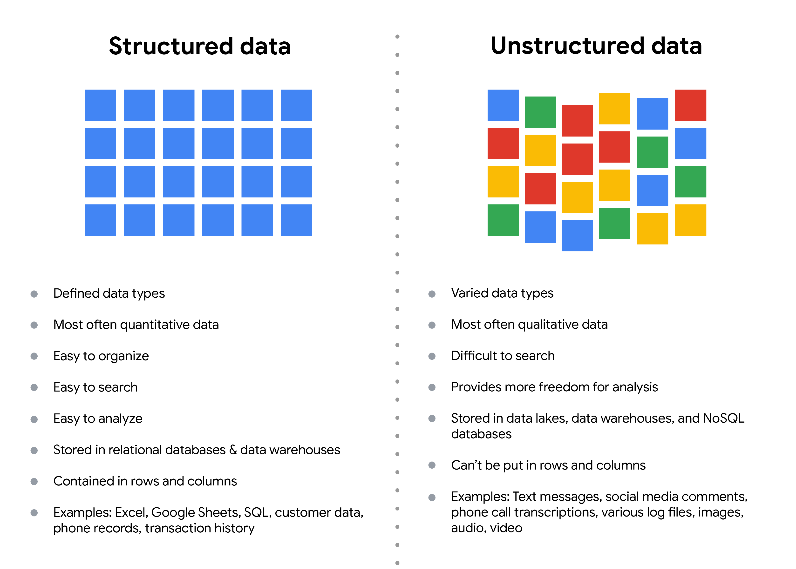
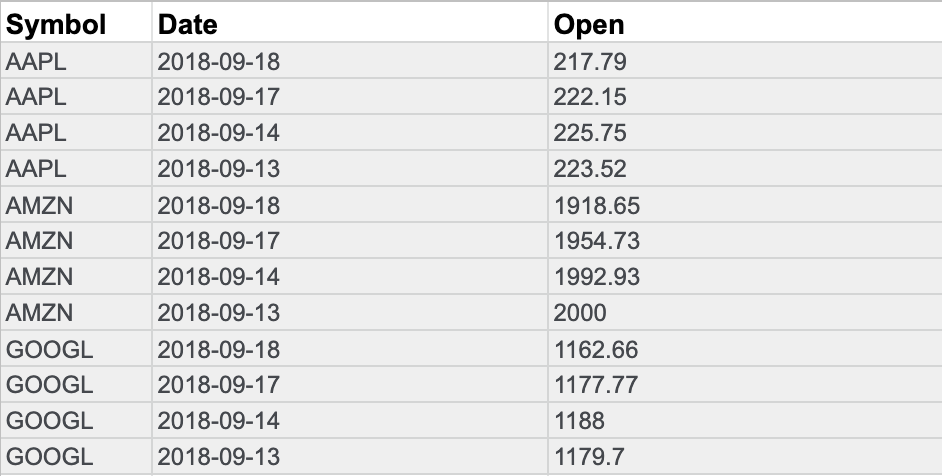

# Select the right data

Following are some data-collection considerations to keep in mind for your analysis:

## How the data will be collected

Decide if you will collect the data using your own resources or receive (and possibly purchase it) from another party. Data that you collect yourself is called first-party data.

## Data sources

If you don’t collect the data using your own resources, you might get data from second-party or third-party data providers.

**Second-party data** is collected directly by another group and then sold.

**Third-party data** is sold by a provider that didn’t collect the data themselves. Third-party data might come from a number of different sources.

## Solving your business problem

Datasets can show a lot of interesting information. But be sure to choose data that can actually help solve your problem question. For example, if you are analyzing trends over time, make sure you use time series data — in other words, data that includes dates.

## How much data to collect

If you are collecting your own data, make reasonable decisions about sample size. A random sample from existing data might be fine for some projects. Other projects might need more strategic data collection to focus on certain criteria. Each project has its own needs.

## Time frame

If you are collecting your own data, decide how long you will need to collect it, especially if you are tracking trends over a long period of time. If you need an immediate answer, you might not have time to collect new data. In this case, you would need to use historical data that already exists.

Use the flowchart below if data collection relies heavily on how much time you have:

# Data formats in practice

When you think about the word "format," a lot of things might come to mind. Think of an advertisement for your favorite store. You might find it in the form of a print ad, a billboard, or even a commercial. The information is presented in the format that works best for you to take it in. The format of a dataset is a lot like that, and choosing the right format will help you manage and use your data in the best way possible.

## Data format examples

As with most things, it is easier for definitions to click when you can pair them with examples you might encounter on a daily basis. Review each data format’s definition first and then use the examples to lock in your understanding.

## Primary versus secondary data

The following table highlights the differences between primary and secondary data and presents examples of each.

| **Data format classification** | **Definition**                                    | **Examples**                                                                                                                                                       |
| -------------------------------- | --------------------------------------------------- | -------------------------------------------------------------------------------------------------------------------------------------------------------------------- |
| Primary data                   | Collected by a researcher from first-hand sources | *Data from an interview you conducted - Data from a survey returned from 20 participants* Data from questionnaires you got back from a group of workers            |
| Secondary data                 | Gathered by other people or from other research   | *Data you bought from a local data analytics firm’s customer profiles* Demographic data collected by a university* Census data gathered by the federal government |

## Internal versus external data

The following table highlights the differences between internal and external data and presents examples of each.

| **Data format classification** | **Definition**                                           | **Examples**                                                                                                                                          |
| -------------------------------- | ---------------------------------------------------------- | ------------------------------------------------------------------------------------------------------------------------------------------------------- |
| Internal data                  | Data that is stored inside a company’s own systems      | *Wages of employees across different business units tracked by HR* Sales data by store location* Product inventory levels across distribution centers |
| External data                  | Data that is stored outside of a company or organization | *National average wages for the various positions throughout your organization* Credit reports for customers of an auto dealership                    |

## Continuous versus discrete data

The following table highlights the differences between continuous and discrete data and presents examples of each.

| **Data format classification** | **Definition**                                              | **Examples**                                                                                                                                 |
| -------------------------------- | ------------------------------------------------------------- | ---------------------------------------------------------------------------------------------------------------------------------------------- |
| Continuous data                | Data that is measured and can have almost any numeric value | *Height of kids in third grade classes (52.5 inches, 65.7 inches)* Runtime markers in a video* Temperature                                   |
| Discrete data                  | Data that is counted and has a limited number of values     | *Number of people who visit a hospital on a daily basis (10, 20, 200)* Maximum capacity allowed in a room* Tickets sold in the current month |

## Qualitative versus quantitative data

The following table highlights the differences between qualitative and quantitative data and presents examples of each.

| **Data format classification** | **Definition**                                                         | **Examples**                                                                                                                                   |
| -------------------------------- | ------------------------------------------------------------------------ | ------------------------------------------------------------------------------------------------------------------------------------------------ |
| Qualitative                    | A subjective and explanatory measure of a quality or characteristic    | *Favorite exercise activity* Brand with best customer service* Fashion preferences of young adults                                             |
| Quantitative                   | A specific and objective measure, such as a number, quantity, or range | *Percentage of board certified doctors who are women* Population size of elephants in Africa* Distance from Earth to Mars at a particular time |

## Nominal versus ordinal data

The following table highlights the differences between nominal and ordinal data and presents examples of each.

| **Data format classification** | **Definition**                                                     | **Examples**                                                                                                                                                                            |
| -------------------------------- | -------------------------------------------------------------------- | ----------------------------------------------------------------------------------------------------------------------------------------------------------------------------------------- |
| Nominal                        | A type of qualitative data that is categorized without a set order | *First time customer, returning customer, regular customer* New job applicant, existing applicant, internal applicant* New listing, reduced price listing, foreclosure                  |
| Ordinal                        | A type of qualitative data with a set order or scale               | *Movie ratings (number of stars: 1 star, 2 stars, 3 stars)* Ranked-choice voting selections (1st, 2nd, 3rd)* Satisfaction level measured in a survey (satisfied, neutral, dissatisfied) |

## Structured versus unstructured data

The following table highlights the differences between structured and unstructured data and presents examples of each.

| **Data format classification** | **Definition**                                                           | **Examples**                                   |
| -------------------------------- | -------------------------------------------------------------------------- | ------------------------------------------------ |
| Structured data                | Data organized in a certain format, like rows and columns                | *Expense reports* Tax returns* Store inventory |
| Unstructured data              | Data that cannot be stored as columns and rows in a relational database. | *Social media posts* Emails* Videos            |

# The effects of different structures

Data is everywhere and it can be stored in lots of ways. Two general categories of data are:

* **Structured data:** Organized in a certain format, such as rows and columns.
* **Unstructured data:** Not organized in any easy-to-identify way.

For example, when you rate your favorite restaurant online, you're creating structured data. But when you use Google Earth to check out a satellite image of a restaurant location, you're using unstructured data.

Here's a refresher on the characteristics of structured and unstructured data:

Structured data:

* Defined data types
* Most often quantitative data
* Easy to organize
* Easy to search
* Easy to analyze
* Stored in relational databases
* Contained in rows and columns
* Examples: Excel, Google Sheets, SQL, customer data, phone records, transaction history

Unstructured data:

* Varied data types
* Most often qualitative data
* Difficult to search
* Provides more freedom for analysis
* Stored in data lakes and NoSQL databases
* Can't be put in rows and columns
* Examples: Text messages, social media comments, phone call transcriptions, various log files, images, audio, video

## Structured data

As we described earlier, **structured data** is organized in a certain format. This makes it easier to store and query for business needs. If the data is exported, the structure goes along with the data.

## Unstructured data

**Unstructured data** can’t be organized in any easily identifiable manner. And there is much more unstructured than structured data in the world. Video and audio files, text files, social media content, satellite imagery, presentations, PDF files, open-ended survey responses, and websites all qualify as types of unstructured data.

## The fairness issue

The lack of structure makes unstructured data difficult to search, manage, and analyze. But recent advancements in artificial intelligence and machine learning algorithms are beginning to change that. Now, the new challenge facing data scientists is making sure these tools are inclusive and unbiased. Otherwise, certain elements of a dataset will be more heavily weighted and/or represented than others. And as you're learning, an unfair dataset does not accurately represent the population, causing skewed outcomes, low accuracy levels, and unreliable analysis.

# Data modeling levels and techniques

This reading introduces you to data modeling and different types of data models. Data models help keep data consistent and enable people to map out how data is organized. A basic understanding makes it easier for analysts and other stakeholders to make sense of their data and use it in the right ways.

**Important note:** As a junior data analyst, you won't be asked to design a data model. But you might come across existing data models your organization already has in place.

## What is data modeling?

**Data modeling** is the process of creating diagrams that visually represent how data is organized and structured.  These visual representations are called **data models**. You can think of data modeling as a blueprint of a house. At any point, there might be electricians, carpenters, and plumbers using that blueprint. Each one of these builders has a different relationship to the blueprint, but they all need it to understand the overall structure of the house. Data models are similar; different users might have different data needs, but the data model gives them an understanding of the structure as a whole.

## Levels of data modeling

Each level of data modeling has a different level of detail.

1. **Conceptual data modeling** gives a high-level view of the data structure, such as how data interacts across an organization. For example, a conceptual data model may be used to define the business requirements for a new database. A conceptual data model doesn't contain technical details.
2. **Logical data modeling** focuses on the technical details of a database such as relationships, attributes, and entities. For example, a logical data model defines how individual records are uniquely identified in a database. But it doesn't spell out actual names of database tables. That's the job of a physical data model.
3. **Physical data modeling** depicts how a database operates. A physical data model defines all entities and attributes used; for example, it includes table names, column names, and data types for the database.

More information can be found in this [comparison of data models.](https://www.1keydata.com/datawarehousing/data-modeling-levels.html "comparison of data models")

## Data-modeling techniques

There are a lot of approaches when it comes to developing data models, but two common methods are the **Entity Relationship Diagram (ERD)** and the **Unified Modeling Language (UML)** diagram. ERDs are a visual way to understand the relationship between entities in the data model. UML diagrams are very detailed diagrams that describe the structure of a system by showing the system's entities, attributes, operations, and their relationships. As a junior data analyst, you will need to understand that there are different data modeling techniques, but in practice, you will probably be using your organization’s existing technique.

You can read more about ERD, UML, and data dictionaries in this [data modeling techniques article](https://dataedo.com/blog/basic-data-modeling-techniques "data modeling techniques article").

## Data analysis and data modeling

Data modeling can help you explore the high-level details of your data and how it is related across the organization’s information systems. Data modeling sometimes requires data analysis to understand how the data is put together; that way, you know how to map the data. And finally, data models make it easier for everyone in your organization to understand and collaborate with you on your data. This is important for you and everyone on your team!

# Use Boolean logic

In this reading, you will explore the basics of Boolean logic and learn how to use single and multiple conditions in a Boolean statement. These conditions are created with Boolean operators, including AND, OR, and NOT. These operators are similar to mathematical operators and can be used to create logical statements that filter your results. Data analysts use Boolean statements to do a wide range of data analysis tasks, such as writing queries for searches and checking for conditions when writing programming code.

## Boolean logic example

Imagine you are shopping for shoes, and are considering certain preferences:

* You will buy the shoes only if they are any combination of pink and grey
* You will buy the shoes if they are entirely pink, entirely grey, or if they are pink and grey
* You will buy the shoes if they are grey, but not if they have any pink

These Venn diagrams illustrate your shoe preferences. AND is the center of the Venn diagram, where two conditions overlap. OR includes either condition. NOT includes only the part of the Venn diagram that doesn't contain the exception.

The intersection of these circles is highlighted to indicate the AND condition requires shoes to be both grey and pink. The Venn diagram that represents OR includes a circle labeled grey shoes overlapping with a circle labeled pink shoes. The entirety of both circles is highlighted to indicate the OR condition means any shoe with grey, pink, or some combination satisfies the requirement. The Venn diagram that represents NOT includes a circle labeled grey shoes overlapping with a circle labeled pink shoes. The portion of the grey shoes circle that does not intersect with the pink shoes circle is highlighted to indicate the NOT condition requires shoes to not include pink.

## Use Boolean logic in statements

In queries, Boolean logic is represented in a statement written with Boolean operators. An **operator** is a symbol that names the operation or calculation to be performed. Read on to discover how you can convert your shoe preferences into Boolean statements.

### **The AND operator**

Your condition is “If the color of the shoe has any combination of grey and pink, you will buy them.” The Boolean statement would break down the logic of that statement to filter your results by both colors. It would say IF (Color="Grey") AND (Color="Pink") then buy them

The AND operator lets you stack both of your conditions.

Below is a simple truth table that outlines the Boolean logic at work in this statement. In the **Color is Grey** column, there are two pairs of shoes that meet the color condition. And in the **Color is Pink** column, there are two pairs that meet that condition. But in the **If Grey AND Pink** column, only one pair of shoes meets both conditions. So, according to the Boolean logic of the statement, there is only one pair marked true. In other words, there is one pair of shoes that you would buy.

| **Color is Grey** | Color is Pink | **If Grey AND Pink, then Buy** | **Boolean Logic**       |
| ------------------- | --------------- | -------------------------------- | ------------------------- |
| Grey/True         | Pink/True     | True/Buy                       | True AND True = True    |
| Grey/True         | Black/False   | False/Don't buy                | True AND False = False  |
| Red/False         | Pink/True     | False/Don't buy                | False AND True = False  |
| Red/False         | Green/False   | False/Don't buy                | False AND False = False |

### **The OR operator**

The OR operator lets you move forward if either one of your two conditions is met. Your condition is “If the shoes are grey or pink, you will buy them.” The Boolean statement would be IF (Color="Grey") OR (Color="Pink") then buy them.

Notice that any shoe that meets either the **Color is Grey** or the **Color is Pink** condition is marked as true by the Boolean logic. According to the truth table below, there are three pairs of shoes that you can buy.

| **Color is Grey** | **Color is Pink** | **If Grey OR Pink, then Buy** | **Boolean Logic**      |
| ------------------- | ------------------- | ------------------------------- | ------------------------ |
| Red/False         | Black/False       | False/Don't buy               | False OR False = False |
| Black/False       | Pink/True         | True/Buy                      | False OR True = True   |
| Grey/True         | Green/False       | True/Buy                      | True OR False = True   |
| Grey/True         | Pink/True         | True/Buy                      | True OR True = True    |

### **The NOT operator**

Finally, the NOT operator lets you filter by subtracting specific conditions from the results. Your condition is "You will buy any grey shoe except for those with any traces of pink in them." Your Boolean statement would be IF (Color="Grey") AND (Color=NOT "Pink") then buy them

Now, all of the grey shoes that aren't pink are marked true by the Boolean logic for the NOT Pink condition. The pink shoes are marked false by the Boolean logic for the NOT Pink condition. Only one pair of shoes is excluded in the truth table below.

| **Color is Grey** | Color is Pink | **Boolean Logic for NOT Pink** | If Grey AND (NOT Pink), then Buy | Boolean Logic          |
| ------------------- | --------------- | -------------------------------- | ---------------------------------- | ------------------------ |
| Grey/True         | Red/False     | Not False = True               | True/Buy                         | True AND True = True   |
| Grey/True         | Black/False   | Not False = True               | True/Buy                         | True AND True = True   |
| Grey/True         | Green/False   | Not False = True               | True/Buy                         | True AND True = True   |
| Grey/True         | Pink/True     | Not True = False               | False/Don't buy                  | True AND False = False |

## The power of multiple conditions

For data analysts, the real power of Boolean logic comes from being able to combine multiple conditions in a single statement. For example, if you wanted to filter for shoes that were grey or pink, and waterproof, you could construct a Boolean statement such as: “IF ((Color = "Grey") OR (Color = "Pink")) AND (Waterproof="True")

Notice that you can use parentheses to group your conditions together.

## Key takeaways

Operators are symbols that name the operation or calculation to be performed. The operators AND, OR, and NOT can be used to write Boolean statements in programming languages. Whether you are doing a search for new shoes or applying this logic to queries, Boolean logic lets you create multiple conditions to filter your results. Now that you know a little more about Boolean logic, you can start using it!

# Transforming data

## What is data transformation?

A woman presenting data, a hand holding a medal, two people chatting, a ship's wheel being steered, two people high-fiving each other

In this reading, you will explore how data is transformed and the differences between wide and long data. **Data transformation** is the process of changing the data’s format, structure, or values. As a data analyst, there is a good chance you will need to transform data at some point to make it easier for you to analyze it.

Data transformation usually involves:

* Adding, copying, or replicating data
* Deleting fields or records
* Standardizing the names of variables
* Renaming, moving, or combining columns in a database
* Joining one set of data with another
* Saving a file in a different format. For example, saving a spreadsheet as a comma separated values (.csv) file.

## Why transform data?

Goals for data transformation might be:

* Data **organization**: better organized data is easier to use
* Data **compatibility**: different applications or systems can then use the same data
* Data **migration**: data with matching formats can be moved from one system to another
* Data **merging**: data with the same organization can be merged together
* Data **enhancement**: data can be displayed with more detailed fields
* Data **comparison**: apples-to-apples comparisons of the data can then be made

## Data transformation example: data merging

Mario is a plumber who owns a plumbing company. After years in the business, he buys another plumbing company. Mario wants to merge the customer information from his newly acquired company with his own, but the other company uses a different database. So, Mario needs to make the data compatible. To do this, he has to transform the format of the acquired company’s data. Then, he must remove duplicate rows for customers they had in common. When the data is compatible and together, Mario’s plumbing company will have a complete and merged customer database.

## Data transformation example: data organization (long to wide)

To make it easier to create charts, you may also need to transform long data to wide data. Consider the following example of transforming stock prices (collected as long data) to wide data.

**Long data** is data where **each row contains a single data point** for a particular item. In the long data example below, individual stock prices (data points) have been collected for Apple (AAPL), Amazon (AMZN), and Google (GOOGL) (particular items) on the given dates.

**Long data example: Stock prices**

**Wide data** is data where **each row contains multiple data points** for the particular items identified in the columns.

**Wide data example: Stock prices**

With data transformed to wide data, you can create a chart comparing how each company's stock changed over the same period of time.

You might notice that all the data included in the long format is also in the wide format. But wide data is easier to read and understand. That is why data analysts typically transform long data to wide data more often than they transform wide data to long data. The following table summarizes when each format is preferred:

| **Wide data is preferred when**                                    | **Long data is preferred when**                                                                            |
| -------------------------------------------------------------------- | ------------------------------------------------------------------------------------------------------------ |
| Creating tables and charts with a few variables about each subject | Storing a lot of variables about each subject. For example, 60 years worth of interest rates for each bank |
| Comparing straightforward line graphs                              | Performing advanced statistical analysis or graphing                                                       |

# Data anonymization

## What is data anonymization?

You have been learning about the importance of privacy in data analytics. Now, it is time to talk about **data anonymization** and what types of data should be anonymized. **Personally identifiable information**, or **PII**, is information that can be used by itself or with other data to track down a person's identity.

Data anonymization is the process of protecting people's private or sensitive data by eliminating that kind of information. Typically, data anonymization involves blanking, hashing, or masking personal information, often by using fixed-length codes to represent data columns, or hiding data with altered values.

### **Your role in data anonymization**

Organizations have a responsibility to protect their data and the personal information that data might contain. As a data analyst, you might be expected to understand what data needs to be anonymized, but you generally wouldn't be responsible for the data anonymization itself. A rare exception might be if you work with a copy of the data for testing or development purposes. In this case, you could be required to anonymize the data before you work with it.

## What types of data should be anonymized?

Healthcare and financial data are two of the most sensitive types of data. These industries rely a lot on data anonymization techniques. After all, the stakes are very high. That’s why data in these two industries usually goes through **de-identification**, which is **a process used to wipe data clean of all personally identifying information**.

Data anonymization is used in just about every industry. That is why it is so important for data analysts to understand the basics. Here is a list of data that is often anonymized:

* Telephone numbers
* Names
* License plates and license numbers
* Social security numbers
* IP addresses
* Medical records
* Email addresses
* Photographs
* Account numbers

For some people, it just makes sense that this type of data should be anonymized. For others, we have to be very specific about what needs to be anonymized. Imagine a world where we all had access to each other’s addresses, account numbers, and other identifiable information. That would invade a lot of people’s privacy and make the world less safe. Data anonymization is one of the ways we can keep data private and secure!

# The open data debate

Just like data privacy, open data is a widely debated topic in today’s world. Data analysts think a lot about open data, and as a future data analyst, you need to understand the basics to be successful in your new role.

## What is open data?

In data analytics, **open data** is part of **data ethics,** which has to do with using data ethically. **Openness** refers to free access, usage, and sharing of data. But for data to be considered open, it has to:

* Be available and accessible to the public as a complete dataset
* Be provided under terms that allow it to be reused and redistributed
* Allow universal participation so that anyone can use, reuse, and redistribute the data

Data can only be considered open when it meets all three of these standards.

## The open data debate: What data should be publicly available?

One of the biggest benefits of open data is that credible databases can be used more widely. Basically, this means that all of that good data can be leveraged, shared, and combined with other data. This could have a huge impact on scientific collaboration, research advances, analytical capacity, and decision-making. But it is important to think about the individuals being represented by the public, open data, too.

**Third-party data** is collected by an entity that doesn’t have a direct relationship with the data. You might remember learning about this type of data earlier. For example, third parties might collect information about visitors to a certain website. Doing this lets these third parties create audience profiles, which helps them better understand user behavior and target them with more effective advertising.

**Personal identifiable information (PII)** is data that is reasonably likely to identify a person and make information known about them. It is important to keep this data safe. PII can include a person’s address, credit card information, social security number, medical records, and more.

Everyone wants to keep personal information about themselves private. Because third-party data is readily available, it is important to balance the openness of data with the privacy of individuals.

# Resources for open data

Luckily for data analysts, there are lots of trustworthy resources available for open data. It is important to remember that even reputable data needs to be constantly evaluated, but these websites are a useful starting point:

1. [**U.S. government data site**](https://www.data.gov/ "U.S. government data site"): Data.gov is one of the most comprehensive data sources in the US. This resource gives users the data and tools that they need to do research, and even helps them develop web and mobile applications and design data visualizations.
2. [**U.S. Census Bureau**](https://www.census.gov/data.html "U.S. Census Bureau"): This open data source offers demographic information from federal, state, and local governments, and commercial entities in the U.S. too.
3. [**Open Data Network**](https://www.opendatanetwork.com/ "Open Data Network"): This data source has a really powerful search engine and advanced filters. Here, you can find data on topics like finance, public safety, infrastructure, and housing and development.
4. [**Google Cloud Public Datasets**](https://cloud.google.com/datasets "Google Cloud Public Datasets"): There are a selection of public datasets available through the Google Cloud Public Dataset Program that you can find already loaded into BigQuery.
5. [**Dataset Search**](https://datasetsearch.research.google.com/ "Dataset Search"): The Dataset Search is a search engine designed specifically for data sets; you can use this to search for specific data sets.

# Maximize databases in data analytics

Databases enable analysts to manipulate, store, and process data. This helps them search through data a lot more efficiently to get the best insights.

## Relational databases

A **relational database** is a database that contains a series of tables that can be connected to form relationships. Basically, they allow data analysts to organize and link data based on what the data has in common.

In a non-relational table, you will find all of the possible variables you might be interested in analyzing all grouped together. This can make it really hard to sort through. This is one reason why relational databases are so common in data analysis: they simplify a lot of analysis processes and make data easier to find and use across an entire database.

**Normalization**is a process of organizing data in a relational database. For example, creating tables and establishing relationships between those tables. It is applied to eliminate data redundancy, increase data integrity, and reduce complexity in a database.

## **The key to relational databases**

Tables in a relational database are connected by the fields they have in common. You might remember learning about primary and foreign keys before. As a quick refresher, a **primary key** is an identifier that references a column in which each value is unique. In other words, it's a column of a table that is used to uniquely identify each record within that table. The value assigned to the primary key in a particular row must be unique within the entire table. For example, if customer_id is the primary key for the customer table, no two customers will ever have the same customer_id.

By contrast, a **foreign key** is a field within a table that is a primary key in another table. A table can have only one primary key, but it can have multiple foreign keys. These keys are what create the relationships between tables in a relational database, which helps organize and connect data across multiple tables in the database.

Some tables don't require a primary key. For example, a revenue table can have multiple foreign keys and not have a primary key. A primary key may also be constructed using multiple columns of a table. This type of primary key is called a **composite key**. For example, if customer_id and location_id are two columns of a composite key for a customer table, the values assigned to those fields in any given row must be unique within the entire table.

## SQL? You’re speaking my language

As you've been learning, **Structured Query Language** (SQL) is a type of query language that enables data analysts to communicate with a database. So, a data analyst will use SQL to create a query to view the specific data that they want from within a larger dataset. In a relational database, data analysts can write queries to get data from the related tables. SQL is a powerful tool for working with databases—which is why you are going to learn more about it coming up!

# Metadata is as important as the data itself

Data analytics, by design, is a field that thrives on collecting and organizing data. In this reading, you’ll learn about metadata and the type of information it can provide. In addition, you’ll explore examples of metadata.

Explore a data file by opening any file on your computer or a document in your home or workplace. What is it? Where did it come from? Is it useful? How do you know? This is where metadata comes in to provide a deeper understanding of the data. To put it simply, **metadata** is data about data. In database management, metadata provides information about other data and helps data analysts interpret the contents of the data within a database.

Regardless of whether you’re working with a large or small quantity of data, metadata is the mark of a knowledgeable analytics team. Metadata helps people communicate about data across the business and makes it easier to reuse data. In essence, metadata tells the who, what, when, where, which, why, and how of data.

## Elements of metadata

Before examining metadata examples, it’s important to understand what type of information metadata typically provides:

* **File or document type:** What type of file or document are you examining?
* **Date, time, and creator:** When was it created? Who created it? When was it last modified?
* **Title and description:** What is the name of the item you are examining? What type of content does it contain?
* **Geolocation:** If you’re examining a photo, where was it taken?
* **Tags and categories:** What is the general overview of the item that you have? Is it indexed or described in a specific way?
* **Who last modified it and when:** Were any changes made to the file? If yes, when were the most recent modifications made?
* **Who can access or update it:** If you’re examining a dataset, is it public? Are special permissions needed to customize or modify it?

## Examples of metadata

In today’s digital world, metadata is everywhere! Here are some examples—with accompanying images—of where you might find metadata.

### **Photos**

Whenever a photo is captured with a camera, metadata such as filename, date, time, geolocation, and the type of device on which it was taken are gathered and saved with it. The metadata of the following photo is displayed as a pop-up alongside the photo.

Image with accompanying Information pop-up that displays its description, the date and time the image was taken, its size, the device on which it was taken, and an option to add the geolocation of the image.

### **Emails**

When an email is sent or received, it contains metadata such as subject line, sender, recipient, date sent, and time sent.

Emails also contain hidden metadata that includes server names, IP addresses, HTML format, and software details. This image includes hidden email metadata such as the message ID and when the email was created.

Hidden metadata from an email that includes Message ID, creation date, the recipient, the sender, the subject line, the SPF, DKIM, and DMARC.

### **Spreadsheets and electronically created documents**

Spreadsheets and documents are already filled with a considerable amount of data, so it’s no surprise that they also include metadata such as title, author, creation date, number of pages, and user comments. Additionally, spreadsheet metadata includes tab names, tables, and columns. In the following example, the image demonstrates the metadata for an electronically created Google Sheet:

The metadata of a Google Sheet including the title, type, size, storage used, owner, the last person who modified the document, the last person who opened the document, when it was created, download permissions, and an option to include a description.

### **Websites**

Every web page has a number of standard metadata fields such as tags and categories, the site creator’s name, web page title and description, and time of creation. Results of search engine queries that you might make on a daily basis are metadata!

A search engine result that includes meta title as Google Advanced Data Analytics Professional Certificate. Under the website hyperlink is the Meta description that says: Offered by Google. Learn in-demand skills like statistical analysis, Python, regression models, and machine learning in less than 6 months. Enroll for free.

### **Books and audiobooks**

Non-digital items can have metadata, too! Every book has standard metadata that will inform you of its title, author’s name, a table of contents, publisher information, copyright description, index, and a brief description of the book’s contents. Audiobook metadata also includes this data, as well as metadata specific to the audiobook such as narrator and recording length.

Audiobook’s metadata including the title of the audiobook, author, narrator, its length, the release date, language the audiobook is read in, its published, and its rating score.

# Metadata and metadata repositories

As you’re learning, metadata is data about data. It clearly describes how and when data was collected and how it’s organized. Metadata puts data into context and makes the data more understandable. This helps data analysts use data to solve problems and make informed business decisions.

In this reading, you’ll learn more about the benefits of metadata, metadata repositories, and metadata of external databases.

## The benefits of metadata

### Reliability

Data analysts use reliable and high-quality data to identify the root causes of any problems that might occur during analysis and to improve their results. If the data being used to solve a problem or to make a data-driven decision is unreliable, there’s a good chance the results will be unreliable as well.

Metadata helps data analysts confirm their data is reliable by making sure it is:

* Accurate
* Precise
* Relevant
* Timely

It does this by helping analysts ensure that they’re working with the right data and that the data is described correctly. For example, a data analyst completing a project with data from 2022 can use metadata to easily determine if they should use data from a particular file.

### Consistency

Data analysts thrive on consistency and aim for uniformity in their data and databases,  and metadata helps make this possible. For example, to use survey data from two different sources, data analysts use metadata to make sure the same collection methods were applied in the survey so that both datasets can be compared reliably.

When a database is consistent, it’s easier to discover relationships between the data inside the database and data that exists elsewhere. When data is uniform, it is:

* Organized: Data analysts can easily find tables and files, monitor the creation and alteration of assets, and store metadata.
* Classified: Data analysts can categorize data when it follows a consistent format, which is beneficial in cleaning and processing data.
* Stored: Consistent and uniform data can be efficiently stored in various data repositories. This streamlines storage management tasks such as managing a database.
* Accessed: Users, applications, and systems can efficiently locate and use data.

Together, these benefits empower data analysts to effectively analyze and interpret their data.

## Metadata repositories

Metadata repositories help data analysts ensure their data is reliable and consistent.

Metadata repositories are specialized databases specifically created to store and manage metadata. They can be kept in a physical location or a virtual environment—like data that exists in the cloud.

Metadata repositories describe where the metadata came from and store that data in an accessible form with a common structure. This provides data analysts with quick and easy access to the data. If data analysts didn’t use a metadata repository, they would have to select each file to look up its information and compare the data manually, which would waste a lot of time and effort.

Data analysts also use metadata repositories to bring together multiple sources for data analysis. Metadata repositories do this by describing the state and location of the data, the structure of the tables inside the data, and who accessed the user logs.

## Metadata of external databases

Data analysts use both second-party and third-party data to gain valuable insights and make strategic, data-driven decisions. Second-party data is data that’s collected by a group directly from the group’s audience and then sold. Third-party data is provided by outside sources that didn’t collect it directly. The providers of this data are not its original collectors and do not have a direct relationship with any individuals to whom the data belongs. The outside providers get the data from websites or other programs that pull it from the various platforms where it was originally generated.

Data analysts should understand the metadata of external databases to confirm that it is consistent and reliable. In some cases, they should also contact the owner of the third-party data to confirm that it is accessible and available for purchase. Confirming that the data is reliable and that the proper permissions to use it have been obtained are best practices when using data that comes from another organization.

# Import data dynamically

As you’ve learned, you can import data from some data sources, like .csv files into a Google spreadsheet from the **File** menu. Keep in mind that, when you use this method, data that is updated in the .csv will not automatically be updated in the Google Sheet. Instead, it will need to be manually—and continually—updated in the Google Sheet. In some situations, such as when you want to be able to keep track of changes you’ve made, this method is ideal. In other situations, you might need to keep the data the same in both places, and using data that doesn’t update automatically can be time-consuming and tedious. Further, trying to maintain the same dataset in multiple places can cause errors later on.

Fortunately, there are tools to help you automate data imports so you don’t need to continually update the data in your current spreadsheet. Take a small general store as an example. The store has three cash registers handled by three clerks. At the end of each day, the owner wants to determine the total sales and the amount of cash in each register. Each clerk is responsible for counting their money and entering their sales total into a spreadsheet. The owner has the spreadsheets set up to import each clerks’ data into another spreadsheet, where it automates and calculates the total sales for all three registers. Without this automation, each clerk would have to take turns entering their data into the owner’s spreadsheet. This is an example of a dynamic method of importing data, which saves the owner and clerks time and energy. When data is dynamic, it is interactive and automatically changes and updates over time.

In the following sections you’ll learn how to import data into Google Sheets dynamically.

## IMPORT functions in Google Sheets

### **The **IMPORTRANGE** function**

In Google Sheets, the **IMPORTRANGE** function can import all or part of a dataset from another Google Sheet.

To use this function, you need two pieces of information:

1. The URL of the Google Sheet from which you’ll import data.
2. The name of the sheet and the range of cells you want to import into your Google Sheet.

Once you have this information, open the Google Sheet into which you want to import data and select the cell into which the first cell of data should be copied. Enter = to indicate you will enter a function, then complete the **IMPORTRANGE** function with the URL and range you identified in the following manner: **=IMPORTRANGE("URL", "sheet_name!cell_range")**. Note that an exclamation point separates the sheet name and the cell range in the second part of this function.

An example of this function is:

**=IMPORTRANGE("https://docs.google.com/thisisatestabc123", "sheet1!A1:F13")**

**Note:** This URL is for syntax purposes only. It is not meant to be entered into your own spreadsheet.

Once you’ve completed the function, a box will pop up to prompt you to allow access to the Google Sheet from which you’re importing data. You must allow access to the spreadsheet containing the data the first time you import it into Google Sheets. Replace it with a spreadsheet’s URL that you have created so you can control access by selecting the Allow access button.

Refer to the Google Help Center's [IMPORTRANGE](https://support.google.com/docs/answer/3093340?hl=en&ref_topic=9199554) page for more information about the syntax. You’ll also learn more about this later in the program.

### **The **IMPORTHTML** function**

Importing HTML tables is a basic method to extract data from public web pages. This process is often called “scraping.” [Web scraping made easy](https://www.thedataschool.co.uk/anna-prosvetova/web-scraping-made-easy-import-html-tables-or-lists-using-google-sheets-and-excel) introduces how to do this with Google Sheets or Microsoft Excel.

In Google Sheets, you can use the **IMPORTHTML** function to import the data from an HTML table (or list) on a web page. This function is similar to the IMPORTRANGE function. Refer to the Google Help Center's [IMPORTHTML](https://support.google.com/docs/answer/3093339?hl=en) page for more information about the syntax.

### **The **IMPORTDATA** function**

Sometimes data displayed on the web is in the form of a comma- or tab-delimited file.

You can use the **IMPORTDATA** function in a Google Sheet to import data into a Google Sheet. This function is similar to the **IMPORTRANGE** function. Refer to Google Help Center's [IMPORTDATA](https://support.google.com/docs/answer/3093335?hl=en) page for more information and the syntax.

# Explore public datasets

**Open data** helps create a lot of **public datasets** that you can access to make data-driven decisions. Here are some resources you can use to start searching for public datasets on your own:

* The [Google Cloud Public Datasets](https://cloud.google.com/public-datasets "This link takes you to the Google Cloud Public Datasets site.") allow data analysts access to high-demand public datasets, and make it easy to uncover insights in the cloud.
* The [Dataset Search](https://datasetsearch.research.google.com/ "This link takes you to Google's dataset search engine.") can help you find available datasets online with keyword searches.
* [Kaggle](https://www.kaggle.com/datasets?utm_medium=paid&utm_source=google.com+search&utm_campaign=datasets&gclid=CjwKCAiAt9z-BRBCEiwA_bWv-L6PpACh6RzmrJjQjmNGCCE7kky1FCtc6Jf1qld-4NwDMYL0WsUyxBoCdwAQAvD_BwE "This link takes you to the Kaggle Datasets page where you can explore, analyze, and share data.") has an Open Data search function that can help you find datasets to practice with.
* Finally, [BigQuery](https://cloud.google.com/bigquery/public-data "This link takes you to the BigQuery public datasets documentation.") hosts 150+ public datasets you can access and use.

### **Public health datasets**

1. [Global Health Observatory data](https://www.who.int/data/collections "This link takes you to the World Health Organization's data collections site."): You can search for datasets from this page or explore featured data collections from the World Health Organization.
2. [The Cancer Imaging Archive (TCIA) dataset](https://cloud.google.com/healthcare/docs/resources/public-datasets/tcia "This link takes you to the Google Cloud Cancer Imaging Archive (TCIA) overview page."): Just like the earlier dataset, this data is hosted by the Google Cloud Public Datasets and can be uploaded to BigQuery.
3. [1000 Genomes](https://cloud.google.com/life-sciences/docs/resources/public-datasets/1000-genomes "This link takes you to the Google Cloud Life Sciences 1000 Genomes project page."): This is another dataset from the Google Cloud Public resources that can be uploaded to BigQuery.

### **Public climate datasets**

1. [National Climatic Data Center](https://www.ncei.noaa.gov/products "Natonal Climate Data Center Link"): The NCDC Quick Links page has a selection of datasets you can explore.
2. [NOAA Public Dataset Gallery](https://www.climate.gov/maps-data/datasets "This link takes you to a NOAA dataset gallery from climate.gov."): The NOAA Public Dataset Gallery contains a searchable collection of public datasets.

### **Public social-political datasets**

1. [UNICEF State of the World’s Children](https://data.unicef.org/resources/dataset/sowc-2019-statistical-tables/ "This link takes you to statistical tables for children's health published by Unicef."): This dataset from UNICEF includes a collection of tables that can be downloaded.
2. [CPS Labor Force Statistics](https://www.bls.gov/cps/tables.htm "This link takes you to the U.S. Bureau of Labor Statistics page."): This page contains links to several available datasets that you can explore.
3. [The Stanford Open Policing Project](https://openpolicing.stanford.edu/ "This link takes you to the Stanford open policing project page and datasets."): This dataset can be downloaded as a .csv file for your own use.

# File organization guidelines

Every data analyst’s goal is to conduct efficient data analysis. One way to increase the efficiency of your analyses is to streamline processes that help save time and energy in the long run. Meaningful, logical, and consistent file names help data analysts organize their data and automate their analysis process. When you use consistent guidelines to describe the content, date, or version of a file and its name, you’re using file naming conventions.

In this reading, you’ll learn more about best practices for file naming conventions and file organization.

## Best practices for naming files

File-naming conventions help you organize, access, process, and analyze data because they act as quick reference points to identify what’s in a file. One important practice is to decide on file naming conventions—as a team or company—early in a project. This will prevent you from spending time updating file names later, which can be a time-consuming process. In addition, you should align your project’s file names with your team’s or company’s existing file-naming conventions. You don’t want to spend time learning a new file-naming convention each time you look up a file in a new project!

It's also critical to ensure that file names are meaningful, consistent, and easy-to-read. File names should include:

* The project’s name
* The file creation date
* Revision version
* Consistent style and order

Further, file-naming conventions should act as quick reference points to identify what is in the file. Because of this, they should be short and to the point.

In the following sections, you’ll explore each part of a sales report file name that follows an established naming convention, **SalesReport_20231125_v02**. This example will help you understand the key parts of a strong file name and why they’re important.

### **Name**

Giving a file a meaningful name to describe its contents makes searching for it straightforward. It also makes it easy to understand the type of data the file contains.

In the example, the file name includes the text **SalesReport**, a succinct description of what the file contains: a sales report.

### **Creation date**

Knowing when a file was created can help you understand if it is relevant to your current analysis. For example, you might want to analyze only data from 2023.

In the example, the year is described as **20231125**. This reads as the sales report from November 25, 2023 following the year, month, and day (YYYYMMDD) format of the international date standard. Keep in mind that different countries follow different date conventions, so make sure you know the date standard your company follows.

### **Revision version**

Including a revision version helps ensure you’re working with the correct file. You wouldn’t want to make edits to an old version of a file without realizing it! When you include revision numbers in a file name, lead with a zero. This way, if your team reaches more than nine rounds of revisions, double digits are already built into your convention.

In the example, the version is described as **v02**. The v is short for the version of the file, and the number following the v indicates which round of revisions the file is currently in.

### **Consistent order and style **

Make sure the information you include in a file name follows a consistent order. For example, you wouldn’t want version three of the sales report in the example to be titled **20231125_v03_SalesReport**. It would be difficult to find and compare multiple documents.

When you use spaces and special characters in a file name, software may not be able to recognize them, which causes problems and errors in some applications. An alternative is to use hyphens, underscores, and capital letters. The example includes underscores between each piece of information, but your team could choose to use hyphens between year, month, and date, too: **SalesReport_2023_11_25_v02**.

## Ensure team consistency

To ensure all team members use the agreed-upon file naming conventions, create a text file as a sample that includes all of the naming conventions on a project. This can benefit new team members to help them quickly get up to speed or a current team member who just needs a refresher on the file naming conventions.

## File organization

To keep your files organized, create folders and subfolders—in a logical hierarchy—to ensure related files are stored together and can be found easily later. A hierarchy is a way of organizing files and folders. Broader-topic folders are located at the top of the hierarchy, and more specific subfolders and files are contained within those folders. Each folder can contain other folders and files. This allows you to group related files together and makes it easier to find the files you need. In addition, it’s a best practice to store completed files separately from in-progress files so the files you need are easy to find. Archive older files in a separate folder or in an external storage location.

## Key takeaways

Use consistent, meaningful file-naming conventions throughout your project to save you and your team time by making data easy to find and use. File-naming conventions should be agreed upon by all team members before starting a project and should describe the project by including its name, the date, and the revision version. Document this information in a location that team members can access.

# Balance security and analytics

**Data security** means protecting data from unauthorized access or corruption by putting safety measures in place. Usually the purpose of data security is to keep unauthorized users from accessing or viewing sensitive data. Data analysts have to find a way to balance data security with their actual analysis needs. This can be tricky-- we want to keep our data safe and secure, but we also want to use it as soon as possible so that we can make meaningful and timely observations.

In order to do this, companies need to find ways to balance their data security measures with their data access needs.

Luckily, there are a few security measures that can help companies do just that. The two we will talk about here are encryption and tokenization.

**Encryption** uses a unique algorithm to alter data and make it unusable by users and applications that don’t know the algorithm. This algorithm is saved as a “key” which can be used to reverse the encryption; so if you have the key, you can still use the data in its original form.

**Tokenization** replaces the data elements you want to protect with randomly generated data referred to as a “token.” The original data is stored in a separate location and mapped to the tokens. To access the complete original data, the user or application needs to have permission to use the tokenized data and the token mapping. This means that even if the tokenized data is hacked, the original data is still safe and secure in a separate location.

Encryption and tokenization are just some of the data security options out there. There are a lot of others, like using authentication devices for AI technology.

As a junior data analyst, you probably won’t be responsible for building out these systems. A lot of companies have entire teams dedicated to data security or hire third party companies that specialize in data security to create these systems. But it is important to know that all companies have a responsibility to keep their data secure, and to understand some of the potential systems your future employer might use.

However, one thing you absolutely can do to help strike the right balance is to use **version control** best practices. Version control enables all collaborators within a file to track changes over time. You can understand who made what changes to a file, when they were made, and why.

Here's a simple example: Perhaps you're working on a project with a team of other people. You are all collaborating within the same set of files, but each person is responsible for a different part of the project. Without version control, it would be very difficult to keep track of who made what changes to the files and when. This would lead to confusion and, even worse, people accidentally overwriting each other's work! Version control is essential for data analytics professionals because it allows users to effectively collaborate with others and experiment with new ideas without fear of losing their work.
